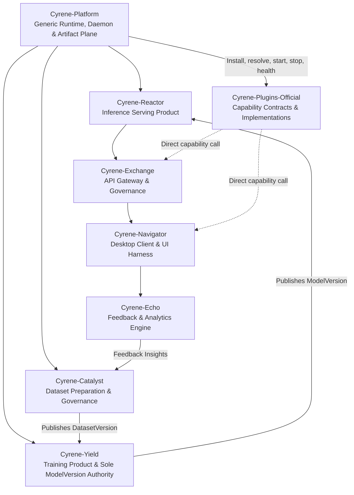
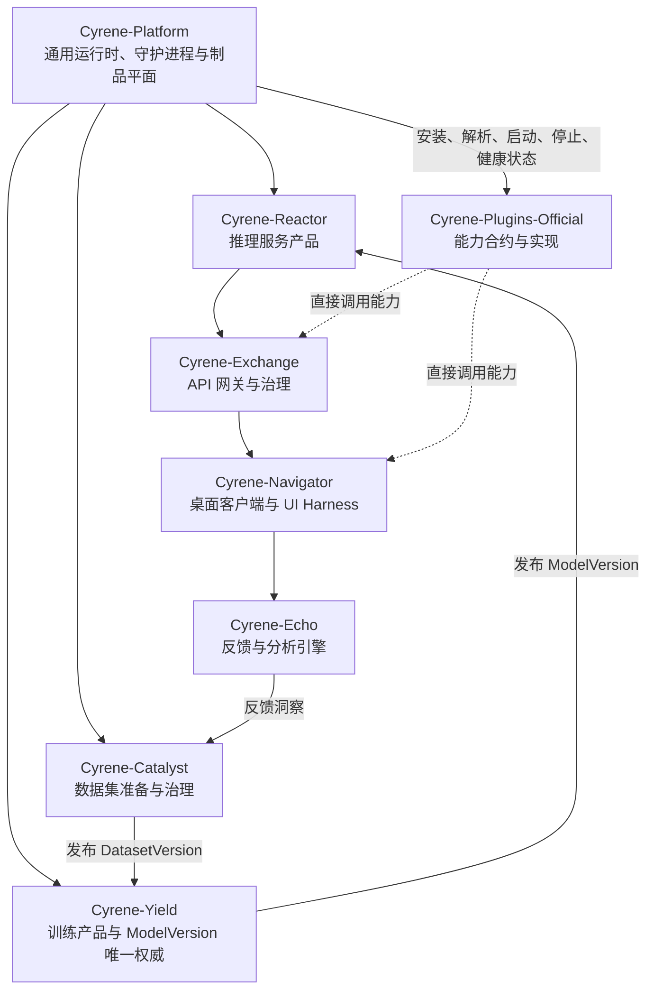

# Cyrene System Architecture (Canonical V1)

## 1. Overview
Cyrene is a high-performance, contract-governed AI system architecture designed for multi-tier execution, reproducible training and inference, and robust plugin extensibility.

The platform enforces a strict clean-room boundary separating core infrastructure, platform contracts, service products, and plugin extensions.

## 2. Three-Tier Architectural Topology

### Tier 1: Core Platform & Execution Authority (`Cyrene-Platform`)
- **Language Stack**: Rust (Daemon / Core) + Python (Platform SDK & Tooling)
- **Role**: Foundational generic runtime authority for device leases, process lifecycle, placement, daemon IPC, and the Artifact Plane.
- **Invariants**:
  - Platform strictly owns execution / device / lease / Worker / Artifact Plane. Kernel transport-neutral.
  - Zero reliance on deleted legacy shims or backwards-compatibility hacks.
  - Strict contract enforcement across process boundaries via locked schemas.

### Tier 2: Specialized Product Services
Cyrene decomposes AI engineering into six specialized service repositories with single-concept authorities:
1. **Cyrene-Catalyst**: Dataset curation, provenance tracking, and sole authority for canonical `DatasetVersion`.
2. **Cyrene-Yield**: Model training orchestrator and **Sole Authority** for canonical `ModelVersion` creation, hashing, and publishing.
3. **Cyrene-Reactor**: High-throughput inference serving engine (Rust core + Python serving layer) and sole authority for `ServingBinding` / `DeploymentDraft`.
4. **Cyrene-Exchange**: Multi-tenant API Gateway and sole authority for routing, API keys, tenant quotas, token billing, and audit logs.
5. **Cyrene-Navigator**: Front-end orchestration harness, desktop client experience, and sole authority for `Conversation` / `AgentRun` sessions.
6. **Cyrene-Echo**: Post-inference evaluation, quality metrics, and sole authority for `EvaluationRun` / `HumanAnnotation` / `FeedbackSet`.

### Tier 3: Extensibility (`Cyrene-Plugins-Official`)
- **Cyrene-Plugins-Official**: Owns versioned capability payload contracts, generated bindings, TCKs, and curated implementations. Products call these contracts directly after Platform returns generic lifecycle and connection facts.

## 3. Communication & Contract Invariants
- **Single Authority Invariant**: One concept = one authority. Yield owns ModelVersion; Catalyst owns DatasetVersion; Platform owns Execution; Exchange owns Routes/Quotas; Echo owns Feedback; Navigator owns Sessions.
- **Schema Single Source of Truth**: Products own domain schemas such as `ModelVersion`, `DatasetVersion`, and `TenantQuota`; Platform owns only generic runtime and ArtifactRef schemas; Plugins owns capability payload schemas.
- **No Direct Database Bypass**: Services must interact across canonical public HTTP/gRPC/IPC APIs rather than querying internal databases.
- **Fail-Fast In Production**: Deprecated compatibility modes are strictly disabled in production environments.
---
<!-- Chinese Translation / 中文翻译 -->

# Cyrene 系统架构（规范 V1）

## 1. 概览
Cyrene 是一套高性能、由合约治理的 AI 系统架构，面向多层级执行、可复现的训练与推理，以及可靠的插件扩展。

平台通过严格的洁净室边界，将核心基础设施、平台合约、服务产品和插件扩展彼此隔离。

## 2. 三层架构拓扑

### 第 1 层：核心平台与执行权威（`Cyrene-Platform`）
- **语言栈**：Rust（守护进程 / 核心层）与 Python（平台 SDK 和工具）。
- **职责**：提供基础通用运行时权威，负责设备租约、进程生命周期、放置、守护进程 IPC 和制品平面。
- **不变量**：
  - Platform 独占执行、设备、租约、Worker 和制品平面的所有权；Kernel 与传输方式无关。
  - 不依赖已删除的旧兼容垫片或向后兼容变通方案。
  - 通过锁定的 schema 严格执行跨进程边界的合约。

### 第 2 层：专业化产品服务
Cyrene 将 AI 工程能力拆分到六个各自拥有单一概念权威的专业服务仓库：
1. **Cyrene-Catalyst**：负责数据集整理、来源追踪，并且是规范 `DatasetVersion` 的唯一权威。
2. **Cyrene-Yield**：模型训练编排器，也是创建、哈希和发布规范 `ModelVersion` 的**唯一权威**。
3. **Cyrene-Reactor**：高吞吐推理服务引擎（Rust 核心层与 Python 服务层），并且是 `ServingBinding` / `DeploymentDraft` 的唯一权威。
4. **Cyrene-Exchange**：多租户 API 网关，是路由、API 密钥、租户配额、令牌计费和审计日志的唯一权威。
5. **Cyrene-Navigator**：前端编排 Harness 和桌面客户端体验，是 `Conversation` / `AgentRun` 会话的唯一权威。
6. **Cyrene-Echo**：负责推理后的评估与质量指标，是 `EvaluationRun` / `HumanAnnotation` / `FeedbackSet` 的唯一权威。

### 第 3 层：扩展能力（`Cyrene-Plugins-Official`）
- **Cyrene-Plugins-Official**：负责版本化能力载荷合约、生成的绑定、TCK 和精选实现。Platform 返回通用生命周期和连接信息后，产品直接调用这些合约。

## 3. 通信与合约不变量
- **单一权威不变量**：一个概念只能有一个权威。Yield 拥有 ModelVersion，Catalyst 拥有 DatasetVersion，Platform 拥有执行权威，Exchange 拥有路由与配额，Echo 拥有反馈，Navigator 拥有会话。
- **Schema 单一事实来源**：产品拥有 `ModelVersion`、`DatasetVersion` 和 `TenantQuota` 等领域 schema；Platform 只拥有通用运行时和 `ArtifactRef` schema；Plugins 拥有能力载荷 schema。
- **禁止绕过数据库**：服务之间必须通过规范的公开 HTTP/gRPC/IPC API 交互，不得查询对方的内部数据库。
- **生产环境快速失败**：生产环境严格禁用已弃用的兼容模式。
