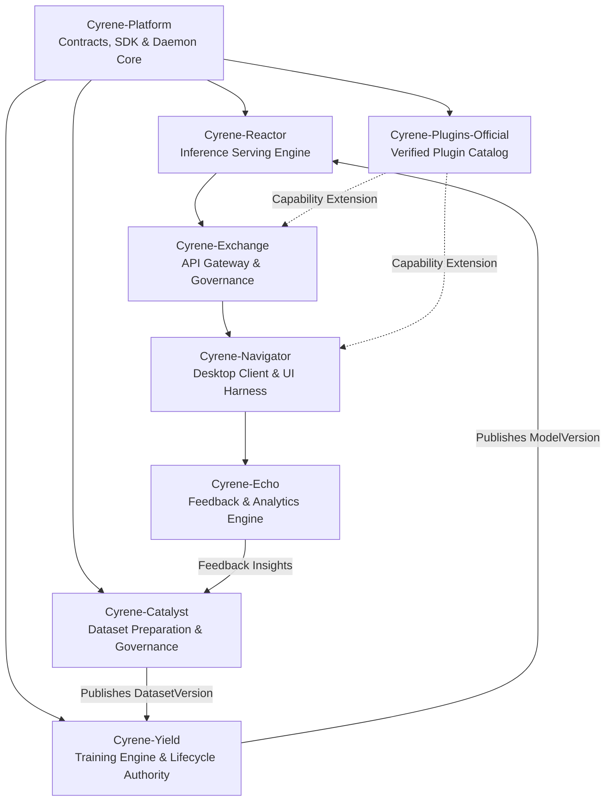

# Cyrene System Architecture (Canonical V1)

## 1. Overview
Cyrene is a high-performance, contract-governed AI system architecture designed for multi-tier execution, reproducible training and inference, and robust plugin extensibility.

The platform enforces a strict clean-room boundary separating core infrastructure, platform contracts, service products, and plugin extensions.

## 2. Three-Tier Architectural Topology

### Tier 1: Core Platform & Protocol Daemon (`Cyrene-Platform`)
- **Language Stack**: Rust (Daemon / Core) + Python (Platform SDK & Tooling)
- **Role**: Foundational kernel runtime, shared data models (`cy_artifacts`, `cy_engine`, `cy_kernel`), and CI governance tools (`check-no-legacy-surface.sh`).
- **Invariants**:
  - Zero reliance on deleted legacy shims or backwards-compatibility hacks.
  - Strict contract enforcement across process boundaries via locked schemas.

### Tier 2: Specialized Product Services
Cyrene decomposes AI engineering into six specialized service repositories:
1. **Cyrene-Catalyst**: Dataset curation, provenance tracking, and canonical `DatasetVersion` management.
2. **Cyrene-Yield**: Model training orchestrator and sole creator/authority of canonical `ModelVersion` artifacts.
3. **Cyrene-Reactor**: High-throughput inference serving engine (Rust core + Python serving layer).
4. **Cyrene-Exchange**: Multi-tenant API Gateway handling authentication, quotas, token billing, and audit logs.
5. **Cyrene-Navigator**: Front-end orchestration harness and desktop client experience.
6. **Cyrene-Echo**: Post-inference evaluation, quality metrics, and continuous feedback capture.

### Tier 3: Extensibility & Capability Workers (`Cyrene-Plugins-Official` & `Astrbot-Rev`)
- **Cyrene-Plugins-Official**: Curated, verified plugins adhering strictly to `PluginManifest` schema v1 without legacy shims.
- **AstrBot Compatibility**: Hosted in C# .NET Host (`AstrBot.DotNetHost`) with Python workers communicating via the canonical capability worker interface.

## 3. Communication & Contract Invariants
- **Schema Single Source of Truth**: All domain artifacts (`ModelVersion`, `DatasetVersion`, `TenantQuota`) are defined strictly in platform schemas.
- **No Direct Database Bypass**: Services must interact across canonical public HTTP/gRPC/IPC APIs rather than querying internal databases.
- **Fail-Fast In Production**: Deprecated compatibility modes are strictly disabled in production environments.
