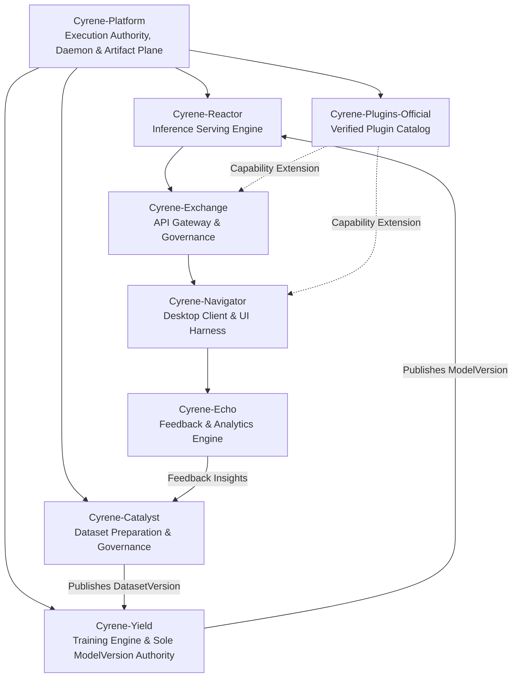

# Cyrene System Architecture (Canonical V1)

## 1. Overview
Cyrene is a high-performance, contract-governed AI system architecture designed for multi-tier execution, reproducible training and inference, and robust plugin extensibility.

The platform enforces a strict clean-room boundary separating core infrastructure, platform contracts, service products, and plugin extensions.

## 2. Three-Tier Architectural Topology

### Tier 1: Core Platform & Execution Authority (`Cyrene-Platform`)
- **Language Stack**: Rust (Daemon / Core) + Python (Platform SDK & Tooling)
- **Role**: Foundational kernel runtime, **Sole Execution Authority** (Device leases, worker process lifecycle, kernel scheduling, daemon IPC, and Artifact Plane).
- **Invariants**:
  - Platform strictly owns execution / device / lease / Worker / Artifact Plane. Kernel transport-neutral.
  - Zero reliance on deleted legacy shims or backwards-compatibility hacks.
  - Strict contract enforcement across process boundaries via locked schemas.

### Tier 2: Specialized Product Services
Cyrene decomposes AI engineering into six specialized service repositories with single-concept authorities:
1. **Cyrene-Catalyst**: Dataset curation, provenance tracking, and sole authority for canonical `DatasetVersion`.
2. **Cyrene-Yield**: Model training orchestrator and **Sole Authority** for canonical `ModelVersion` creation, hashing, and publishing.
3. **Cyrene-Reactor**: High-throughput inference serving engine (Rust core + Python serving layer) and sole authority for `ServingBinding` / `DeploymentDraft`.
4. **Cyrene-Exchange**: Multi-tenant API Gateway and sole authority for routing, API keys, tenant quotas, token billing, and audit logs.
5. **Cyrene-Navigator**: Front-end orchestration harness, desktop client experience, and sole authority for `Conversation` / `AgentRun` sessions.
6. **Cyrene-Echo**: Post-inference evaluation, quality metrics, and sole authority for `EvaluationRun` / `HumanAnnotation` / `FeedbackSet`.

### Tier 3: Extensibility & Application Runtimes (`Cyrene-Plugins-Official` & `Astrbot-Rev`)
- **Cyrene-Plugins-Official**: Curated, verified plugins adhering strictly to `plugin.manifest.json` schema v1 without legacy shims.
- **Astrbot-Rev (Extensibility & Bot Application Runtime / Compatibility Bridge)**:
  - Role: Bot application runtime and messaging platform connector (QQ, Discord, WeChat, WebUI) hosted in C# .NET Host (`AstrBot.DotNetHost`).
  - Worker Integration: Executes Python capabilities via the canonical `python/capability_worker` interface mounted under Platform's worker execution model.
  - Legacy Status: Standalone Python provider runtime is frozen and terminated; Astrbot-Rev is strictly a bot application adapter, not an execution authority.

## 3. Communication & Contract Invariants
- **Single Authority Invariant**: One concept = one authority. Yield owns ModelVersion; Catalyst owns DatasetVersion; Platform owns Execution; Exchange owns Routes/Quotas; Echo owns Feedback; Navigator owns Sessions.
- **Schema Single Source of Truth**: All domain artifacts (`ModelVersion`, `DatasetVersion`, `TenantQuota`) are defined strictly in platform schemas.
- **No Direct Database Bypass**: Services must interact across canonical public HTTP/gRPC/IPC APIs rather than querying internal databases.
- **Fail-Fast In Production**: Deprecated compatibility modes are strictly disabled in production environments.
