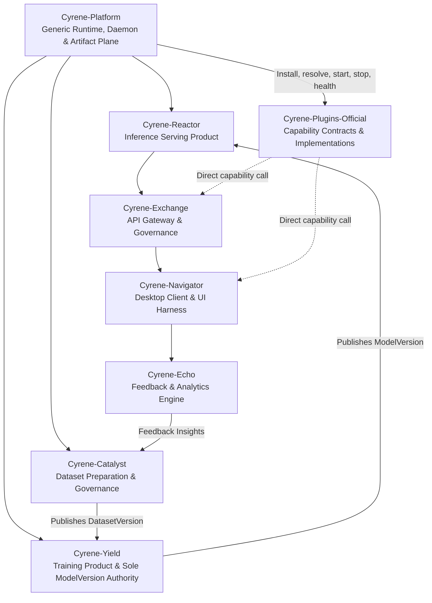

# Cyrene System Architecture (Canonical V1)

## 1. Overview
Cyrene is a high-performance, contract-governed AI system architecture designed for multi-tier execution, reproducible training and inference, and robust plugin extensibility.

The platform enforces a strict clean-room boundary separating core infrastructure, platform contracts, service products, and plugin extensions.

## 2. Three-Tier Architectural Topology

### Tier 1: Core Platform & Execution Authority (`Cyrene-Platform`)
- **Language Stack**: Rust (Daemon / Core) + Python (Platform SDK & Tooling)
- **Role**: Foundational generic runtime authority for device leases, process lifecycle, placement, daemon IPC, and the Artifact Plane.
- **Invariants**:
  - Platform strictly owns execution / device / lease / Worker / Artifact Plane. Kernel transport-neutral.
  - Zero reliance on deleted legacy shims or backwards-compatibility hacks.
  - Strict contract enforcement across process boundaries via locked schemas.

### Tier 2: Specialized Product Services
Cyrene decomposes AI engineering into six specialized service repositories with single-concept authorities:
1. **Cyrene-Catalyst**: Dataset curation, provenance tracking, and sole authority for canonical `DatasetVersion`.
2. **Cyrene-Yield**: Model training orchestrator and **Sole Authority** for canonical `ModelVersion` creation, hashing, and publishing.
3. **Cyrene-Reactor**: High-throughput inference serving engine (Rust core + Python serving layer) and sole authority for `ServingBinding` / `DeploymentDraft`.
4. **Cyrene-Exchange**: Multi-tenant API Gateway and sole authority for routing, API keys, tenant quotas, token billing, and audit logs.
5. **Cyrene-Navigator**: Front-end orchestration harness, desktop client experience, and sole authority for `Conversation` / `AgentRun` sessions.
6. **Cyrene-Echo**: Post-inference evaluation, quality metrics, and sole authority for `EvaluationRun` / `HumanAnnotation` / `FeedbackSet`.

### Tier 3: Extensibility (`Cyrene-Plugins-Official`)
- **Cyrene-Plugins-Official**: Owns versioned capability payload contracts, generated bindings, TCKs, and curated implementations. Products call these contracts directly after Platform returns generic lifecycle and connection facts.

## 3. Communication & Contract Invariants
- **Single Authority Invariant**: One concept = one authority. Yield owns ModelVersion; Catalyst owns DatasetVersion; Platform owns Execution; Exchange owns Routes/Quotas; Echo owns Feedback; Navigator owns Sessions.
- **Schema Single Source of Truth**: Products own domain schemas such as `ModelVersion`, `DatasetVersion`, and `TenantQuota`; Platform owns only generic runtime and ArtifactRef schemas; Plugins owns capability payload schemas.
- **No Direct Database Bypass**: Services must interact across canonical public HTTP/gRPC/IPC APIs rather than querying internal databases.
- **Fail-Fast In Production**: Deprecated compatibility modes are strictly disabled in production environments.
