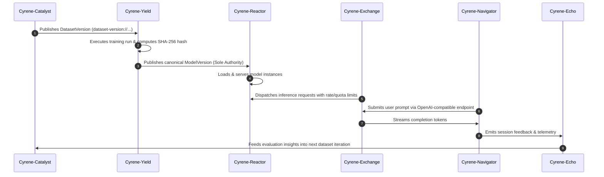

# Cyrene Text Model Lifecycle V1 (Current Canonical Specification)

## 1. Lifecycle Overview
The Cyrene text model lifecycle establishes an unbroken, reproducible closed loop across dataset preparation, model training, artifact publishing, deployment, gateway routing, client usage, and feedback collection.

## 2. Six-Stage Closed Loop

### Stage 1: Dataset Engineering (`Cyrene-Catalyst`)
- Ingests raw multi-turn dialogue data.
- Enforces cleansing, deduplication, formatting, and license compliance.
- Emits immutable `DatasetVersion` manifest.

### Stage 2: Model Training (`Cyrene-Yield`)
- Consumes verified `DatasetVersion`.
- Orchestrates training runs (full fine-tuning, LoRA adapters, DPO).
- Generates reproducible checkpoints and evaluation benchmarks.

### Stage 3: Model Version Authority (`Cyrene-Yield` & `Cyrene-Platform`)
- **Authority Model**:
  - `Cyrene-Platform`: Defines the canonical `cy_artifacts.ModelVersion` schema.
  - `Cyrene-Yield`: **Sole authority** that creates, hashes (`model-version://sha256/<hash>`), and publishes `ModelVersion`.
  - No other service may synthesize or mint a `ModelVersion` authority ID.

### Stage 4: Inference Serving (`Cyrene-Reactor`)
- Consumes `ModelVersion` manifest.
- Boots serving runtime backends with warm-up verification.
- Exposes high-performance streaming inference endpoints.

### Stage 5: Gateway Routing & Policy (`Cyrene-Exchange`)
- Authenticates incoming requests via `APIKey`.
- Enforces `TenantQuota` and records token consumption in `UsageRecord`.
- Proxies requests to healthy `Cyrene-Reactor` worker instances.

### Stage 6: Client Orchestration & Feedback (`Cyrene-Navigator` & `Cyrene-Echo`)
- `Cyrene-Navigator` renders user interface and manages multi-turn conversation context.
- `Cyrene-Echo` collects explicit user feedback (thumbs up/down, edits) and implicit metrics (latency, cost, downgrade display).
- Metrics feed back into `Cyrene-Catalyst` for continuous dataset enhancement.
