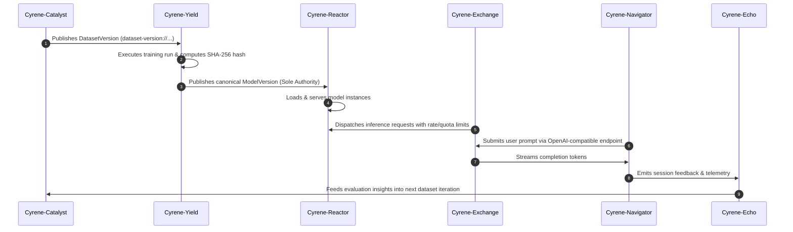
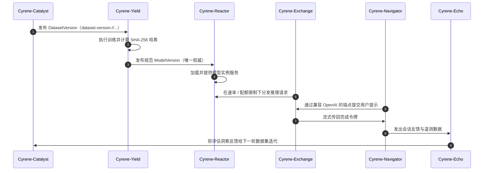

# Cyrene Text Model Lifecycle V1 (Current Canonical Specification)

## 1. Lifecycle Overview
The Cyrene text model lifecycle establishes an unbroken, reproducible closed loop across dataset preparation, model training, artifact publishing, deployment, gateway routing, client usage, and feedback collection.

## 2. Six-Stage Closed Loop

### Stage 1: Dataset Engineering (`Cyrene-Catalyst`)
- Ingests raw multi-turn dialogue data.
- Enforces cleansing, deduplication, formatting, and license compliance.
- Emits immutable `DatasetVersion` manifest.

### Stage 2: Model Training (`Cyrene-Yield`)
- Consumes verified `DatasetVersion`.
- Orchestrates training runs (full fine-tuning, LoRA adapters, DPO).
- Generates reproducible checkpoints and evaluation benchmarks.

### Stage 3: Model Version Authority (`Cyrene-Yield`)
- **Authority Model**:
  - `Cyrene-Yield`: Defines, creates, hashes (`model-version://sha256/<hash>`), and publishes the canonical `ModelVersion`.
  - `Cyrene-Platform`: Defines only generic `ArtifactRef` identity, transfer, and runtime facts; it does not define model lineage or composition.
  - No other service may synthesize or mint a `ModelVersion` authority ID.

### Stage 4: Inference Serving (`Cyrene-Reactor`)
- Consumes `ModelVersion` manifest.
- Boots serving runtime backends with warm-up verification.
- Exposes high-performance streaming inference endpoints.

### Stage 5: Gateway Routing & Policy (`Cyrene-Exchange`)
- Authenticates incoming requests via `APIKey`.
- Enforces `TenantQuota` and records token consumption in `UsageRecord`.
- Proxies requests to healthy `Cyrene-Reactor` worker instances.

### Stage 6: Client Orchestration & Feedback (`Cyrene-Navigator` & `Cyrene-Echo`)
- `Cyrene-Navigator` renders user interface and manages multi-turn conversation context.
- `Cyrene-Echo` collects explicit user feedback (thumbs up/down, edits) and implicit metrics (latency, cost, downgrade display).
- Metrics feed back into `Cyrene-Catalyst` for continuous dataset enhancement.
---
<!-- Chinese Translation / 中文翻译 -->

# Cyrene 文本模型生命周期 V1（当前规范）

## 1. 生命周期概览
Cyrene 文本模型生命周期在数据集准备、模型训练、制品发布、部署、网关路由、客户端使用和反馈收集之间建立连续且可复现的闭环。

## 2. 六阶段闭环

### 阶段 1：数据集工程（`Cyrene-Catalyst`）
- 接入原始多轮对话数据。
- 执行清理、去重、格式化和许可合规校验。
- 生成不可变的 `DatasetVersion` 清单。

### 阶段 2：模型训练（`Cyrene-Yield`）
- 消费经过验证的 `DatasetVersion`。
- 编排训练运行（全量微调、LoRA 适配器、DPO）。
- 生成可复现的检查点和评估基准。

### 阶段 3：模型版本权威（`Cyrene-Yield`）
- **权威模型**：
  - `Cyrene-Yield`：定义、创建、计算哈希（`model-version://sha256/<hash>`）并发布规范 `ModelVersion`。
  - `Cyrene-Platform`：只定义通用 `ArtifactRef` 身份、传输和运行时事实；不定义模型血缘或组合关系。
  - 其他服务均不得合成或签发 `ModelVersion` 权威 ID。

### 阶段 4：推理服务（`Cyrene-Reactor`）
- 消费 `ModelVersion` 清单。
- 启动服务运行时后端并执行预热验证。
- 提供高性能流式推理端点。

### 阶段 5：网关路由与策略（`Cyrene-Exchange`）
- 通过 `APIKey` 对传入请求进行身份验证。
- 执行 `TenantQuota` 限制，并在 `UsageRecord` 中记录令牌用量。
- 将请求代理到健康的 `Cyrene-Reactor` Worker 实例。

### 阶段 6：客户端编排与反馈（`Cyrene-Navigator` 与 `Cyrene-Echo`）
- `Cyrene-Navigator` 渲染用户界面并管理多轮对话上下文。
- `Cyrene-Echo` 收集显式用户反馈（赞 / 踩、编辑）和隐式指标（延迟、成本、降级显示）。
- 指标回流到 `Cyrene-Catalyst`，用于持续增强数据集。
