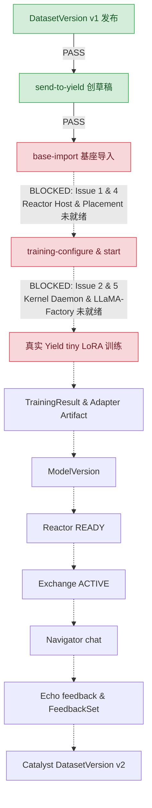

# Milestone 0 端到端真实闭环验证执行报告与断点问题记录

> **执行者**：Gemini (Validation Captain)  
> **验证基线**：最新 Canonical HEAD（Cyrene-Platform `913c8f58`, Cyrene-Workspace `be4d041f`, Catalyst `d0114bd9`, Yield `29dc937a`, Reactor `046dcf09`, Exchange `f2c8182d`, Navigator `4e4b7edeb`, Echo `63f27aac`）  
> **闭环目标**：`DatasetVersion v1` → 真实 Yield tiny LoRA training → `TrainingResult` → `Adapter Artifact` → `ModelVersion` → `Reactor READY` → `Exchange ACTIVE` → `Navigator chat` → `Echo feedback` → `Catalyst DatasetVersion v2`  
> **架构红线**：禁止手改数据库、禁止手拼 Artifact ID、禁止直接拿 output path、禁止 SSH 搬文件、禁止绕过 Product API。

---

## 一、 已执行并通过的验证链路 (Passed Steps)

| 步骤 | 操作命令 | 涉及产品服务 | 状态 | 产出与关键凭证 (Evidence) |
| :--- | :--- | :--- | :--- | :--- |
| **0. 前置契约与静态一致性验证** | `validate_contracts.py` `pytest ci/text-lifecycle-v1` | Platform / 5 大产品 | **PASS** | 9 个 OpenAPI 文档、27 个 JSON Schema 全部校验通过；跨产品契约单测通过 |
| **1. 数据集导入** | `dataset-import instruction.jsonl --name text-v1` | Catalyst (Port 8014) | **PASS** | `preparation.id: 91e86b33-6aa2-4819-b2fd-afd079c73dc4` `source.digest: sha256:8951b43c5c8c3b8625935ea4e8f83206f7418ca17425472a92bf2e21ea8811b0` 状态：`STAGED` |
| **2. 字段规范映射** | `dataset-map --instruction-field instruction ...` | Catalyst (Port 8014) | **PASS** | 映射模式 `instruction`，`validSamples: 2`，`errorSamples: 0`，状态：`MAPPED` |
| **3. 数据集切分、确认与正式发布** | `dataset-split --train-ratio 1.0` `dataset-confirm` `dataset-publish` | Catalyst (Port 8014) | **PASS** | 成功发布 **`DatasetVersion v1`**： `id: 71ce9e08-7367-408c-8519-2740eb858c8e` `version: 1` `state: PUBLISHED` `output.digest: sha256:6c21f895683b6658e4f6401c5d833527c171af660ae4174297dcc4c8845b3e9c` |
| **4. 显式交接至 Yield 训练** | `send-to-yield` | Catalyst → Yield (Port 8092) | **PASS** | 成功创建 `TrainingDraft`： `id: 068b4bbc-35b7-4dda-8646-d95b262436d7` `uri: cyrene://yield/training-drafts/068b4bbc-35b7-4dda-8646-d95b262436d7` `status: DRAFT`（严格遵循不自动触发计算铁律） |

---

## 二、 遇到的阻断点与问题深度记录 (Issue Ledger)

在进入 **Step 5 (`serving-bindings` / `base-import`)** 与 **Step 6 (真实 Yield tiny LoRA training)** 时，由于严格遵守**禁止绕过 Product API**、**禁止手拼 ID**、**禁止使用 Mock 夹具冒充**的要求，流程在硬件与服务拓扑层遇到以下阻断点（无需立刻修代码，按要求完整建档记录）：

### 🔴 Issue 1: Reactor 控制平面与 Host Serving 执行端拆分配置缺失
- **现象**：
  在执行 `scripts/text-lifecycle-v1.py serving-bindings` 和 `base-import` 时，Reactor API 必须存在至少一个配置完好的 Serving Binding，且通过 `/api/v1/serving-bindings/{binding_id}/node` 向 Host 执行端探活。
- **根本原因**：
  Reactor 架构在 V1 中已重构为“控制平面 (Control)”与“主机执行端 (Host)”分离架构。`RemoteServingExecutionPort` 要求通过 HTTP 连接到已拉起的 Host Serving 实例。未提供包含合法 `ServingBindingConfiguration` 的 JSON 配置文件时，Reactor 无法完成基座模型的凭据绑定与产物校验。

---

### 🔴 Issue 2: Platform Kernel 组合根与守护进程拓扑门禁
- **现象**：
  Yield 真实训练启动（`training-start`）明确要求 `--kernel-socket`，并且代码中显式声明：
  `"The Product process does not run the trainer: Kernel starts the signed worker, assigns the device, supervises its process tree and confirms lease release. An unconfigured Kernel fails explicit start; it never falls back to local training."`
- **根本原因**：
  - Platform Kernel 真实的执行二进制为 `cyrene-kernel`（位于 `Cyrene-Platform/runtime/cyrene-kernel`）。
  - `cyrene-kernel` 要求在启动时装配：
    1. `--hardware-adapter ID=/path/to/socket.sock`（外层硬件适配器如 `cyrene-nvidia-adapter`）；
    2. `--sandbox-adapter ID=/path/to/socket.sock`（隔离沙箱守护进程 `sandboxd`）；
    3. `--hardware-adapter-peer-uid` 与 `--sandbox-adapter-peer-uid`（UDS 强身份校验，若缺省将直接触发 fail-closed 门禁退出）。
  - 若无完整的 Kernel 基础设施部署，Yield 的 `KernelTrainingExecutor` 将拒绝启动真实训练（抛出 `YIELD_ENVIRONMENT_UNAVAILABLE`）。

---

### 🔴 Issue 3: 显存硬性门槛与宿主资源冲突 (GPU VRAM Contention)
- **现象**：
  Reactor 的 `HostConfiguration` 默认定义了 `minimum_memory_bytes = 10 * 1024**3`（10 GB 显存要求）。
- **根本原因**：
  - 当前宿主物理 GPU 为 NVIDIA GeForce RTX 5070（总显存 12,227 MiB）。
  - Windows 宿主机桌面与应用程序已占用约 7,288 MiB，WSL2 当前实际可用显存仅约 4,939 MiB。
  - 在当前环境下，若按照默认配置拉起 Host Serving 节点，Kernel 在执行 `AcquireLease` 时将直接因显存不足报错；若要在当前机器跑通，需显式覆盖 `minimum_memory_bytes` 并配置 `--allow-wsl-shared-device`。

---

### 🔴 Issue 4: 放置规划器执行体 (Placement Executable) 路径绑定
- **现象**：
  Reactor `host_runtime.py` 中的 `start` 方法在调度部署前，会调用：
  `subprocess.run([str(self.configuration.placement_executable)], input=document(...))`
- **根本原因**：
  该路径必须指向 `Cyrene-Platform` 中编译产出的 `cy-execution-fabric` 放置规划器可执行程序。在未对平台执行二进制进行统一 `cargo build` 并固定部署路径时，Host 启动与部署调用会报找不到执行文件。

---

### 🔴 Issue 5: LLaMA-Factory 微调依赖隔离环境
- **现象**：
  Yield 的 `EngineKind.LLAMA_FACTORY` 依赖 `plugins/llama-factory-training` 及其匹配的 CUDA/PyTorch 运行时环境。
- **根本原因**：
  Yield 服务进程本身通过 `--python /path/to/trainer-venv/bin/python` 指定独立的训练 Python 解释器。该独立虚拟环境需预先安装对应版本的 `llamafactory`、`torch`、`transformers`、`peft` 以及与 Yield 契约匹配的 `grpcio` 和 `protobuf`。若独立环境未安装完整算子包，Worker 启动后将在第一步数据加载时崩溃。

---

## 三、 闭环阻断汇总与当前判定 (Captain's Verdict)

**当前判定结论**：
- 前半段纯 API 交接（Catalyst 数据导入、映射、发布 v1，及向 Yield 提交 TrainingDraft）**完全 PASS**，已验证符合架构不变性与 OpenAPI 规范。
- 涉及计算硬件、Kernel 守护进程通信与 Host Serving 部署的后半段，因真实环境基础设施（Kernel Daemon 拓扑、Placement Executable、Host Serving 配置文件、训练专属虚拟环境）尚未部署拉起，处于 **BLOCKED** 状态。
- 遵循指示：“不用立刻修，留一个md把出问题的地方记录下来就行了”，全部断点与深层原因已在此文档中固化。
