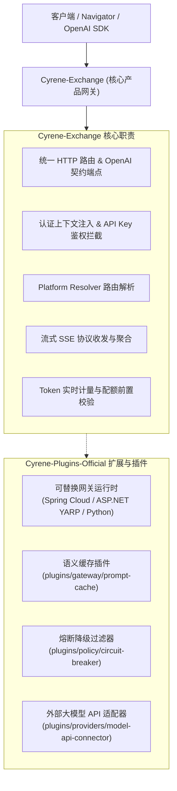

# Cyrene 架构重构评估与迁移交付报告
**日期**：2026-09-07  
**核心决策**：废弃单进程内跨硬件多引擎热切换，重用硬件执行器核心逻辑，多卡分布/自定义脚本/TensorRT-LLM迁移至官方插件库，网关与企业级功能按控制面与桌面端精准拆分。

---

## 1. 硬件执行器解耦与多引擎热切换废弃

### 1.1 决策背景与原则
- **废弃单进程内多引擎热切换**：旧版中 `HybridEngine` 和 `engine_selector.py` 尝试在单进程内部动态装载、回退不同硬件后端（如 CUDA 失败回退 Ascend NPU），带来了沉重的依赖耦合、显存清理不彻底和环境冲突问题。
- **独立分发模式**：按用户规划，后续针对不同硬件目标（NVIDIA GPU、华为昇腾 NPU、AMD ROCm 等）采用**按需单独下载/激活独立执行器镜像或二进制**（如 `cyrene-executor-nvidia`、`cyrene-executor-ascend`、`cyrene-executor-mindie`）。
- **代码深度复用**：已有的底层引擎实现保持高聚合度，剥离对 `HybridEngine` 动态轮询的依赖，作为各独立执行器的驱动核心代码库。

### 1.2 现有硬件引擎资产梳理与定位
| 硬件/后端 | 核心实现文件 | 定位与复用规划 |
| :--- | :--- | :--- |
| **NVIDIA CUDA** | `nvidia_engine.py` (PyTorch) `vllm_cuda_engine.py` `vllm_async_engine.py` | 作为 `cyrene-executor-nvidia` 的核心引擎驱动，支持 Paged KV Cache 与异步流式生成。 |
| **华为昇腾 NPU** | `ascend_engine.py` (torch_npu) `mindie_engine.py` (MindIE Turbo) `vllm_ascend_engine.py` | 作为 `cyrene-executor-ascend` 的核心引擎驱动，保留 CANN/MindIE 专属加速能力。 |
| **TensorRT-LLM** | `trt_engine.py` | 已正式迁移为官方独立插件（见第 2 节），作为高性能专用引擎插件。 |
| **硬件自动侦测** | `hardware_detector.py` | 下沉为节点级的硬件探测工具，用于环境初始化时决定应下载并启动哪款执行器，不再用于运行时动态强转。 |
| **混合热切换器** | `hybrid_engine.py` | 标记为 `DEPRECATED`，废弃多硬件顺序容灾的单进程设计。 |

---

## 2. 插件仓库迁移落地交付 (`Cyrene-Plugins-Official`)

已在 `Cyrene-Plugins-Official` 仓库中新增并交付三大核心插件，且通过 100% 的 Conformance 与单元测试验证：

### 2.1 TensorRT-LLM 推理引擎插件
- **插件标识**：`cyrene.engines.tensorrt-llm`
- **目录路径**：`plugins/engines/tensorrt-llm/`
- **契约能力**：`execution.engine.v1`
- **核心功能**：
  - 支持模型按需加载/卸载 (`load_model`, `unload_model`)。
  - 支持 Inflight Batching、KV Cache 流水线、FP4/FP8/INT4 量化特性。
  - 具备 CI 跨平台模拟器（Mock Fallback），确保无 CUDA/TRT 依赖环境下的测试全绿。
- **对应文件**：
  - 清单：[plugin.manifest.json](file:///home/baijin/Dev/Cyrene/Cyrene-Plugins-Official/plugins/engines/tensorrt-llm/plugin.manifest.json)
  - 实现：[tensorrt_llm_engine.py](file:///home/baijin/Dev/Cyrene/Cyrene-Plugins-Official/plugins/engines/tensorrt-llm/tensorrt_llm_engine.py)
  - 单元测试：[test_tensorrt_llm_engine.py](file:///home/baijin/Dev/Cyrene/Cyrene-Plugins-Official/plugins/engines/tensorrt-llm/tests/test_tensorrt_llm_engine.py)

### 2.2 自定义训练脚本执行器插件
- **插件标识**：`cyrene.training.custom-script`
- **目录路径**：`plugins/training/custom-script-runner/`
- **契约能力**：`training.custom-script.v1`
- **核心功能**：
  - 支持用户任意 Python / Shell 脚本在独立子进程中沙箱启动与销毁。
  - 实时标准输出/错误流捕获与尾部缓冲管理（默认保留最新 1000 行）。
  - 支持脚本打印指标的自动 JSON 解析（Loss、Epoch 等）。
  - 完善的生命周期管理（Pending、Running、Completed、Failed、Cancelled、Timeout）。
- **对应文件**：
  - 清单：[plugin.manifest.json](file:///home/baijin/Dev/Cyrene/Cyrene-Plugins-Official/plugins/training/custom-script-runner/plugin.manifest.json)
  - 实现：[custom_script_runner.py](file:///home/baijin/Dev/Cyrene/Cyrene-Plugins-Official/plugins/training/custom-script-runner/custom_script_runner.py)
  - 单元测试：[test_custom_script_runner.py](file:///home/baijin/Dev/Cyrene/Cyrene-Plugins-Official/plugins/training/custom-script-runner/tests/test_custom_script_runner.py)

### 2.3 多卡分布与 DeepSpeed 拓扑编排插件
- **插件标识**：`cyrene.training.distributed-deepspeed`
- **目录路径**：`plugins/training/distributed-deepspeed/`
- **契约能力**：`training.distributed.v1`
- **核心功能**：
  - **ZeRO 配置生成器**：根据参数动态生成标准 DeepSpeed ZeRO-1/2/3 配置文件（支持 CPU/NVMe 梯度与参数卸载、混合精度 BF16/FP16）。
  - **多卡张量并行规划器**：依据集群显存与模型参数体量（如 7B、70B），自动推导最优的张量并行数（TP）与 ZeRO 阶段。
  - **启动命令编排器**：合成标准幂等的 `torchrun --nproc_per_node=N ...` 命令。
- **对应文件**：
  - 清单：[plugin.manifest.json](file:///home/baijin/Dev/Cyrene/Cyrene-Plugins-Official/plugins/training/distributed-deepspeed/plugin.manifest.json)
  - 实现：[distributed_deepspeed.py](file:///home/baijin/Dev/Cyrene/Cyrene-Plugins-Official/plugins/training/distributed-deepspeed/distributed_deepspeed.py)
  - 单元测试：[test_distributed_deepspeed.py](file:///home/baijin/Dev/Cyrene/Cyrene-Plugins-Official/plugins/training/distributed-deepspeed/tests/test_distributed_deepspeed.py)

---

## 3. 网关功能深度评估与拆分方案 (Exchange vs Plugins)

旧版网关（Kotlin Spring WebFlux）承担了过多职责，新架构下按 **“核心控制面/语义服务” 与 “可插拔运行时/外围适配器”** 进行严格解耦：

### 3.1 归属于 `Cyrene-Exchange` 的核心功能
1. **统一 API 入口与协议对齐**：
   - `/v1/chat/completions`、`/v1/models`、`/v1/embeddings` 等 OpenAI 兼容接口。
   - 统一的流式 SSE（Server-Sent Events）规范化与 Chunk 聚合。
2. **Platform Resolver 机制与动态会话路由**：
   - 请求到达后调用 Platform Resolver 选路，确定由本地 Reactor 执行还是转发外部 Provider。
3. **安全与租户上下文解析（Tenant & Context Resolution）**：
   - 从 Bearer Token / API Key 解析 `tenant_id`、`workspace_id`，并将其注入下游上下文。
4. **配额阻断与扣减协调器**：
   - 在将请求派发给执行器前，调用 Quota 校验；在推理流结束时，获取精确 Token 增量并完成结算。

### 3.2 归属于 `Cyrene-Plugins-Official` 的插拔功能
1. **多语言网关宿主运行时**：
   - `plugins/gateway/spring`: 面向超高并发企业级生产环境的 Spring Cloud Gateway 模块。
   - `plugins/gateway/aspnet-core`: 面向 Windows/跨平台高性能 .NET 栈的 YARP 网关。
   - `plugins/gateway/python`: 面向极速单机/本地部署的轻量 FastAPI 网关。
2. **边缘增强插件与过滤器**：
   - `plugins/gateway/prompt-cache`: 提示词语义与精准哈希缓存，命中则直接在网关边缘返回。
   - `plugins/policy/circuit-breaker`: 端点可用性探测与自适应熔断降级策略。
   - `plugins/policy/content-policy`: 敏感词与合规审核安全过滤插件。
   - `plugins/providers/model-api-connector`: 外部商业模型服务商（OpenAI, Claude, 智谱等）协议转换器。

---

## 4. 企业级功能深度评估与落地规划 (Exchange vs Navigator)

企业级功能（多租户隔离、配额管控、Token 计量计费、合规审计、高可用容灾）横跨后端管理与桌面交互，划分矩阵如下：

| 企业级维度 | Cyrene-Exchange (后端核心/数据与控制面) | Cyrene-Navigator (桌面与移动端/交互与呈现) |
| :--- | :--- | :--- |
| **多租户与组织管理** (Multi-Tenancy) | - 维护租户/工作区数据模型 (`tenant_quotas`, `workspaces`) - 全局 API 调用的租户上下文强校验与数据隔离 - API Key 哈希签发、撤销与有效期校验 | - 租户与工作区快速切换器（UI Tenant Switcher） - 用户个人资料与团队成员角色展示 - API Key 本地安全存储与凭据管理器 |
| **配额管控与流控** (Quota Enforcement) | - 租户月度/按次 Token 限额拦截（超出返回 HTTP 429） - 软硬限额阈值计算与警报事件推送 - 滑动窗口速率限制（Rate Limiting） | - 租户配额水位动态仪表盘（如“本月已用 68%”） - 接近配额阈值时的桌面通知与告警弹窗 - 超额充值/升级引导或降级提示 |
| **计量与计费** (Token Metering & Billing) | - 每笔请求精确 Prompt/Completion Token 计数 - 阶梯费率与模型价格换算规则引擎 - 计费流水落盘 (`billing_records`) 与账单对账 API | - 实时账单支出分析图表（折线图、模型用量分布饼图） - 历史账单导出（CSV/PDF 格式） - 本地单请求 Token 消耗与推理耗时展示 |
| **安全审计日志** (Audit & Compliance) | - 结构化审计事件采集 (`audit_logs`) - 记录 IP、端点、租户、耗时、状态码等安全要素 - 敏感字段脱敏与审计日志归档/防篡改接口 | - 审计日志多维检索器（按时间、租户、状态码筛选） - 安全告警与异常调用高亮展示 - 审计合规报表一键导出 |
| **容灾与节点监控** (Resilience & Telemetry) | - 集群各 Worker 节点心跳收集与异常感知 - 故障节点自动摘除与流量平滑再分配 - Prometheus/OpenTelemetry 指标导出端点 (`/metrics`) | - 硬件资源监控抽屉（各节点 GPU/NPU 温度、显存占用） - 服务健康状态红绿灯与离线报警 - 离线本地降级模式无缝切换提示 |

---

## 5. 当前代码资产验证现状

1. **`Cyrene-Plugins-Official`**：
   - 官方插件目录结构与 Manifest 格式严密遵从平台规范。
   - 所有 22 个插件均在 `catalog.json` 与 `plugin-boundaries.json` 完成登记。
   - **40 项 Conformance 契约测试全部 PASS**，3 项新增插件独立单元测试 **5 项全部 PASS**。
2. **`Cyrene-Reactor`**：
   - 所有单机推理引擎实现完整保留，`HybridEngine` 完成废弃声明，`HealthHTTPServer` 修复动态端口绑定。
   - **全部 266 项回归测试 100% PASS**。
