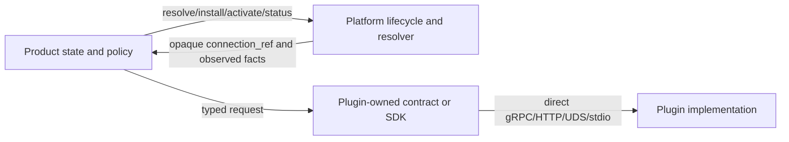

# Cyrene Services 标准化、插件抽取与公开准备
# Cyrene Services Standardization, Plugin Extraction, and Publication Readiness

> **版本 / Version**：v1.4.0
>
> **复核日期 / Reviewed**：2026-09-12（America/New_York）
>
> **状态 / Status**：`IMPLEMENTED_AND_PUSHED / HOSTED_CI_BLOCKED / PR_MERGE_PUBLICATION_OPEN`
>
> **通用规范权威 / Generic authority**：`Cyrene-Platform@c59be6f2bd82489fbe933dadff84fc589e00afd9`

## 1. 当前结论 / Current Verdict

本轮已完成目标范围内的生产实现去重：可复用、可替换的具体算法和运行后端只在
`Cyrene-Plugins-Official` 实现；Product 仓库保留自身领域状态、策略、编排、持久化和交接。
Product 通过 Plugins-owned 版本化 contract/SDK，使用 Platform 解析出的不透明
`connection_ref` 直连 Plugin endpoint。Platform 不代理 capability 业务 payload。

The targeted production implementations now have one canonical home in
`Cyrene-Plugins-Official`. Product repositories retain domain authority and consume
versioned Plugin-owned endpoints through opaque `connection_ref` values.

这不是完整交付 PASS。当前分支均已推送，但 hosted jobs 在执行任何 step 前失败；PR、目标分支
合并、canonical read-back、真实训练/推理后端及 GPU/NPU E2E 尚未完成。GitHub 上 Plugins 仓库的
可见性仍为 `PRIVATE`，本轮没有更改远端可见性。

## 2. 唯一权威与连接矩阵 / Ownership and Connection Matrix

| Product | Product 继续拥有 | Plugins 唯一实现 | 标准连接 |
| --- | --- | --- | --- |
| Catalyst | `Dataset`/`DatasetVersion`、准备请求、审阅、血缘、发布与 Yield handoff | `dataset.preparation.v1` 的解析、规范化、去重、拆分与格式转换 | `DirectPluginClient` → gRPC endpoint from `connection_ref` |
| Yield | `TrainingSpec`/Draft/Run/Attempt/Result/`ModelVersion`、准入策略、编排、重试/取消、checkpoint 与 lineage | `training.llama-factory.v1`、`model.analyzer.v1`、`compatibility.evaluator.v1`、`tool.dataset.validator.v1` | `DirectPluginClient` → gRPC endpoint from `connection_ref` |
| Reactor | Deployment/Endpoint、请求准入与有界队列、streaming、readiness/drain、模型驻留策略与发布 | `execution.engine.v1` 的 vLLM、TensorRT-LLM 与 Ascend MindIE | `DirectPluginClient` → gRPC endpoint from `connection_ref` |
| Echo | EvaluationSuite/Run、quality gate、annotation、feedback set 与 Product handoff | `evaluation.runner.v1` 的可复用评分实现 | `DirectPluginClient` → gRPC endpoint from `connection_ref` |
| Exchange | API key、quota、usage、route/fallback、audit 与 gateway policy | `model.provider.v1`；`cyrene.gateway.cache.http.v1` 的 cache 实现 | provider 使用 Direct gRPC；cache 使用 manifest 声明的 HTTP origin `connection_ref` |
| Navigator | browser/native 客户端、Product API 投影与交互状态 | 尚未 accepted 的 agent/skill/MCP 能力不在本轮伪装成可用 Plugin | 保持 `Core/Ports`；accepted contract 就绪后再直连 |

### 2.1 标准连接规则 / Standard Connection Rules

- Platform 只负责通用安装、解析、生命周期、健康和连接事实，不新增 capability-specific
  `invoke(...)` 或 payload schema。
- Product 不导入 Plugin 实现源码，不依赖可变 sibling checkout，不复制 Plugin schema。
- 必需 binding 缺失、endpoint 解析失败或调用失败时 fail closed，不静默回退到 Product 内嵌实现。
- Product-to-Product 只使用所属方的版本化 API、ResourceRef/ArtifactRef 和确认回执。
- test fixture、loopback consumer stub 和模拟后端必须显式标记，不能作为 REAL/GPU PASS。

## 3. 本轮清理 / Extraction Completed

### Plugins

- `execution.engine.v1` 统一承载 vLLM、TensorRT-LLM 和 Ascend MindIE 的 direct runtime adapter。
- 新增并规范化 `dataset.preparation.v1`、`evaluation.runner.v1`、`model.analyzer.v1`、
  `compatibility.evaluator.v1` 与 `tool.dataset.validator.v1`。
- catalog、capability index、boundary registry、lifecycle、serving set、TCK 与 package verification
  同步更新。
- GitHub source CI 改为仓库内自给，不 checkout 私有 sibling repository；Azure 自动触发关闭，仅保留
  手工 protected-resource/delivery lane。
- 增加 `LICENSE` 指针、`LICENSING.md`、`SECURITY.md` 和 public-repository hygiene gate。

### Products

- Reactor 删除 concrete engine、local prompt/KV cache、通用 scheduler、Product-local worker/host/
  bootstrap/model package/install/kernel RPC/reference server 与 `serving-runtime`；只保留一个薄的
  Platform host-placement adapter。
- Yield 删除 native Transformers trainer、本地 dataset validator、本地 analyzer/compatibility
  算法和重复 JVM control-plane snapshot。
- Catalyst 删除本地 dataset preparation 算法。
- Echo 删除本地 exact-match 评分算法。
- Exchange 删除 embedded Plugin JAR repository、vendored runtime wheels、training/custom-script/
  worker-hardware 越界活跃面；Spring coordinator 改为 Plugin-declared cache HTTP port。

测试中保留的 LLaMA Factory contract fixture 只校验 launch contract，loopback HTTP server 只验证
Exchange consumer port；两者都不是生产实现副本，也不作为真实后端证据。

## 4. Reactor 与 Yield 仍承担什么 / Remaining Product Responsibilities

### Reactor

Reactor 是推理部署 Product，不再是推理引擎仓库。它继续负责：

- Deployment/Endpoint 的 desired/observed Product state 与持久化；
- serving binding 的选择、引用、readiness、health、drain 和 endpoint publication；
- request admission、有界 in-worker queue/backpressure、streaming 与协议适配；
- 基于 Plugin observed facts 的模型驻留/驱逐 Product policy；
- Product handoff，以及到 Platform 通用 placement 的薄适配。

它不再负责 concrete inference backend、prompt/KV cache 实现、通用资源调度/分配、Plugin
安装生命周期、模型分析/兼容算法或训练。

### Yield

Yield 是训练生命周期 Product，不再是训练器或通用预检算法仓库。它继续负责：

- `TrainingSpec`、Draft、Run、Attempt、Result、`ModelVersion` 的状态与持久化；
- training admission/preflight policy，以及对 Plugin 返回事实的业务解释；
- plan、orchestration、retry、cancel、reconciliation；
- checkpoint receipt/digest、ArtifactRef 发布、model lineage 和 Product handoff；
- 与 Platform lifecycle/Kernel 的 executor/control 交互。

它不再负责 trainer loop、dataset parser/schema/quality 实现、模型分析或兼容算法。

## 5. 精确提交与验证 / Exact Commits and Evidence

所有变更位于 `fix/services-decoupling-closure-20260912`，已推送到各远端同名分支。

| Repository | Exact pushed SHA | Local evidence | Hosted evidence |
| --- | --- | --- | --- |
| Platform | `c59be6f2bd82489fbe933dadff84fc589e00afd9` | 本轮只读规范权威 | exact-SHA checks previously succeeded |
| Plugins | `c3f75689ebb10b2e07b3816310e768d74ae6cc10` | 193 tests；42 plugins/18 refs；Python packages；Rust；Spring；public hygiene；clean remote clone PASS | run `34704997918`: all 9 jobs failed with 0 steps |
| Reactor | `fa33fee7955092274d768881ee6c6b63e2428c03` | 209 core/pro + 14 Product tests；Rust fmt/clippy/test；boundary PASS | runs `34705593538`, `34705593618`: 0-step failures |
| Yield | `b225fa7d339141643ee5031b7bdcdb75ed53e02c` | 131 tests；Ruff/format/mypy；boundary PASS | runs `34705592916`, `34705592922`: 0-step failures |
| Exchange | `07765d64abec1f34e4eba17a1e6701b4e850d4e4` | 44 root + 21 Product tests；Spring Gradle；boundary PASS | runs `34705705360`, `34705705353`: 0-step failures |
| Catalyst | `89338e3d527a947933cd2b0fdc24c3323f620244` | 18 tests；Ruff/format/mypy/OpenAPI/boundary PASS | run `34705592984`: 0-step failure |
| Echo | `5119bd6f7c6d5a855bcff0a8aa8c78dd373a74a3` | 47 tests；Ruff/format/mypy/OpenAPI/boundary PASS | run `34705592965`: 0-step failure |
| Navigator | unchanged in this extraction slice | existing Product/API adapter evidence retained | not reclassified by this slice |
| Workspace | this document's task branch | 11 governance/boundary tests；Ruff/format；241 files/0 violations；YAML/JSON/XML structure PASS | automatic Azure job fails before steps because the organization has no free hosted minutes |

Hosted runs terminated before checkout or test execution. They are `NOT_RUN / ACCOUNT_CAPACITY_BLOCKED`,
not source PASS and not a source-code failure diagnosis. Because no hosted source gate passed, no draft PR was
created and no merge/read-back claim is made.

## 6. 公开仓库准备 / Publication Readiness

Plugins 当前 tip 已具备公开 CI 的代码条件：

- CI 在普通 source lane 不需要私有 sibling checkout、cross-repo token 或开发者绝对路径；
- clean remote clone 在 exact SHA 上通过 public hygiene 与完整 Python conformance；
- tracked tree 未发现高置信 credential/private-key pattern；
- root licensing 说明明确：仓库包含 AGPL/Apache/MIT 等既有组件，公开可见不等于统一重授权；
- security reporting policy 已落库。

仍有两个发布动作没有执行：

1. GitHub visibility 仍为 `PRIVATE`，需单独切换并进行匿名 clone/CI/read-back；
2. 旧 Git 历史仍可能保留已从当前 tree 清理的开发者绝对路径。若公开时要求历史隐私也干净，
   应选择 clean/squashed public root，或另立经审阅的 history rewrite；不得在本任务中直接 force-push。

## 7. 完成定义 / Definition of Done

### 已完成 / Complete at pushed-candidate level

- 目标 concrete capability 在 Product 活跃生产路径中没有第二套实现；
- Product/Plugin/Platform 权威边界与标准直连已落代码、测试与文档；
- 五个改造 Product 的普通 build 不再依赖可变 Plugins sibling source；
- 插件仓库当前 tip 可从 clean clone 运行公开 source CI 所需门禁；
- 所有候选分支已推送并可按 exact SHA 回读。

### 仍开放 / Open

- hosted source jobs 真正执行并成功；
- required checks、PR review、normal merge、fetch/read-back 与 ancestry closure；
- 真实 vLLM/TensorRT-LLM/MindIE/LLaMA Factory process 与 GPU/NPU acceptance；
- DatasetVersion → TrainingRun → ModelVersion → Deployment/Endpoint → Exchange → Navigator →
  Echo 的完整 cross-Product E2E；
- Plugins 可见性切换、匿名 clone 和公开 CI read-back；
- 若选择保留完整历史，完成 history privacy review。

在这些轨道闭合前，状态保持
`IMPLEMENTED_AND_PUSHED / HOSTED_CI_BLOCKED / PR_MERGE_PUBLICATION_OPEN`，不得写成
`FULL_DECOUPLING_COMPLETE` 或 `PUBLIC_RELEASED`。
---
<!-- Chinese Translation / 中文翻译 -->

# Cyrene Services 标准化、插件抽取与公开准备

**版本**：v1.4.0

**复核日期**：2026-09-12（America/New_York）

**状态**：`IMPLEMENTED_AND_PUSHED / HOSTED_CI_BLOCKED / PR_MERGE_PUBLICATION_OPEN`

**通用规范权威**：`Cyrene-Platform@c59be6f2bd82489fbe933dadff84fc589e00afd9`

## 1. 当前结论

本轮已完成目标范围内的生产实现去重：可复用、可替换的具体算法和运行后端只在 `Cyrene-Plugins-Official` 实现；Product 仓库保留各自领域状态、策略、编排、持久化和交接职责。Product 通过 Plugins 所有的版本化 contract/SDK，使用 Platform 解析出的不透明 `connection_ref` 直接连接 Plugin endpoint。Platform 不代理 capability 业务 payload。

本轮指定范围内的生产实现现只有一个规范归属，即 `Cyrene-Plugins-Official`。Product 仓库保留领域权威，并通过不透明的 `connection_ref` 消费由 Plugin 所有的版本化 endpoint。

这并不代表完整交付 PASS。当前分支均已推送，但 hosted job 在执行任何 step 前就失败；PR、目标分支合并、canonical read-back、真实训练 / 推理后端及 GPU/NPU E2E 都尚未完成。GitHub 上 Plugins 仓库仍为 `PRIVATE`，本轮没有更改远端可见性。

## 2. 唯一权威与连接矩阵

| Product | Product 继续拥有 | Plugins 唯一实现 | 标准连接 |
|---|---|---|---|
| Catalyst | `Dataset` / `DatasetVersion`、准备请求、审阅、血缘、发布与 Yield handoff | `dataset.preparation.v1` 的解析、规范化、去重、拆分和格式转换 | `DirectPluginClient` → 来自 `connection_ref` 的 gRPC endpoint |
| Yield | `TrainingSpec` / Draft / Run / Attempt / Result / `ModelVersion`、准入策略、编排、重试 / 取消、checkpoint 与 lineage | `training.llama-factory.v1`、`model.analyzer.v1`、`compatibility.evaluator.v1`、`tool.dataset.validator.v1` | `DirectPluginClient` → 来自 `connection_ref` 的 gRPC endpoint |
| Reactor | Deployment/Endpoint、请求准入与有界队列、streaming、readiness/drain、模型驻留策略与发布 | `execution.engine.v1` 的 vLLM、TensorRT-LLM 和 Ascend MindIE | `DirectPluginClient` → 来自 `connection_ref` 的 gRPC endpoint |
| Echo | EvaluationSuite/Run、quality gate、annotation、feedback set 与 Product handoff | `evaluation.runner.v1` 的可复用评分实现 | `DirectPluginClient` → 来自 `connection_ref` 的 gRPC endpoint |
| Exchange | API key、quota、usage、route/fallback、audit 和 gateway policy | `model.provider.v1`；`cyrene.gateway.cache.http.v1` 的 cache 实现 | provider 使用 Direct gRPC；cache 使用 manifest 声明的 HTTP origin `connection_ref` |
| Navigator | browser/native 客户端、Product API 投影与交互状态 | 本轮不把尚未 accepted 的 agent/skill/MCP 能力伪装成可用 Plugin | 保持 `Core/Ports`；accepted contract 就绪后再直接连接 |

### 2.1 标准连接规则

- Platform 只负责通用安装、解析、生命周期、健康状态和连接事实，不新增 capability 专属的 `invoke(...)` 或 payload schema。
- Product 不导入 Plugin 实现源码，不依赖可变的 sibling checkout，也不复制 Plugin schema。
- 必需 binding 缺失、endpoint 解析失败或调用失败时，必须 fail closed；不能静默回退到 Product 内嵌实现。
- Product-to-Product 通信只使用资源所属方的版本化 API、ResourceRef/ArtifactRef 和确认回执。
- test fixture、loopback consumer stub 和模拟后端都必须显式标记，不能作为 REAL/GPU PASS。

## 3. 本轮清理与抽取结果

### Plugins

- `execution.engine.v1` 统一承载 vLLM、TensorRT-LLM 和 Ascend MindIE 的 direct runtime adapter。
- 新增并规范化 `dataset.preparation.v1`、`evaluation.runner.v1`、`model.analyzer.v1`、`compatibility.evaluator.v1` 和 `tool.dataset.validator.v1`。
- 同步更新 catalog、capability index、boundary registry、lifecycle、serving set、TCK 和 package verification。
- GitHub source CI 改为仓库内自给，不再检出私有 sibling repository；关闭 Azure 自动触发，只保留手动的 protected-resource/delivery lane。
- 增加 `LICENSE` 指针、`LICENSING.md`、`SECURITY.md` 和 public-repository hygiene gate。

### Products

- Reactor 删除 concrete engine、本地 prompt/KV cache、通用 scheduler、Product 本地 worker/host/bootstrap/model package/install/kernel RPC/reference server 和 `serving-runtime`；只保留一个轻量的 Platform host-placement adapter。
- Yield 删除 native Transformers trainer、本地 dataset validator、本地 analyzer/compatibility 算法和重复的 JVM control-plane snapshot。
- Catalyst 删除本地 dataset preparation 算法。
- Echo 删除本地 exact-match 评分算法。
- Exchange 删除 embedded Plugin JAR repository、vendored runtime wheels、training/custom-script/worker-hardware 越界活跃代码面；Spring coordinator 改用 Plugin 声明的 cache HTTP port。

测试中保留的 LLaMA Factory contract fixture 只验证 launch contract；loopback HTTP server 只验证 Exchange consumer port。二者都不是生产实现副本，也不能作为真实后端证据。

## 4. Reactor 与 Yield 仍承担的职责

### Reactor

Reactor 是推理部署 Product，不再是推理引擎仓库。它继续负责：

- Deployment/Endpoint 的 desired/observed Product state 与持久化；
- serving binding 的选择、引用、readiness、health、drain 和 endpoint publication；
- request admission、有界的 in-worker queue/backpressure、streaming 与协议适配；
- 根据 Plugin observed facts 执行模型驻留 / 驱逐 Product policy；
- Product handoff，以及接入 Platform 通用 placement 的轻量适配。

它不再负责 concrete inference backend、prompt/KV cache 实现、通用资源调度 / 分配、Plugin 安装生命周期、模型分析 / 兼容算法或训练。

### Yield

Yield 是训练生命周期 Product，不再是训练器或通用预检算法仓库。它继续负责：

- `TrainingSpec`、Draft、Run、Attempt、Result、`ModelVersion` 的状态与持久化；
- training admission/preflight policy，以及对 Plugin 返回事实的业务解释；
- plan、orchestration、retry、cancel、reconciliation；
- checkpoint receipt/digest、ArtifactRef 发布、model lineage 和 Product handoff；
- 与 Platform lifecycle/Kernel 的 executor/control 交互。

它不再负责 trainer loop、dataset parser/schema/quality 实现、模型分析或兼容算法。

## 5. 精确提交与证据

所有变更都位于 `fix/services-decoupling-closure-20260912`，并已推送到各远端的同名分支。

| 仓库 | 精确推送 SHA | 本地证据 | Hosted 证据 |
|---|---|---|---|
| Platform | `c59be6f2bd82489fbe933dadff84fc589e00afd9` | 本轮只读规范权威 | 先前 exact-SHA checks 成功 |
| Plugins | `c3f75689ebb10b2e07b3816310e768d74ae6cc10` | 193 个测试；42 plugins/18 refs；Python packages、Rust、Spring、public hygiene、clean remote clone 均 PASS | run `34704997918`：9 个 job 均在 0 steps 时失败 |
| Reactor | `fa33fee7955092274d768881ee6c6b63e2428c03` | 209 个 core/pro + 14 个 Product 测试；Rust fmt/clippy/test；boundary PASS | runs `34705593538`、`34705593618`：0-step failures |
| Yield | `b225fa7d339141643ee5031b7bdcdb75ed53e02c` | 131 个测试；Ruff/format/mypy；boundary PASS | runs `34705592916`、`34705592922`：0-step failures |
| Exchange | `07765d64abec1f34e4eba17a1e6701b4e850d4e4` | 44 个 root + 21 个 Product 测试；Spring Gradle；boundary PASS | runs `34705705360`、`34705705353`：0-step failures |
| Catalyst | `89338e3d527a947933cd2b0fdc24c3323f620244` | 18 个测试；Ruff/format/mypy/OpenAPI/boundary PASS | run `34705592984`：0-step failure |
| Echo | `5119bd6f7c6d5a855bcff0a8aa8c78dd373a74a3` | 47 个测试；Ruff/format/mypy/OpenAPI/boundary PASS | run `34705592965`：0-step failure |
| Navigator | 本次抽取切片中未变更 | 保留既有 Product/API adapter 证据 | 本切片未重新分类 |
| Workspace | 本文所属任务分支 | 11 个治理 / 边界测试；Ruff/format；241 files/0 violations；YAML/JSON/XML 结构 PASS | 组织没有免费 hosted minutes，自动 Azure job 在 steps 开始前失败 |

Hosted run 都在 checkout 或测试执行前终止，状态是 `NOT_RUN / ACCOUNT_CAPACITY_BLOCKED`；既不是源码 PASS，也不是源码失败诊断。由于没有 hosted source gate 通过，因此没有创建 Draft PR，也不宣称已合并或完成 read-back。

## 6. 公开仓库准备度

Plugins 当前 tip 已具备公开 CI 的代码条件：

- 普通 source lane 的 CI 不需要私有 sibling checkout、cross-repo token 或开发者绝对路径；
- exact SHA 上的 clean remote clone 通过 public hygiene 和完整 Python conformance；
- tracked tree 中未发现高置信度 credential/private-key pattern；
- 根级许可说明明确指出仓库包含既有 AGPL/Apache/MIT 等组件；公开可见不代表统一重新授权；
- security reporting policy 已提交。

仍有两个发布动作未执行：

1. GitHub 可见性仍为 `PRIVATE`，还需单独切换，并执行匿名 clone/CI/read-back；
2. 旧 Git 历史可能仍包含已从当前 tree 清除的开发者绝对路径。如果公开时也要求历史隐私干净，应选择 clean/squashed public root，或另行审查后执行 history rewrite；不得在本任务中直接 force-push。

## 7. 完成定义

### 已完成（推送候选版本层面）

- Product 活跃生产路径中没有目标 concrete capability 的第二套实现；
- Product/Plugin/Platform 权威边界及标准直连已落实到代码、测试和文档；
- 五个改造后的 Product 在普通构建中不再依赖可变 Plugins sibling source；
- 插件仓库当前 tip 可从 clean clone 执行公开 source CI 所需门禁；
- 所有候选分支均已推送，可通过 exact SHA 回读。

### 仍未完成

- hosted source job 实际执行并成功；
- required checks、PR review、常规合并、fetch/read-back 和 ancestry closure；
- 真实 vLLM/TensorRT-LLM/MindIE/LLaMA Factory 进程，以及 GPU/NPU 验收；
- DatasetVersion → TrainingRun → ModelVersion → Deployment/Endpoint → Exchange → Navigator → Echo 的完整跨 Product E2E；
- Plugins 可见性切换、匿名 clone 和公开 CI read-back；
- 若选择保留完整历史，则完成 history privacy review。

在上述轨道闭合前，状态保持 `IMPLEMENTED_AND_PUSHED / HOSTED_CI_BLOCKED / PR_MERGE_PUBLICATION_OPEN`，不得标记为 `FULL_DECOUPLING_COMPLETE` 或 `PUBLIC_RELEASED`。
