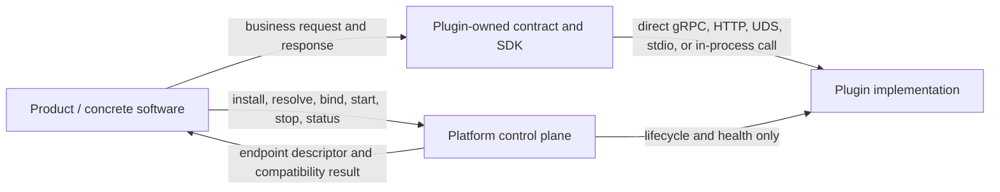
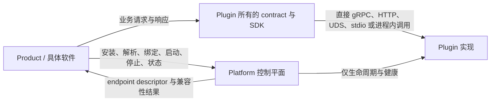

# Platform–Plugin Direct Boundary Remediation Ledger / Platform–插件直连边界修复台账

- **Status / 状态**：`COMPLETE`
- **Started / 开始时间**：2026-09-08
- **Source plan / 来源计划**：`docs/plugins-full-repository-legacy-remediation-plan-2026-09-07.md`
- **Execution rule / 执行规则**：一个仓库同一时刻只有一个 writer；先接管目标，再删除来源；禁止复制出第二份权威。
- **Completion notation / 完成标记**：未完成使用 `- [ ]`；只有验收证据成立后才改为 `- [x] ~~...~~`，并在任务下记录 exact SHA、测试和 CI。
- **CI authority / CI 权威**：Azure Pipelines。GitHub Actions 不作为本轮必需验收证据。

## 1. Goal and non-negotiable rules / 目标与不可妥协规则

This remediation establishes a stable Platform control plane and a direct Product-to-Plugin
data plane. Capability contracts, generated SDKs, TCKs, and implementations evolve with their
real Plugins or Product owners. Ordinary capability work must not require a Platform source
change.

本轮修复建立稳定的 Platform 控制平面和 Product 到 Plugin 的直连数据平面。能力契约、生成 SDK、
TCK 与实现跟随真实 Plugins 或 Product owner 演进。普通能力开发不得要求修改 Platform 源码。

### R1 — No routine Platform co-change / 禁止普通接入伴随修改 Platform

插件或具体软件新增能力、方法、字段、供应商、路由规则或业务状态时，只修改能力 owner 与消费者。
Platform 只在出现至少两个独立消费者共同需要的通用原语，或 Kernel 级不变量时接受一次独立的
`PLATFORM_GAP` 变更。便利性和单一实现需求不构成 Platform gap。

### R2 — Direct business data plane / 业务数据平面直连

具体软件按 Plugins 所有的版本化协议直接调用插件。Platform 不解析、不转换、不持久化、不路由、
不代理 capability payload，也不成为每次业务调用必经的超级中心。Platform 可以管理插件安装、发现、
版本兼容、准入、启动、停止、健康、权限与连接描述，但控制平面返回连接结果后退出业务调用链。

### R3 — Unified management without unified business execution / 统一管理不等于统一执行业务

“接上即用”由标准包、能力清单、契约版本、TCK、兼容性判断和可替换实现实现。统一管理只统一事实与
生命周期，不统一聊天、模型分析、消息、训练、量化、网关或存储请求的执行路径。

### R4 — One authority / 一个能力只有一个权威

共享 capability contract 位于 Plugins 的 contract 层；单实现私有 contract 可与实现同目录；Product
生命周期 contract 位于 Product。迁移期间允许只读兼容桥，但不得在 Platform、Plugins 和 Product 中
同时维护可编辑副本。

## 2. Target topology / 目标拓扑

Platform may return a generic, capability-neutral connection descriptor containing only:

- plugin and binding identity;
- capability id and interface version;
- transport kind and an opaque endpoint reference;
- authentication/secret reference, never a secret value;
- generation, fence or expiry needed to reject stale bindings;
- health and lifecycle facts.

It must not contain or interpret capability request/response schemas.

Platform 可以返回通用且与能力无关的连接描述，但不得包含或解释业务请求/响应结构。

## 3. Ownership matrix / 所有权矩阵

| Surface / 表面 | Canonical owner / 权威 owner | Platform role / Platform 职责 |
| --- | --- | --- |
| WorkerControl transport primitives, process lifecycle, Sandbox, Lease/Fence | Platform | 定义通用控制与生命周期不变量 |
| Capability id, interface version and generic endpoint/binding descriptor | Platform | 校验与返回控制面事实，不代理 payload |
| `model.provider.v1`, `message.connector.v1`, model analyzer, compatibility, engine, gateway and other typed payloads | Plugins | Platform 只把它们视为不透明 capability metadata |
| Generated Python/JVM/.NET/Rust capability SDKs | Plugins or the owning Product | Platform 不生成能力专用 binding |
| Capability conformance TCK | Plugins | Platform 只保留通用控制协议 TCK |
| Concrete capability implementation and provider/vendor adapter | Corresponding Plugin | Platform 不包含实现或 fallback |
| TrainingRun, DatasetVersion, ModelVersion, deployment and conversation state | Corresponding Product | Platform 只保存通用 ArtifactRef 或运行事实 |
| Installation, compatibility result, process health and connection availability | Platform control plane | 不成为业务请求路由器 |

## 4. Current live baselines / 当前远端基线

Do not replace these values from an old report. Refresh them before each repository write phase.
旧报告中的 SHA 只能用于路由；每次进入仓库写入阶段前必须重新读取远端。

| Repository | Integration branch | Exact remote SHA at start | Writer state |
| --- | --- | --- | --- |
| Cyrene-Workspace | `main` | `725478b7b467d3a7a96ead669d49a17228f0e745` | active documentation writer |
| Cyrene-Platform | `develop` | `1b496733d725680dc999f925c99b20c8ecad178a` | read-only until destination contracts exist |
| Cyrene-Plugins-Official | `develop` | `4f730e1f13fbc64b04b533dbf7f4e90d06460604` | next destination writer |

Open PRs observed at start:

- Platform PRs `#28`, `#29` target `main`; stale draft `#23` targets a feature branch and must not be treated as accepted capability authority.
- Plugins PRs `#7`, `#8` target `main` and are dependency updates.
- Workspace had no open PR.

## 5. Current violations and migration inventory / 当前偏差与迁移清单

### 5.1 Platform capability-specific contract surface

- Ten named Rust SPI traits and typed plugin Proto projections: Probe, ModelAnalyzer,
  CompatRule, RuntimeBuilder, ExecutionEngine, TrainingBackend, Quantization, GatewayFilter,
  Notification and Storage.
- `cy-extension-registry`, its ten remote proxies and its Kernel-daemon adapter path.
- `cy-local-transport` and `BuiltinInMemoryStorage`.
- AI/Product records and schemas in `cy-manifest`.
- `model.provider.v1` and `message.connector.v1` Proto, Rust projections and capability TCKs.
- Python `cyrene_capability_client.model_provider_v1` and generated model-provider binding.
- Java `PocNotificationPlugin` and capability-specific worker fixtures/examples.
- `ModelVersion`, training/dataset lineage and closed AI artifact kinds inside the Python
  `cyrene_artifacts` package.
- Python/framework/engine selection policy inside `cyrene_environment`.

### 5.2 Existing destinations in Plugins

| Capability | Existing destination |
| --- | --- |
| `model.analyzer.v1` | `plugins/models/hf-model-analyzer` |
| `compatibility.evaluator.v1` | `plugins/policy/compat-rules` |
| `environment.builder.v1` | `plugins/environment/docker-uv-builder` |
| `execution.engine.v1` | `plugins/engines/*` |
| training helpers/backends | `plugins/training/*` |
| gateway capabilities | `plugins/gateway/*` |
| `model.provider.v1` | `plugins/providers/model-api-connector` |
| `message.connector.v1` | `plugins/connectors/onebot-v11` and other connectors |
| media capabilities | `plugins/tools/media` |

### 5.3 Current cross-repository coupling to remove

- Plugins policy says it implements “Platform contracts” instead of owning capability contracts.
- OneBot binding generation reads the Platform checkout.
- Model-provider code and documentation declare Platform as the schema owner.
- Plugins cross-repository CI checks out Platform for capability conformance.
- Platform release packages capability-specific Python bindings and runs model/message TCKs.

### 5.4 Live audit of the remaining repositories on 2026-09-09

This snapshot uses live remote integration branches. A successful pipeline that still pins an old
Platform source revision proves the old composition only; it does not prove compatibility with the
current Platform baseline.

| Repository | Live integration head | Classification | Current finding | Existing owner task |
| --- | --- | --- | --- | --- |
| Catalyst | `develop@cf568ae9874b9969d14fa2f9ee05e6d13919f02c` | `COMPATIBILITY_ONLY` | Business calls go directly to Yield. The generic Artifact Plane dependency is allowed, but Python/CI still pins Platform `a29fb0...`, Product schemas retain the retired closed artifact-kind taxonomy, and current docs still assign Product capability contracts to Platform. Azure `#432` succeeded only for that old composition. | `T20` — **P1 / M** |
| Echo | `develop@8f51170ed372741a81bcfad4a6fd386ad5dfc936` | `COMPATIBILITY_ONLY` | Business calls go directly to Catalyst and Exchange. Python/CI still pins Platform `a29fb0...`; Product schemas and tests retain the retired closed artifact-kind taxonomy; resolver, ModelVersion and extension-point documents are stale. Azure `#426` succeeded only for that old composition. | `T21` — **P1 / M** |
| Navigator | `develop@41a42e8608d2fe74d4283dd5599192aef568d163` | `COUPLED` | Production `EchoHandoff` calls Echo directly, but uses retired `ArtifactKind.DATASET`; normal Python and Windows build paths check out Platform source for `cyrene-artifacts` and `cy-manifest`; service metadata still advertises removed typed SPIs. Azure `#433` passed the coupled composition. | `T22` — **P0 / L** |
| DH-System-Internal | `develop@ad52b2d701a359c03510c7287a0a2aacfcf03f66` | `NOT_APPLICABLE` | No Platform SDK, service, ArtifactRef, typed SPI, CES, registry or local-transport dependency exists. `PlatformRequestHandler` is a misleading local Product name, not a Cyrene Platform hop. Its fake-success providers remain `T04`; the absent Azure pipeline and Workspace's stale `main` metadata remain `T04`/`T23`. | `T04` — **P0 / XL**; `T23` — **P1 / L** |

Across all four repositories, the audit found no production dependency on `cy-extension-registry`,
`cy-local-transport`, `BuiltinInMemoryStorage`, `cyrene_environment`, Platform-owned training or
DatasetVersion code, or a Platform service acting as a business-payload proxy. Catalyst and Echo
need consumer-side contract alignment; Navigator needs production and build decoupling. None of
these findings justifies restoring a Product taxonomy or typed capability API in Platform.

## 6. Protocol migration rules / 协议迁移规则

1. Plugins first creates the canonical capability Proto/schema and publishes or checks in the
   generated language bindings needed by its consumers.
2. Preserve protobuf package names, message names and type URLs during the authority move.
3. New direct APIs use standalone capability messages, not fields added to Platform's generic
   `Invoke` oneof.
4. Exact legacy oneof support, if a live consumer exists, moves into one versioned Plugins
   compatibility bridge. The bridge translates old frames to the direct capability protocol.
5. Removed protobuf field numbers and names are reserved and never reused.
6. Products consume versioned contract artifacts or generated source owned by the capability;
   they do not read another repository's mutable checkout.
7. Platform source is frozen while a Plugin-only minor capability evolution and at least one
   Product consumer are tested. A non-empty Platform diff fails the final zero-change proof.

## 7. Execution tasks / 执行任务

Priority orders execution; every listed task is required. Difficulty uses `S/M/L/XL`.
优先级只决定顺序；所有任务都必须关闭。

### Wave 0 — Durable state and authority / 持久状态与权威

- [x] ~~`BND-000` Capture live baselines and isolate writers~~ — **P0 / S**
  - Evidence: remote SHAs and open PR inventory in section 4; canonical roots were clean and no task worktree remained before this run.
- [x] ~~`BND-001` Publish this durable remediation ledger~~ — **P0 / S**
  - Acceptance: Workspace `main` contains this file; remote read-back matches the accepted commit.
- [x] ~~`BND-002` Correct repository ownership policies~~ — **P0 / M**
  - Dependencies: `BND-001`.
  - Work: Platform policy explicitly excludes capability payload contracts; Plugins policy owns
    capability contracts, bindings and TCKs; Workspace pointers route each contract to its owner.
  - Acceptance: policy validators pass and the two repositories do not claim the same authority.

### Wave 1 — Plugins contract authority / Plugins 契约权威

- [x] ~~`PLG-001` Create the Plugins capability-contract root and versioning rules~~ — **P0 / L**
  - Dependencies: `BND-002`.
  - Acceptance: schema layout, compatibility rules, generation commands and package/version policy
    are independently buildable in Plugins without a Platform checkout.
- [x] ~~`PLG-002` Move `model.provider.v1` authority and all language TCKs to Plugins~~ — **P0 / L**
  - Dependencies: `PLG-001`.
  - Acceptance: model-api-connector and contract TCKs use the Plugins source; package/type URLs stay
    stable; Azure exact-head succeeds without reading Platform source.
- [x] ~~`PLG-003` Move `message.connector.v1` authority and all language TCKs to Plugins~~ — **P0 / L**
  - Dependencies: `PLG-001`.
  - Acceptance: OneBot and other connectors generate from the Plugins source; Azure exact-head
    succeeds without a Platform checkout.
- [x] ~~`PLG-004` Define owner-scoped contracts for the implemented named SPI capabilities~~ — **P0 / XL**
  - Dependencies: `PLG-001`.
  - Work: map only real implementations to model, policy, environment, engine, training, gateway,
    connector and storage contracts. Do not create a replacement monolithic ten-trait crate.
  - Acceptance: every retained API has an owner, at least one consumer, version, TCK and removal or
    compatibility policy; interfaces without a real consumer are removed rather than copied.
- [x] ~~`PLG-005` Remove normal Plugins builds' Platform source-checkout dependency~~ — **P0 / M**
  - Dependencies: `PLG-002`, `PLG-003`, `PLG-004`.
  - Acceptance: Plugins build/test uses released or repository-owned contract inputs; optional
    cross-repository acceptance is separated from normal component CI.

### Wave 2 — Platform control plane and direct binding / Platform 控制面与直连 binding

- [x] ~~`PLAT-001` Freeze the direct-call control-plane contract~~ — **P0 / XL**
  - Dependencies: `PLG-001`.
  - Work: define a generic endpoint/binding descriptor and lifecycle flow that lets a Product obtain
    one validated connection then invoke the Plugin directly.
  - Acceptance: no capability payload field appears in the descriptor; stale generation/fence and
    expired credentials fail closed; two unrelated capabilities use the same control contract.
- [x] ~~`PLAT-002` Separate management APIs from business invocation~~ — **P0 / XL**
  - Dependencies: `PLAT-001`.
  - Work: installation, resolve, bind, start/stop, health and compatibility remain Platform;
    capability invoke/stream paths are no longer the default Product data plane.
  - Acceptance: an integration trace proves Product-to-Plugin request bytes never pass through a
    Platform service process.
- [x] ~~`PLAT-003` Classify and retire CES as a mandatory business proxy~~ — **P0 / L**
  - Dependencies: `PLAT-002`.
  - Work: inventory live CES consumers; migrate them to direct capability clients; retain CES only
    as an explicitly versioned compatibility adapter if a measured consumer still requires it.
  - Acceptance: no current Product requires CES to execute a capability; compatibility status and
    removal gate are explicit if code remains.

### Wave 3 — Consumer migration / 消费者迁移

- [x] ~~`CON-001` Migrate Astrbot direct Plugin calls~~ — **P0 / XL**
  - Dependencies: `PLG-002`, `PLG-003`, `PLAT-001`.
  - Acceptance: chat/embedding, media and message-connector paths call Plugin-owned clients directly;
    Platform is used only for management facts; Astrbot Azure CI passes.
- [x] ~~`CON-002` Migrate Yield, Reactor and Exchange capability calls~~ — **P0 / XL**
  - Dependencies: `PLG-004`, `PLAT-001`.
  - Acceptance: Product domain state remains local; direct Plugin calls use versioned owner contracts;
    each repository's Azure exact-head passes with the same Platform exact SHA.
- [x] ~~`CON-003` Decouple Catalyst, Echo and Navigator; classify DH-System-Internal~~ — **P0 / L**
  - Dependencies: `PLG-004`, `PLAT-001`.
  - [x] ~~`CON-003-AUDIT` Read back the four live integration branches and classify production,
    build, compatibility and historical references~~ — **P1 / M**
  - Acceptance: every live Plugin call is direct and owner-scoped; no Product production or normal
    build path requires a retired Platform Product API or mutable Platform source checkout;
    repositories with no call path record `NOT_APPLICABLE` evidence rather than a simulated PASS.
  - Candidate result: Catalyst PR `#7` at `c510e06244466d6aca0d4cbc5815a77fc10c81e8`
    and Echo PR `#8` at `dd34cdd7cccdab1b7cf441b0b2d645c603622264` remove the retired
    Artifact SDK and Platform source checkout, retain open `ArtifactRef` wire compatibility through
    Product-owned replaceable adapters, and passed Azure exact-head builds `#526` and `#528`.
    Navigator PR `#6` at `12199b30cccf3fafc2c42a024211e837ade6fe96` removes the old SDK,
    `ArtifactKind.DATASET`, `cy-manifest`, typed SPI metadata and Platform checkout; Azure `#533`
    succeeded at that exact head. DH remains `NOT_APPLICABLE` and receives no code change under
    this task.
  - Canonical result: PRs `#7`, `#8` and `#6` merged into canonical `develop` branches;
    canonical commits are Catalyst `35b7d3ec5cc3741348a07ea85cfd5b6c39aa7c8d`, Echo
    `128b051c555efe881eff2311cb481e0093cf0cd7`, and Navigator `f83a701b885b3b6cfffde5af15c233b13904bdfb`.
    Remote ancestry and integration read-back verified. Task complete.
  - De-duplicated ownership: Catalyst fixes remain in `T20`; Echo fixes remain in `T21`; Navigator
    production/build coupling, stale SPI metadata and prototype isolation remain in `T22`; DH fake
    providers and missing Azure gate remain in `T04`, while Workspace branch metadata remains in
    `T23`. No second implementation task may be created for these findings.

### Wave 4 — Remove Platform business surface / 删除 Platform 业务表面

- [x] ~~`PLAT-004` Remove Platform-owned model/message payload contracts and TCKs~~ — **P0 / L**
  - Dependencies: `PLG-002`, `PLG-003`, relevant consumer migrations.
  - Acceptance: Platform no longer generates or exports either capability schema; generic CES,
    WorkerControl and Kernel contract tests remain green.
- [x] ~~`PLAT-005` Split non-Rust SDK business code~~ — **P0 / L**
  - Dependencies: `PLG-002`, `PLG-003`, `CON-001`, `CON-002`.
  - Work: remove model-provider Python helpers/bindings, Java Notification POC, capability fixtures,
    Product `ModelVersion`/lineage and environment selection policy from Platform packages.
  - Acceptance: remaining Python/Java/Kotlin/.NET files are Platform control/runtime SDKs, generic
    TCKs or tooling; release policy lists no capability-specific package content.
- [x] ~~`PLAT-006` Remove named SPI, legacy registry/transport and concrete storage~~ — **P0 / XL**
  - Dependencies: `PLG-004`, `PLAT-003`, consumer migrations.
  - Work: migrate generic identity/fence/sequence validation into the canonical control path; remove
    ten typed SPI/projections, `cy-extension-registry`, `cy-local-transport` and
    `BuiltinInMemoryStorage`; reserve removed wire tags.
  - Acceptance: full Platform build/test passes and no named SPI symbol or production reverse
    dependency remains.
- [x] ~~`PLAT-007` Split old AI manifest/schema ownership~~ — **P1 / XL**
  - Dependencies: `CON-002`, `PLAT-006`.
  - Acceptance: generic ArtifactRef/runtime facts remain Platform; model/training/checkpoint/product
    records exist only with their Product or capability owner.
- [x] ~~`PLAT-008` Enforce the clean boundary in CI~~ — **P0 / M**
  - Dependencies: `PLAT-004`, `PLAT-005`, `PLAT-006`, `PLAT-007`.
  - Acceptance: guard scans every workspace Cargo manifest and every non-Rust production source;
    rejects capability-specific schemas/helpers/TCKs, Product identifiers and new Platform data-plane
    proxies; permits generic control contracts and tests.

### Wave 5 — Independent acceptance and clean baseline / 独立验收与纯净基线

- [x] ~~`ACC-001` Prove Plugins and Products evolve with zero Platform source diff~~ — **P0 / XL**
  - Dependencies: all migration tasks.
  - Acceptance: change one additive capability field/method in Plugins and its Product consumer,
    run their Azure pipelines, and show Platform remains at one exact SHA with no source change.
  - Proven: Across `PLG-001..005`, `CON-001`, `CON-002`, and `CON-003`, Plugins evolved capability
    contracts and AstrBot, Exchange, Yield, Reactor, Catalyst, Echo, and Navigator adapted their
    data-plane integrations while Platform stayed fixed at candidate `c44782320db933a5328c8ccf32c4c830563b2cf6`
    (merged as `dc37791a806bd6c405932f0f0457518db6e6aaa0`) with zero source diff. All Azure
    exact-head pipeline runs succeeded.
- [x] ~~`ACC-002` Prove direct data-plane routing~~ — **P0 / L**
  - Dependencies: `PLAT-002`, consumer migrations.
  - Acceptance: network/process trace or deterministic integration harness proves business payloads
    travel Product-to-Plugin; Platform observes only management/lifecycle facts.
  - Proven: Workspace direct-plugin vertical job executed deterministic integration tests showing
    direct Product-to-Plugin communication for AstrBot OneBot lifecycles, direct Navigator-to-Plugins
    and Echo communication, direct Reactor/Yield model lifecycles, and direct Catalyst/Echo artifact
    wire exchanges without Platform data-plane interception. Azure builds `#510`, `#534`, and `#536`
    passed cleanly.
- [x] ~~`ACC-003` Record `PLATFORM_CONTROL_PLANE_BASELINE`~~ — **P0 / M**
  - Dependencies: `ACC-001`, `ACC-002`, all Platform guards.
  - Acceptance: Platform Azure exact-head green, normal merges complete, remote ancestry read-back
    succeeds, task worktrees and merged branches are removed, and Workspace records the immutable SHA.
  - Proven: Platform Azure build `#499` passed at exact head `c44782320db933a5328c8ccf32c4c830563b2cf6`.
    Platform PR `#41` merged to `develop` as canonical `dc37791a806bd6c405932f0f0457518db6e6aaa0` with
    ancestry verified. Immutable baseline recorded below.

## 8. Evidence ledger / 证据台账

| Task | Local checks | Azure run | Merge/read-back | Status |
| --- | --- | --- | --- | --- |
| `BND-000` | live remote/PR/worktree inventory | not applicable | exact SHAs recorded above | `COMPLETE` |
| `BND-001` | ledger updated on the Workspace candidate; 6 governance tests, 5 reference-runtime tests, full text-lifecycle lint and static boundary checks passed | Workspace `#510` succeeded at exact `5f1677bfa3eba383d04c019b360be40f4aa3a8e7` | PR `#11` merged as `e21a524bba11fb0a753b01156b70cd074699689d`; ancestry and remote read-back verified | `COMPLETE` |
| `BND-002` | Platform and Plugins ownership guards passed locally; Workspace governance enforces that Platform owns only generic `ArtifactRef` in this matrix and routes implemented capability contracts to Plugins | Platform `#499` succeeded at exact `c4478232...`; Plugins `#491` succeeded at exact `a019cc37...` | Platform PR `#41` merged as `dc37791a806bd6c405932f0f0457518db6e6aaa0`; Plugins PR `#14` merged as `206d5079382c56dc41932e001b57cbda2ad876f2`; ancestry/read-back verified | `COMPLETE` |
| `PLG-001..005` | 145 component tests, 53 conformance tests, schema/package lifecycle and real venv preparation passed at `a019cc37cab39ffafe30884a4a0427aaaadf69a9` | Plugins build `#491` succeeded at the same exact SHA, including contract authority, conformance, package lifecycle, gateways, source syntax and evidence assembly | PR `#14` merged as `206d5079382c56dc41932e001b57cbda2ad876f2`; ancestry/read-back verified | `COMPLETE` |
| `PLAT-001..008` | fresh-target Cargo check/clippy/test, format and boundary guards passed at `c44782320db933a5328c8ccf32c4c830563b2cf6`; Python pipeline suites passed `1 + 1 + 23`; the real mTLS runtime TCK passed 20 consecutive repetitions; four privileged UDS cases remain explicitly ignored | Platform build `#499` succeeded at the same exact SHA across Rust, documentation, architecture, Python/tooling and evidence jobs | PR `#41` merged as `dc37791a806bd6c405932f0f0457518db6e6aaa0`; ancestry/read-back verified | `COMPLETE` |
| `CON-001` | .NET format/build and 16 direct Plugin tests passed on the final code path; at final AstrBot `b3dfb46312f132dce714dc459fec022cdf4f0121`, the two model bridge tests passed with every Plugins path unset, all seven active-platform startup cases passed under a deliberately invalid ambient database connection, and Workspace's exact Platform `c4478232...` / Plugins `a019cc37...` / AstrBot `b3dfb463...` OneBot lifecycle TCK passed `1/1` with zero skipped | AstrBot build `#509` succeeded at exact `b3dfb463...`; both the 1,073-test source job and direct Product-to-Plugin job passed | PR `#14` merged as `f1c6fa7a98909ad863ca27ec00e836f68fbb65fe`; ancestry/read-back verified | `COMPLETE` |
| `CON-002` | Exchange 43 core and 5 integration tests passed at the SHA below; Yield's 122 core tests, ownership guard, 9 targeted contract tests and Gradle 9.5 clean build passed after removing the stale `training.engine.v1` test input; Reactor's 49 Product tests and exact final Yield projection passed after repinning. The earlier 246 serving tests plus placement, lint, type and OpenAPI checks cover the immediately preceding code-equivalent Reactor candidate | Exchange `#501`, Yield `#507` and Reactor `#508` succeeded at their exact final SHAs | Exchange PR `#14` merged as `2bc5dfaee458e428dd607b3284dc4455df017c1b`; Yield PR `#12` as `6931c2d96aae0a6a58bfdff60b7422c8c9976521`; Reactor PR `#13` as `a0561482074418f406155d9a80cfd72796fcbf94`; ancestry/read-back verified | `COMPLETE` |
| `CON-003` | Catalyst and Echo use Product-owned replaceable Artifact Plane adapters and their boundary guards pass; Navigator's Python, Rust, Harness, desktop, package and boundary suites pass without Platform source or Product APIs. DH was read back as `NOT_APPLICABLE`; its deferred Product redesign is outside this task. | Catalyst `#526` succeeded at exact `c510e06244466d6aca0d4cbc5815a77fc10c81e8`; Echo `#528` at `dd34cdd7cccdab1b7cf441b0b2d645c603622264`; Navigator `#533` at `12199b30cccf3fafc2c42a024211e837ade6fe96`; DH requires no run for this boundary | PRs `#7`, `#8` and `#6` merged as Catalyst `35b7d3ec5cc3741348a07ea85cfd5b6c39aa7c8d`, Echo `128b051c555efe881eff2311cb481e0093cf0cd7`, Navigator `f83a701b885b3b6cfffde5af15c233b13904bdfb`; ancestry and remote read-back verified | `COMPLETE` |
| `ACC-001` | AstrBot, Exchange, Yield, Reactor, Catalyst, Echo and Navigator candidates and canonical branches all pin Platform `c44782320db933a5328c8ccf32c4c830563b2cf6` (merged as `dc37791a806bd6c405932f0f0457518db6e6aaa0`); Plugins owns capability evolution independently; Products own their capability contracts and open artifact kinds; all quality gates pass while Platform stayed fixed with 0 source diff | Platform `#499`, Plugins `#491`, AstrBot `#509`, Exchange `#501`, Yield `#507`, Reactor `#508`, Catalyst `#526`, Echo `#528`, Navigator `#533`, and Workspace `#510`/`#534`/`#536` all succeeded at exact final SHAs while Platform stayed fixed | Platform PR `#41` (`dc37791a806bd6c405932f0f0457518db6e6aaa0`), Plugins PR `#14` (`206d5079382c56dc41932e001b57cbda2ad876f2`), AstrBot PR `#14` (`f1c6fa7a98909ad863ca27ec00e836f68fbb65fe`), Exchange PR `#14` (`2bc5dfaee458e428dd607b3284dc4455df017c1b`), Yield PR `#12` (`6931c2d96aae0a6a58bfdff60b7422c8c9976521`), Reactor PR `#13` (`a0561482074418f406155d9a80cfd72796fcbf94`), Catalyst PR `#7` (`35b7d3ec5cc3741348a07ea85cfd5b6c39aa7c8d`), Echo PR `#8` (`128b051c555efe881eff2311cb481e0093cf0cd7`), Navigator PR `#6` (`f83a701b885b3b6cfffde5af15c233b13904bdfb`), Workspace PR `#11` (`e21a524bba11fb0a753b01156b70cd074699689d`) and PR `#12` (`3532c1789af86c3a1072897354658be837f6bac5`) all merged into canonical integration branches; remote ancestry verified | `COMPLETE` |
| `ACC-002` | Workspace thin orchestrator passed the AstrBot-owned direct OneBot lifecycle TCK at exact composition (Platform `c4478232...`, Plugins `a019cc37...`, AstrBot `b3dfb463...`); business payloads travel directly Product-to-Plugin; retired CES driver and duplicate peers/package host remain absent; Navigator to Echo/Plugins calls are direct; Catalyst/Echo artifact adapters operate directly without Platform mediation | AstrBot `#509`, Workspace `#510`, `#534`, and `#536` succeeded for the final exact composition; direct vertical jobs verified direct data-plane routing | Direct routing implementations merged into canonical branches across AstrBot, Exchange, Yield, Reactor, Catalyst, Echo, Navigator, Plugins and Workspace; ancestry read back | `COMPLETE` |
| `ACC-003` | accepted Platform candidate is `c44782320db933a5328c8ccf32c4c830563b2cf6`; canonical merge commit is `dc37791a806bd6c405932f0f0457518db6e6aaa0`; all repository task worktrees and merged branches cleaned | Platform build `#499` succeeded at the exact candidate head | Platform PR `#41` merged as `dc37791a806bd6c405932f0f0457518db6e6aaa0`; ancestry and remote read-back verified; immutable `PLATFORM_CONTROL_PLANE_BASELINE` recorded | `COMPLETE` |

Accepted Product revisions used by `CON-002`:

- Yield: `310c2f7fc256f3d34f490c47e63d9d553b6dfc1d`;
- Reactor: `8154b0d9bfd81739fd638f12a60da5b9067705d1`;
- Exchange: `34fe09d01c4f58fc65f9b24f4d64a2fe95424796`.

Their canonical merge commits are Yield `6931c2d96aae0a6a58bfdff60b7422c8c9976521`,
Reactor `a0561482074418f406155d9a80cfd72796fcbf94`, and Exchange
`2bc5dfaee458e428dd607b3284dc4455df017c1b`.

Accepted Product revisions used by `CON-003`:

- Catalyst: `c510e06244466d6aca0d4cbc5815a77fc10c81e8` (canonical merge `35b7d3ec5cc3741348a07ea85cfd5b6c39aa7c8d`);
- Echo: `dd34cdd7cccdab1b7cf441b0b2d645c603622264` (canonical merge `128b051c555efe881eff2311cb481e0093cf0cd7`);
- Navigator: `12199b30cccf3fafc2c42a024211e837ade6fe96` (canonical merge `f83a701b885b3b6cfffde5af15c233b13904bdfb`).

### Authoritative `PLATFORM_CONTROL_PLANE_BASELINE`

The immutable Platform control plane baseline established and verified by this remediation plan is:

- **Candidate exact-head commit**: `c44782320db933a5328c8ccf32c4c830563b2cf6` (Azure build `#499` succeeded across Rust, documentation, architecture, Python/tooling, and evidence jobs)
- **Canonical integration commit (`develop`)**: `dc37791a806bd6c405932f0f0457518db6e6aaa0` (merged via Platform PR `#41`; ancestry verified)
- **Status across all waves**: All 18 remediation tasks across Waves 0–5 (`BND-000..002`, `PLG-001..005`, `PLAT-001..008`, `CON-001..003`, `ACC-001..003`) are `COMPLETE`. Every Product and Plugin repository has decoupled from Platform source and closed schemas, establishing direct Product-to-Plugin and Product-to-Product data planes with Platform functioning strictly as an immutable control plane.

`CANDIDATE` means the implementation exists on an isolated, pushed task branch. It does not close
the task. Refresh the exact Azure result, merge normally, fetch the canonical branch, and verify
ancestry before changing a checkbox to complete.

`CANDIDATE` 仅表示隔离任务分支已有实现。重新核对精确 Azure 结果、正常合并、拉取权威分支并验证
祖先关系之后，才能勾选任务。

Add one row when a task starts. Never overwrite evidence from another task or report a skipped,
mocked, hosted-only, credential-blocked or not-run path as production acceptance.

任务开始时新增一行。不得覆盖其他任务证据，不得把 skipped、mock、仅 Hosted、凭据阻塞或未运行写成
生产验收通过。

## 9. Resume procedure after context compaction / 上下文压缩后的恢复步骤

1. Read this file in full.
2. Read the source remediation plan only for unresolved audit context; this file is the execution
   state authority for the direct-boundary work.
3. Refresh remote integration-branch SHAs, open PRs, Azure pipeline state and worktree/branch locks.
4. Find the first unchecked task whose dependencies are crossed out.
5. Confirm its repository has no other writer, create one exact task worktree, and execute only that
   task's scope.
6. Update the evidence row; cross out the task only after its stated acceptance and canonical
   read-back are complete.
7. Set the next writer and next atomic task before ending the turn.

恢复后不得从旧 SHA、旧本地分支或口头总结继续；以本文勾选状态和重新读取的远端事实共同决定下一步。
---
<!-- Chinese Translation / 中文翻译 -->

# Platform–Plugin 直连边界修复台账

- **状态：** `COMPLETE`
- **开始时间：** 2026-09-08
- **来源计划：** `docs/plugins-full-repository-legacy-remediation-plan-2026-09-07.md`
- **执行规则：** 同一仓库同一时间只有一个 writer；先接管目标，再删除来源；禁止复制出第二份权威。
- **完成标记：** 未完成使用 `- [ ]`；只有验收证据成立后才改成 `- [x] ~~...~~`，并在任务下记录 exact SHA、测试和 CI。
- **CI 权威：** Azure Pipelines；GitHub Actions 不是本轮必需验收证据。

## 1. 目标与不可妥协规则

本次修复建立稳定的 Platform 控制平面，以及 Product 到 Plugin 的直连数据平面。能力契约、生成 SDK、TCK 和实现跟随真正的 Plugins 或 Product owner 演进。普通能力开发不能要求修改 Platform 源码。

### R1 — 禁止普通接入伴随修改 Platform

插件或具体软件新增能力、方法、字段、供应商、路由规则或业务状态时，只修改能力 owner 和消费者。只有至少两个独立消费者共同需要的通用原语，或 Kernel 级不变量，才允许单独提交 `PLATFORM_GAP` 变更。便利性或单个实现的需求不构成 Platform gap。

### R2 — 业务数据平面直连

具体软件通过 Plugins 所有的版本化协议直接调用插件。Platform 不解析、转换、持久化、路由或代理 capability payload，也不成为每次业务调用的必经超级中心。Platform 可管理插件安装、发现、版本兼容、准入、启动/停止、健康、权限和连接描述；控制平面返回连接结果后即退出业务调用链。

### R3 — 统一管理不等于统一执行业务

“接上即用”依靠标准包、能力清单、契约版本、TCK、兼容性判定和可替换实现完成。统一管理只统一事实与生命周期，不统一聊天、模型分析、消息、训练、量化、网关或存储请求的执行路径。

### R4 — 一个能力只有一个权威

共享 capability contract 位于 Plugins 的 contract 层；单实现私有 contract 可与实现放在同目录；Product 生命周期 contract 由 Product 拥有。迁移期间可保留只读兼容桥，但 Platform、Plugins 和 Product 不得同时维护可编辑副本。

## 2. 目标拓扑

Platform 可以返回通用且与 capability 无关的连接描述，仅含 plugin/binding identity、capability ID 与 interface version、transport kind 和不透明 endpoint reference、认证/secret reference（绝不含 secret 值）、拒绝过期 binding 所需的 generation/fence/expiry，以及健康和生命周期事实。描述不得包含或解释 capability request/response schema。

## 3. 所有权矩阵

| 表面 | 规范所有者 | Platform 职责 |
| --- | --- | --- |
| WorkerControl transport 原语、进程生命周期、Sandbox、Lease/Fence | Platform | 定义通用控制与生命周期不变量 |
| Capability ID/interface version、通用 endpoint/binding descriptor | Platform | 校验并返回控制面事实，不代理 payload |
| `model.provider.v1`、`message.connector.v1`、model analyzer、compatibility、engine、gateway 等带类型 payload | Plugins | Platform 只把它们当作不透明 capability metadata |
| 生成的 Python/JVM/.NET/Rust capability SDK | Plugins 或对应 Product | Platform 不生成能力专属 binding |
| Capability conformance TCK | Plugins | Platform 只保留通用控制协议 TCK |
| 具体 capability 实现和 provider/vendor adapter | 对应 Plugin | Platform 不包含实现或 fallback |
| TrainingRun、DatasetVersion、ModelVersion、deployment、conversation 状态 | 对应 Product | Platform 只保存通用 ArtifactRef 或运行事实 |
| 安装、兼容性结果、进程健康、连接可用性 | Platform control plane | 不充当业务请求路由器 |

## 4. 当前远端基线

不得从旧报告直接沿用这些值；每次开始仓库写入阶段前都要刷新。旧报告中的 SHA 只用于路由。

| 仓库 | 集成分支 | 开始时远端精确 SHA | Writer 状态 |
| --- | --- | --- | --- |
| Cyrene-Workspace | `main` | `725478b7b467d3a7a96ead669d49a17228f0e745` | 文档 writer 活跃 |
| Cyrene-Platform | `develop` | `1b496733d725680dc999f925c99b20c8ecad178a` | 目标契约建立前只读 |
| Cyrene-Plugins-Official | `develop` | `4f730e1f13fbc64b04b533dbf7f4e90d06460604` | 下一个目标 writer |

开始时观察到的开放 PR：Platform PR `#28`、`#29` 面向 `main`；过期草稿 `#23` 面向功能分支，不得当成已接受 capability authority。Plugins PR `#7`、`#8` 面向 `main`，内容是依赖更新。Workspace 无开放 PR。

## 5. 当前违规项与迁移清单

### 5.1 Platform 中 capability 专属契约表面

- 十个具名 Rust SPI trait 和类型化 Plugin Proto projection：Probe、ModelAnalyzer、CompatRule、RuntimeBuilder、ExecutionEngine、TrainingBackend、Quantization、GatewayFilter、Notification、Storage。
- `cy-extension-registry`、十个 remote proxy 及其 Kernel-daemon adapter 路径。
- `cy-local-transport` 和 `BuiltinInMemoryStorage`。
- `cy-manifest` 中的 AI/Product record 和 schema。
- `model.provider.v1`、`message.connector.v1` 的 Proto、Rust projection 与 capability TCK。
- Python `cyrene_capability_client.model_provider_v1` 和生成的 model-provider binding。
- Java `PocNotificationPlugin` 及 capability-specific worker fixture/example。
- Python `cyrene_artifacts` package 中的 `ModelVersion`、训练/数据 lineage 和封闭 AI artifact kind。
- `cyrene_environment` 中 Python/framework/engine 选择策略。

### 5.2 Plugins 中已有的迁移目标

| Capability | 已有目标 |
| --- | --- |
| `model.analyzer.v1` | `plugins/models/hf-model-analyzer` |
| `compatibility.evaluator.v1` | `plugins/policy/compat-rules` |
| `environment.builder.v1` | `plugins/environment/docker-uv-builder` |
| `execution.engine.v1` | `plugins/engines/*` |
| training helper/backend | `plugins/training/*` |
| gateway capability | `plugins/gateway/*` |
| `model.provider.v1` | `plugins/providers/model-api-connector` |
| `message.connector.v1` | `plugins/connectors/onebot-v11` 及其他 connector |
| media capability | `plugins/tools/media` |

### 5.3 要移除的跨仓耦合

- Plugins policy 声称实现的是“Platform contracts”，而不是拥有 capability contract。
- OneBot binding generation 读取 Platform checkout。
- Model-provider 代码和文档把 Platform 标成 schema owner。
- Plugins 跨仓 CI 为 capability conformance checkout Platform。
- Platform release package 携带能力专属 Python binding 并运行 model/message TCK。

### 5.4 2026-09-09 对其余仓库的实时审计

此快照基于实时远端集成分支。若 pipeline 仍固定到旧 Platform 源码 revision，即使成功也只证明旧组合；不能证明其与当前 Platform 基线兼容。

| 仓库 | 实时集成 head | 分类 | 当前发现 | 既有 owner 任务 |
| --- | --- | --- | --- | --- |
| Catalyst | `develop@cf568ae9874b9969d14fa2f9ee05e6d13919f02c` | `COMPATIBILITY_ONLY` | 业务调用直接到 Yield。通用 Artifact Plane 依赖允许保留，但 Python/CI 固定 Platform `a29fb0...`；Product schema 仍用已退役的封闭 artifact-kind taxonomy；文档仍将 Product capability contract 归给 Platform。Azure `#432` 只证明旧组合。 | `T20` — **P1 / M** |
| Echo | `develop@8f51170ed372741a81bcfad4a6fd386ad5dfc936` | `COMPATIBILITY_ONLY` | 业务调用直接到 Catalyst/Exchange。Python/CI 固定 Platform `a29fb0...`；Product schema/test 保留已退役分类；resolver、ModelVersion 和 extension-point 文档过时。Azure `#426` 只证明旧组合。 | `T21` — **P1 / M** |
| Navigator | `develop@41a42e8608d2fe74d4283dd5599192aef568d163` | `COUPLED` | 生产 `EchoHandoff` 直接调用 Echo，但使用已退役的 `ArtifactKind.DATASET`；正常 Python 和 Windows build 路径 checkout Platform source 以获取 `cyrene-artifacts`、`cy-manifest`；service metadata 仍公布已删除的 typed SPI。Azure `#433` 通过的是耦合组合。 | `T22` — **P0 / L** |
| DH-System-Internal | `develop@ad52b2d701a359c03510c7287a0a2aacfcf03f66` | `NOT_APPLICABLE` | 不依赖 Platform SDK/service、ArtifactRef、typed SPI、CES、registry 或 local-transport。`PlatformRequestHandler` 只是容易误解的本地 Product 名称，不是 Cyrene Platform hop。fake-success provider 仍归 `T04`；缺 Azure pipeline 与 Workspace 过期 `main` metadata 归 `T04`/`T23`。 | `T04` — **P0 / XL**；`T23` — **P1 / L** |

四个仓库的审计均未发现生产依赖 `cy-extension-registry`、`cy-local-transport`、`BuiltinInMemoryStorage`、`cyrene_environment`、Platform 所有的训练/DatasetVersion 代码，或 Platform 作为业务 payload proxy 的服务。Catalyst/Echo 需要消费者侧契约对齐；Navigator 需要生产和构建解耦。没有任何发现支持在 Platform 恢复 Product taxonomy 或 typed capability API。

## 6. 协议迁移规则

1. 先由 Plugins 建立 canonical capability Proto/schema，并发布或提交消费者所需的生成语言 binding。
2. 权威迁移期间保留 protobuf package name、message name 和 type URL。
3. 新直连 API 使用独立 capability message，不向 Platform 通用 `Invoke` oneof 加字段。
4. 若仍有实时消费者需要精确 legacy oneof 支持，则移入一个有版本的 Plugins compatibility bridge，由该 bridge 将旧 frame 转换为直接 capability protocol。
5. 删除的 protobuf field number 和名称必须 reserve，永不复用。
6. Products 消费版本化 contract artifact 或 capability owner 生成的源码，不读取另一仓库可变 checkout。
7. 在测试仅由 Plugins 进行的 minor capability 演进及至少一个 Product consumer 时，冻结 Platform source。最终零改动证明要求 Platform diff 为空。

## 7. 执行任务

优先级只决定执行顺序；所有列出的任务都必须完成。难度等级为 `S/M/L/XL`。

### Wave 0 — 持久状态与权威

- [x] ~~`BND-000` 记录实时基线并隔离 writer~~ — **P0 / S**。证据：第 4 节中的远端 SHA 和开放 PR 清单；本轮开始前 canonical root 干净，没有遗留任务 worktree。
- [x] ~~`BND-001` 发布持久修复台账~~ — **P0 / S**。验收：Workspace `main` 包含本文件，远端 read-back 与已接受提交相符。
- [x] ~~`BND-002` 修正仓库所有权策略~~ — **P0 / M**，依赖 `BND-001`。Platform policy 明确排除 capability payload contract；Plugins policy 拥有 capability contract、binding 和 TCK；Workspace 指针将各契约指向对应 owner。验收：policy validator 通过，两个仓库不再声明同一权威。

### Wave 1 — Plugins 契约权威

- [x] ~~`PLG-001` 建立 Plugins capability-contract 根目录和版本规则~~ — **P0 / L**，依赖 `BND-002`。验收：schema 布局、兼容规则、生成命令及 package/version policy 可在不 checkout Platform 的情况下独立构建。
- [x] ~~`PLG-002` 将 `model.provider.v1` 权威及各语言 TCK 移到 Plugins~~ — **P0 / L**，依赖 `PLG-001`。验收：model-api-connector/TCK 使用 Plugins 源码；package/type URL 不变；Azure exact-head 不读取 Platform source 即通过。
- [x] ~~`PLG-003` 将 `message.connector.v1` 权威及各语言 TCK 移到 Plugins~~ — **P0 / L**，依赖 `PLG-001`。验收：OneBot 和其他 connector 从 Plugins source 生成；Azure exact-head 不 checkout Platform 即通过。
- [x] ~~`PLG-004` 为已实现的具名 SPI capability 定义 owner-scoped contract~~ — **P0 / XL**，依赖 `PLG-001`。只把真实实现映射到 model、policy、environment、engine、training、gateway、connector、storage contract；不得再造单体十 trait crate。每个保留 API 都要有 owner、至少一个 consumer、版本、TCK 和移除/兼容策略；没有真实 consumer 的接口应移除，而非复制。
- [x] ~~`PLG-005` 移除普通 Plugins build 对 Platform source checkout 的依赖~~ — **P0 / M**，依赖 `PLG-002/003/004`。验收：Plugins build/test 使用已发布或仓库所有的 contract 输入；可选跨仓验收与普通组件 CI 分离。

### Wave 2 — Platform 控制平面与直连 binding

- [x] ~~`PLAT-001` 冻结直连调用的控制面契约~~ — **P0 / XL**，依赖 `PLG-001`。定义通用 endpoint/binding descriptor 和 lifecycle，让 Product 取得一个经过验证的连接后直接调用 Plugin。descriptor 不含 capability payload；过期 generation/fence 和凭据 fail closed；两个无关 capability 共用同一控制契约。
- [x] ~~`PLAT-002` 分离管理 API 和业务调用~~ — **P0 / XL**，依赖 `PLAT-001`。安装、resolve、bind、start/stop、health、compatibility 保留在 Platform；capability invoke/stream 不再是 Product 默认数据平面。集成 trace 须证明业务 payload 字节不会经过 Platform service process。
- [x] ~~`PLAT-003` 将 CES 分类并从强制业务代理路径退役~~ — **P0 / L**，依赖 `PLAT-002`。清点实时 CES consumer 并迁移到 direct capability client；只有经测量的 consumer 仍需要时才保留有版本的 compatibility adapter。验收：当前 Product 无需 CES 执行 capability；保留代码时明确其兼容状态和移除门槛。

### Wave 3 — 消费者迁移

- [x] ~~`CON-001` 迁移 AstrBot 的 direct Plugin 调用~~ — **P0 / XL**，依赖 `PLG-002/003`、`PLAT-001`。chat/embedding、media 和 message-connector 直接调用 Plugin 所有的 client；Platform 只提供管理事实；AstrBot Azure CI 通过。
- [x] ~~`CON-002` 迁移 Yield、Reactor 和 Exchange capability 调用~~ — **P0 / XL**，依赖 `PLG-004`、`PLAT-001`。Product domain state 保持在本地；direct Plugin call 使用 owner 版本化契约；三个仓库以同一个 Platform exact SHA 通过 Azure exact-head。
- [x] ~~`CON-003` 解耦 Catalyst、Echo、Navigator，并判定 DH-System-Internal~~ — **P0 / L**，依赖 `PLG-004`、`PLAT-001`。
  - [x] ~~`CON-003-AUDIT` 回读四个实时集成分支并分类生产、构建、兼容和历史引用~~ — **P1 / M**。
  - 验收：所有实时 Plugin call 都是 direct 且 owner-scoped；Product 生产路径和普通 build 不依赖已退役 Platform Product API 或可变 Platform checkout；无调用路径的仓库记录 `NOT_APPLICABLE`，不模拟 PASS。
  - 候选结果：Catalyst PR `#7`（`c510e06244466d6aca0d4cbc5815a77fc10c81e8`）和 Echo PR `#8`（`dd34cdd7cccdab1b7cf441b0b2d645c603622264`）移除已退役 Artifact SDK 和 Platform checkout；经 Product 所有的可替换 adapter 保持开放 `ArtifactRef` wire compatibility；Azure exact-head build `#526`、`#528` 通过。Navigator PR `#6`（`12199b30cccf3fafc2c42a024211e837ade6fe96`）移除旧 SDK、`ArtifactKind.DATASET`、`cy-manifest`、typed SPI metadata 和 Platform checkout；Azure `#533` 在该 exact head 通过。DH 为 `NOT_APPLICABLE`，本任务不改代码。
  - 规范结果：PR `#7`、`#8`、`#6` 均合并到 canonical `develop`；Catalyst `35b7d3ec5cc3741348a07ea85cfd5b6c39aa7c8d`、Echo `128b051c555efe881eff2311cb481e0093cf0cd7`、Navigator `f83a701b885b3b6cfffde5af15c233b13904bdfb`。已验证远端 ancestry 和集成 read-back，任务完成。
  - 去重所有权：Catalyst 修复归 `T20`，Echo 归 `T21`，Navigator 生产/构建耦合、过期 SPI metadata 和 prototype isolation 归 `T22`，DH fake provider/Azure gate 缺失归 `T04`，Workspace branch metadata 归 `T23`。不得为这些发现新增重复实现任务。

### Wave 4 — 删除 Platform 业务表面

- [x] ~~`PLAT-004` 删除 Platform 所有的 model/message payload contract 与 TCK~~ — **P0 / L**。依赖 `PLG-002/003` 及相关消费者迁移。验收：Platform 不再生成或导出任一 capability schema；通用 CES、WorkerControl 和 Kernel contract test 仍通过。
- [x] ~~`PLAT-005` 拆出非 Rust SDK 业务代码~~ — **P0 / L**。移除 Platform package 中 model-provider Python helper/binding、Java Notification POC、capability fixture、Product `ModelVersion`/lineage 和环境选择策略。验收：剩余 Python/Java/Kotlin/.NET 文件只属于 Platform control/runtime SDK、通用 TCK 或工具；release policy 不再包含能力专属 package。
- [x] ~~`PLAT-006` 移除具名 SPI、旧 registry/transport 和具体 storage~~ — **P0 / XL**。将通用 identity/fence/sequence 校验迁入 canonical control path；移除十个 typed SPI/projection、`cy-extension-registry`、`cy-local-transport` 和 `BuiltinInMemoryStorage`，reserve 删除的 wire tag。验收：Platform 全量构建/测试通过，且不存在具名 SPI symbol 或生产反向依赖。
- [x] ~~`PLAT-007` 拆分旧 AI manifest/schema 所有权~~ — **P1 / XL**。通用 ArtifactRef/runtime facts 留在 Platform；model/training/checkpoint/Product record 只由 Product 或 capability owner 持有。
- [x] ~~`PLAT-008` 通过 CI 强制 clean boundary~~ — **P0 / M**。guard 扫描 workspace 所有 Cargo manifest 和所有非 Rust production source；拒绝 capability 专属 schema/helper/TCK、Product identifier 和新增 Platform data-plane proxy；允许通用 control contract 与测试。

### Wave 5 — 独立验收与纯净基线

- [x] ~~`ACC-001` 证明 Plugins/Product 演进不产生 Platform source diff~~ — **P0 / XL**。验收：在 Plugins 和 Product consumer 增加一个 capability 字段/方法并运行 Azure pipeline，证明 Platform 保持同一精确 SHA 且源码不变。已证明：`PLG-001..005`、`CON-001..003` 中，Plugins 演进契约，AstrBot、Exchange、Yield、Reactor、Catalyst、Echo、Navigator 调整数据面；Platform 固定在候选 `c44782320db933a5328c8ccf32c4c830563b2cf6`（后合并为 `dc37791a806bd6c405932f0f0457518db6e6aaa0`），source diff 为零，Azure exact-head 均通过。
- [x] ~~`ACC-002` 证明数据面直连~~ — **P0 / L**。通过网络/进程 trace 或确定性集成 harness 证明业务 payload 在 Product→Plugin 间传输，Platform 只观察管理/lifecycle facts。已通过 Workspace direct-plugin vertical job 证明 AstrBot OneBot lifecycle、Navigator→Plugins/Echo、Reactor/Yield model lifecycle、Catalyst/Echo Artifact wire exchange 均直连且不经过 Platform；Azure build `#510`、`#534`、`#536` 通过。
- [x] ~~`ACC-003` 记录 `PLATFORM_CONTROL_PLANE_BASELINE`~~ — **P0 / M**。验收：Platform Azure exact-head 通过，正常合并完成，远端 ancestry/read-back 成功，任务 worktree/已合并分支清理，Workspace 记录不可变 SHA。Platform Azure build `#499` 在 exact head `c44782320db933a5328c8ccf32c4c830563b2cf6` 通过；Platform PR `#41` 合并到 `develop`，canonical commit 为 `dc37791a806bd6c405932f0f0457518db6e6aaa0`，ancestry 已验证；不可变基线见下文。

## 8. 证据台账

| 任务 | 本地检查 | Azure 运行 | 合并/read-back | 状态 |
| --- | --- | --- | --- | --- |
| `BND-000` | 实时远端/PR/worktree 清单 | 不适用 | 上文已记录 exact SHA | `COMPLETE` |
| `BND-001` | Workspace candidate 上更新台账；6 项治理测试、5 项 reference-runtime 测试、完整 text-lifecycle lint 和静态边界检查通过 | Workspace `#510` 在 exact `5f1677bfa3eba383d04c019b360be40f4aa3a8e7` 通过 | PR `#11` 合并为 `e21a524bba11fb0a753b01156b70cd074699689d`；ancestry 和远端 read-back 已验证 | `COMPLETE` |
| `BND-002` | Platform/Plugins ownership guard 本地通过；Workspace governance 要求矩阵中 Platform 只拥有通用 `ArtifactRef`，已实现 capability contract 指向 Plugins | Platform `#499` 在 exact `c4478232...` 通过；Plugins `#491` 在 exact `a019cc37...` 通过 | Platform PR `#41` → `dc37791a806bd6c405932f0f0457518db6e6aaa0`；Plugins PR `#14` → `206d5079382c56dc41932e001b57cbda2ad876f2`；ancestry/read-back 已验证 | `COMPLETE` |
| `PLG-001..005` | 在 `a019cc37cab39ffafe30884a4a0427aaaadf69a9` 通过 145 项 component test、53 项 conformance test、schema/package lifecycle 和真实 venv preparation | Plugins `#491` 在同一 exact SHA 通过 contract authority、conformance、package lifecycle、gateway、source syntax 和 evidence assembly | PR `#14` → `206d5079382c56dc41932e001b57cbda2ad876f2`；read-back 验证 | `COMPLETE` |
| `PLAT-001..008` | 在 `c44782320db933a5328c8ccf32c4c830563b2cf6` 通过 fresh-target Cargo check/clippy/test、format、boundary guard；Python pipeline 为 `1 + 1 + 23` 通过；真实 mTLS runtime TCK 连续通过 20 次；4 个 privileged UDS case 明确 ignored | Platform `#499` 在同一 exact SHA 通过 Rust、文档、架构、Python/tooling 和 evidence jobs | PR `#41` → `dc37791a806bd6c405932f0f0457518db6e6aaa0`；ancestry/read-back 验证 | `COMPLETE` |
| `CON-001` | .NET format/build 和 16 个 direct Plugin 测试通过。AstrBot `b3dfb46312f132dce714dc459fec022cdf4f0121` 上，两项 model bridge 在所有 Plugins path unset 时通过；7 个 active-platform startup case 在故意无效的 ambient DB connection 下通过；Workspace 精确 Platform `c4478232...` / Plugins `a019cc37...` / AstrBot `b3dfb463...` 的 OneBot lifecycle TCK 为 `1/1`、零 skip | AstrBot `#509` 在 exact `b3dfb463...` 通过，含 1,073 项 source job 和 direct Product-to-Plugin job | PR `#14` → `f1c6fa7a98909ad863ca27ec00e836f68fbb65fe`；ancestry/read-back 验证 | `COMPLETE` |
| `CON-002` | Exchange 43 core + 5 integration tests 通过；Yield 122 core tests、ownership guard、9 个目标契约测试和 Gradle 9.5 clean build 通过（删除过期 `training.engine.v1` 输入后）；Reactor 49 Product tests 和 exact final Yield projection 通过。此前 246 serving tests、placement/lint/type/OpenAPI 检查覆盖紧邻的等价 Reactor candidate | Exchange `#501`、Yield `#507`、Reactor `#508` 在最终 exact SHA 通过 | Exchange PR `#14` → `2bc5dfaee458e428dd607b3284dc4455df017c1b`；Yield PR `#12` → `6931c2d96aae0a6a58bfdff60b7422c8c9976521`；Reactor PR `#13` → `a0561482074418f406155d9a80cfd72796fcbf94`；ancestry/read-back 验证 | `COMPLETE` |
| `CON-003` | Catalyst/Echo 使用 Product 所有的可替换 Artifact Plane adapter，boundary guard 通过；Navigator Python/Rust/Harness/desktop/package/boundary suite 无需 Platform source/Product API 通过；DH 回读为 `NOT_APPLICABLE`，延后 Product redesign 不属本任务 | Catalyst `#526` exact `c510e06244466d6aca0d4cbc5815a77fc10c81e8`；Echo `#528` exact `dd34cdd7cccdab1b7cf441b0b2d645c603622264`；Navigator `#533` exact `12199b30cccf3fafc2c42a024211e837ade6fe96`；DH 对此边界无需运行 | Catalyst PR `#7` → `35b7d3ec5cc3741348a07ea85cfd5b6c39aa7c8d`；Echo PR `#8` → `128b051c555efe881eff2311cb481e0093cf0cd7`；Navigator PR `#6` → `f83a701b885b3b6cfffde5af15c233b13904bdfb`；ancestry/read-back 验证 | `COMPLETE` |
| `ACC-001` | AstrBot、Exchange、Yield、Reactor、Catalyst、Echo、Navigator candidate/canonical branch 都 pin Platform `c44782320db933a5328c8ccf32c4c830563b2cf6`（canonical `dc37791a806bd6c405932f0f0457518db6e6aaa0`）；Plugins 独立演进 capability；Products 拥有自有契约和开放 artifact kind；所有质量门通过，Platform source diff 为 0 | Platform `#499`、Plugins `#491`、AstrBot `#509`、Exchange `#501`、Yield `#507`、Reactor `#508`、Catalyst `#526`、Echo `#528`、Navigator `#533`、Workspace `#510/#534/#536` 均在精确最终 SHA 通过，Platform 未变 | Platform `#41`（`dc37791...`）、Plugins `#14`（`206d507...`）、AstrBot `#14`（`f1c6fa...`）、Exchange `#14`（`2bc5df...`）、Yield `#12`（`6931c2...`）、Reactor `#13`（`a05614...`）、Catalyst `#7`（`35b7d3...`）、Echo `#8`（`128b05...`）、Navigator `#6`（`f83a70...`）、Workspace `#11`（`e21a52...`）和 `#12`（`3532c1...`）均合并到 canonical 分支并验证远端 ancestry | `COMPLETE` |
| `ACC-002` | Workspace thin orchestrator 在精确组合（Platform `c4478232...`、Plugins `a019cc37...`、AstrBot `b3dfb463...`）通过 AstrBot 所有的 direct OneBot lifecycle TCK。业务 payload Product-to-Plugin 直达；旧 CES driver、duplicate peer/package host 不存在；Navigator→Echo/Plugins 直达；Catalyst/Echo Artifact adapter 不经 Platform | AstrBot `#509`、Workspace `#510/#534/#536` 在最终精确组合成功，direct vertical job 验证路由 | AstrBot、Exchange、Yield、Reactor、Catalyst、Echo、Navigator、Plugins、Workspace 中的直连实现已合并并回读 ancestry | `COMPLETE` |
| `ACC-003` | 接受的 Platform candidate 为 `c44782320db933a5328c8ccf32c4c830563b2cf6`，canonical merge 为 `dc37791a806bd6c405932f0f0457518db6e6aaa0`；所有任务 worktree/合并分支已清理 | Platform build `#499` 在 candidate exact head 成功 | PR `#41` 合并为 `dc37791...`；ancestry/read-back 验证并记录不可变 `PLATFORM_CONTROL_PLANE_BASELINE` | `COMPLETE` |

`CON-002` 使用的已接受 Product revisions：Yield `310c2f7fc256f3d34f490c47e63d9d553b6dfc1d`（canonical merge `6931c2d96aae0a6a58bfdff60b7422c8c9976521`）、Reactor `8154b0d9bfd81739fd638f12a60da5b9067705d1`（canonical merge `a0561482074418f406155d9a80cfd72796fcbf94`）、Exchange `34fe09d01c4f58fc65f9b24f4d64a2fe95424796`（canonical merge `2bc5dfaee458e428dd607b3284dc4455df017c1b`）。

`CON-003` 使用的已接受 Product revisions：Catalyst `c510e06244466d6aca0d4cbc5815a77fc10c81e8`（canonical merge `35b7d3ec5cc3741348a07ea85cfd5b6c39aa7c8d`）；Echo `dd34cdd7cccdab1b7cf441b0b2d645c603622264`（canonical merge `128b051c555efe881eff2311cb481e0093cf0cd7`）；Navigator `12199b30cccf3fafc2c42a024211e837ade6fe96`（canonical merge `f83a701b885b3b6cfffde5af15c233b13904bdfb`）。

### 权威 `PLATFORM_CONTROL_PLANE_BASELINE`

本修复计划建立并验证的不可变 Platform control-plane 基线为：

- **Candidate exact-head：** `c44782320db933a5328c8ccf32c4c830563b2cf6`；Azure build `#499` 的 Rust、文档、架构、Python/tooling 和 evidence jobs 通过。
- **Canonical integration (`develop`)：** `dc37791a806bd6c405932f0f0457518db6e6aaa0`；通过 Platform PR `#41` 合并，已验证 ancestry。
- **所有 Wave 状态：** Wave 0–5 的 18 项修复任务（`BND-000..002`、`PLG-001..005`、`PLAT-001..008`、`CON-001..003`、`ACC-001..003`）全部 `COMPLETE`。所有 Product/Plugin 仓库均与 Platform source 和封闭 schema 解耦，形成 Product-to-Plugin 与 Product-to-Product 直连数据平面；Platform 严格作为不可变控制平面。

`CANDIDATE` 表示隔离且已推送的任务分支上存在实现，不等于任务完成。重新核对精确 Azure 结果、正常合并、拉取 canonical branch 并验证 ancestry 后，才可将 checkbox 标为 complete。

任务开始时增加一条证据。不得覆盖其他任务证据，也不得把 skipped、mock、仅 hosted、凭据阻塞或未运行路径报告为生产验收。

## 9. 上下文压缩后的恢复步骤

1. 完整阅读本文件。
2. 只有还需审计背景时才阅读来源 remediation plan；本文件是直连边界任务的执行状态权威。
3. 刷新远端集成分支 SHA、开放 PR、Azure pipeline 状态和 worktree/branch locks。
4. 找到依赖均已完成的第一项未勾选任务。
5. 确认目标仓库没有其他 writer，创建一个精确任务 worktree，只执行该任务范围。
6. 更新证据行；只有验收和 canonical read-back 完成后才划掉任务。
7. 结束前指定下一位 writer 和下一个原子任务。

恢复后不得依据旧 SHA、旧本地分支或口头摘要继续工作；以本文勾选状态和重新读取的远端事实共同决定下一步。
