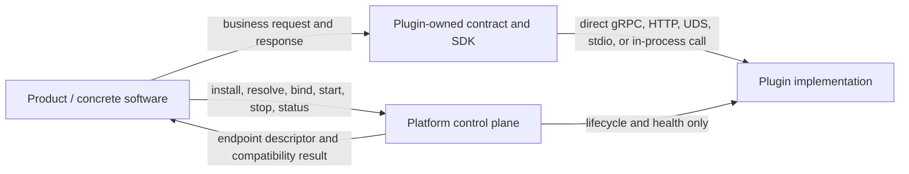

# Platform–Plugin Direct Boundary Remediation Ledger / Platform–插件直连边界修复台账

- **Status / 状态**：`IN_PROGRESS`
- **Started / 开始时间**：2026-09-08
- **Source plan / 来源计划**：`docs/plugins-full-repository-legacy-remediation-plan-2026-09-07.md`
- **Execution rule / 执行规则**：一个仓库同一时刻只有一个 writer；先接管目标，再删除来源；禁止复制出第二份权威。
- **Completion notation / 完成标记**：未完成使用 `- [ ]`；只有验收证据成立后才改为 `- [x] ~~...~~`，并在任务下记录 exact SHA、测试和 CI。
- **CI authority / CI 权威**：Azure Pipelines。GitHub Actions 不作为本轮必需验收证据。

## 1. Goal and non-negotiable rules / 目标与不可妥协规则

This remediation establishes a stable Platform control plane and a direct Product-to-Plugin
data plane. Capability contracts, generated SDKs, TCKs, and implementations evolve with their
real Plugins or Product owners. Ordinary capability work must not require a Platform source
change.

本轮修复建立稳定的 Platform 控制平面和 Product 到 Plugin 的直连数据平面。能力契约、生成 SDK、
TCK 与实现跟随真实 Plugins 或 Product owner 演进。普通能力开发不得要求修改 Platform 源码。

### R1 — No routine Platform co-change / 禁止普通接入伴随修改 Platform

插件或具体软件新增能力、方法、字段、供应商、路由规则或业务状态时，只修改能力 owner 与消费者。
Platform 只在出现至少两个独立消费者共同需要的通用原语，或 Kernel 级不变量时接受一次独立的
`PLATFORM_GAP` 变更。便利性和单一实现需求不构成 Platform gap。

### R2 — Direct business data plane / 业务数据平面直连

具体软件按 Plugins 所有的版本化协议直接调用插件。Platform 不解析、不转换、不持久化、不路由、
不代理 capability payload，也不成为每次业务调用必经的超级中心。Platform 可以管理插件安装、发现、
版本兼容、准入、启动、停止、健康、权限与连接描述，但控制平面返回连接结果后退出业务调用链。

### R3 — Unified management without unified business execution / 统一管理不等于统一执行业务

“接上即用”由标准包、能力清单、契约版本、TCK、兼容性判断和可替换实现实现。统一管理只统一事实与
生命周期，不统一聊天、模型分析、消息、训练、量化、网关或存储请求的执行路径。

### R4 — One authority / 一个能力只有一个权威

共享 capability contract 位于 Plugins 的 contract 层；单实现私有 contract 可与实现同目录；Product
生命周期 contract 位于 Product。迁移期间允许只读兼容桥，但不得在 Platform、Plugins 和 Product 中
同时维护可编辑副本。

## 2. Target topology / 目标拓扑

Platform may return a generic, capability-neutral connection descriptor containing only:

- plugin and binding identity;
- capability id and interface version;
- transport kind and an opaque endpoint reference;
- authentication/secret reference, never a secret value;
- generation, fence or expiry needed to reject stale bindings;
- health and lifecycle facts.

It must not contain or interpret capability request/response schemas.

Platform 可以返回通用且与能力无关的连接描述，但不得包含或解释业务请求/响应结构。

## 3. Ownership matrix / 所有权矩阵

| Surface / 表面 | Canonical owner / 权威 owner | Platform role / Platform 职责 |
| --- | --- | --- |
| CES/WorkerControl transport primitives, process lifecycle, Sandbox, Lease/Fence | Platform | 定义通用控制与生命周期不变量 |
| Capability id, interface version and generic endpoint/binding descriptor | Platform | 校验与返回控制面事实，不代理 payload |
| `model.provider.v1`, `message.connector.v1`, model analyzer, compatibility, engine, gateway and other typed payloads | Plugins | Platform 只把它们视为不透明 capability metadata |
| Generated Python/JVM/.NET/Rust capability SDKs | Plugins or the owning Product | Platform 不生成能力专用 binding |
| Capability conformance TCK | Plugins | Platform 只保留通用控制协议 TCK |
| Concrete capability implementation and provider/vendor adapter | Corresponding Plugin | Platform 不包含实现或 fallback |
| TrainingRun, DatasetVersion, ModelVersion, deployment and conversation state | Corresponding Product | Platform 只保存通用 ArtifactRef 或运行事实 |
| Installation, compatibility result, process health and connection availability | Platform control plane | 不成为业务请求路由器 |

## 4. Current live baselines / 当前远端基线

Do not replace these values from an old report. Refresh them before each repository write phase.
旧报告中的 SHA 只能用于路由；每次进入仓库写入阶段前必须重新读取远端。

| Repository | Integration branch | Exact remote SHA at start | Writer state |
| --- | --- | --- | --- |
| Cyrene-Workspace | `main` | `725478b7b467d3a7a96ead669d49a17228f0e745` | active documentation writer |
| Cyrene-Platform | `develop` | `1b496733d725680dc999f925c99b20c8ecad178a` | read-only until destination contracts exist |
| Cyrene-Plugins-Official | `develop` | `4f730e1f13fbc64b04b533dbf7f4e90d06460604` | next destination writer |

Open PRs observed at start:

- Platform PRs `#28`, `#29` target `main`; stale draft `#23` targets a feature branch and must not be treated as accepted capability authority.
- Plugins PRs `#7`, `#8` target `main` and are dependency updates.
- Workspace had no open PR.

## 5. Current violations and migration inventory / 当前偏差与迁移清单

### 5.1 Platform capability-specific contract surface

- Ten named Rust SPI traits and typed plugin Proto projections: Probe, ModelAnalyzer,
  CompatRule, RuntimeBuilder, ExecutionEngine, TrainingBackend, Quantization, GatewayFilter,
  Notification and Storage.
- `cy-extension-registry`, its ten remote proxies and its Kernel-daemon adapter path.
- `cy-local-transport` and `BuiltinInMemoryStorage`.
- AI/Product records and schemas in `cy-manifest`.
- `model.provider.v1` and `message.connector.v1` Proto, Rust projections and capability TCKs.
- Python `cyrene_capability_client.model_provider_v1` and generated model-provider binding.
- Java `PocNotificationPlugin` and capability-specific worker fixtures/examples.
- `ModelVersion`, training/dataset lineage and closed AI artifact kinds inside the Python
  `cyrene_artifacts` package.
- Python/framework/engine selection policy inside `cyrene_environment`.

### 5.2 Existing destinations in Plugins

| Capability | Existing destination |
| --- | --- |
| `model.analyzer.v1` | `plugins/models/hf-model-analyzer` |
| `compatibility.evaluator.v1` | `plugins/policy/compat-rules` |
| `environment.builder.v1` | `plugins/environment/docker-uv-builder` |
| `execution.engine.v1` | `plugins/engines/*` |
| training helpers/backends | `plugins/training/*` |
| gateway capabilities | `plugins/gateway/*` |
| `model.provider.v1` | `plugins/providers/model-api-connector` |
| `message.connector.v1` | `plugins/connectors/onebot-v11` and other connectors |
| media capabilities | `plugins/tools/media` |

### 5.3 Current cross-repository coupling to remove

- Plugins policy says it implements “Platform contracts” instead of owning capability contracts.
- OneBot binding generation reads the Platform checkout.
- Model-provider code and documentation declare Platform as the schema owner.
- Plugins cross-repository CI checks out Platform for capability conformance.
- Platform release packages capability-specific Python bindings and runs model/message TCKs.

## 6. Protocol migration rules / 协议迁移规则

1. Plugins first creates the canonical capability Proto/schema and publishes or checks in the
   generated language bindings needed by its consumers.
2. Preserve protobuf package names, message names and type URLs during the authority move.
3. New direct APIs use standalone capability messages, not fields added to Platform's generic
   `Invoke` oneof.
4. Exact legacy oneof support, if a live consumer exists, moves into one versioned Plugins
   compatibility bridge. The bridge translates old frames to the direct capability protocol.
5. Removed protobuf field numbers and names are reserved and never reused.
6. Products consume versioned contract artifacts or generated source owned by the capability;
   they do not read another repository's mutable checkout.
7. Platform source is frozen while a Plugin-only minor capability evolution and at least one
   Product consumer are tested. A non-empty Platform diff fails the final zero-change proof.

## 7. Execution tasks / 执行任务

Priority orders execution; every listed task is required. Difficulty uses `S/M/L/XL`.
优先级只决定顺序；所有任务都必须关闭。

### Wave 0 — Durable state and authority / 持久状态与权威

- [x] ~~`BND-000` Capture live baselines and isolate writers~~ — **P0 / S**
  - Evidence: remote SHAs and open PR inventory in section 4; canonical roots were clean and no task worktree remained before this run.
- [ ] `BND-001` Publish this durable remediation ledger — **P0 / S**
  - Acceptance: Workspace `main` contains this file; remote read-back matches the accepted commit.
- [ ] `BND-002` Correct repository ownership policies — **P0 / M**
  - Dependencies: `BND-001`.
  - Work: Platform policy explicitly excludes capability payload contracts; Plugins policy owns
    capability contracts, bindings and TCKs; Workspace pointers route each contract to its owner.
  - Acceptance: policy validators pass and the two repositories do not claim the same authority.

### Wave 1 — Plugins contract authority / Plugins 契约权威

- [ ] `PLG-001` Create the Plugins capability-contract root and versioning rules — **P0 / L**
  - Dependencies: `BND-002`.
  - Acceptance: schema layout, compatibility rules, generation commands and package/version policy
    are independently buildable in Plugins without a Platform checkout.
- [ ] `PLG-002` Move `model.provider.v1` authority and all language TCKs to Plugins — **P0 / L**
  - Dependencies: `PLG-001`.
  - Acceptance: model-api-connector and contract TCKs use the Plugins source; package/type URLs stay
    stable; Azure exact-head succeeds without reading Platform source.
- [ ] `PLG-003` Move `message.connector.v1` authority and all language TCKs to Plugins — **P0 / L**
  - Dependencies: `PLG-001`.
  - Acceptance: OneBot and other connectors generate from the Plugins source; Azure exact-head
    succeeds without a Platform checkout.
- [ ] `PLG-004` Define owner-scoped contracts for the implemented named SPI capabilities — **P0 / XL**
  - Dependencies: `PLG-001`.
  - Work: map only real implementations to model, policy, environment, engine, training, gateway,
    connector and storage contracts. Do not create a replacement monolithic ten-trait crate.
  - Acceptance: every retained API has an owner, at least one consumer, version, TCK and removal or
    compatibility policy; interfaces without a real consumer are removed rather than copied.
- [ ] `PLG-005` Remove normal Plugins builds' Platform source-checkout dependency — **P0 / M**
  - Dependencies: `PLG-002`, `PLG-003`, `PLG-004`.
  - Acceptance: Plugins build/test uses released or repository-owned contract inputs; optional
    cross-repository acceptance is separated from normal component CI.

### Wave 2 — Platform control plane and direct binding / Platform 控制面与直连 binding

- [ ] `PLAT-001` Freeze the direct-call control-plane contract — **P0 / XL**
  - Dependencies: `PLG-001`.
  - Work: define a generic endpoint/binding descriptor and lifecycle flow that lets a Product obtain
    one validated connection then invoke the Plugin directly.
  - Acceptance: no capability payload field appears in the descriptor; stale generation/fence and
    expired credentials fail closed; two unrelated capabilities use the same control contract.
- [ ] `PLAT-002` Separate management APIs from business invocation — **P0 / XL**
  - Dependencies: `PLAT-001`.
  - Work: installation, resolve, bind, start/stop, health and compatibility remain Platform;
    capability invoke/stream paths are no longer the default Product data plane.
  - Acceptance: an integration trace proves Product-to-Plugin request bytes never pass through a
    Platform service process.
- [ ] `PLAT-003` Classify and retire CES as a mandatory business proxy — **P0 / L**
  - Dependencies: `PLAT-002`.
  - Work: inventory live CES consumers; migrate them to direct capability clients; retain CES only
    as an explicitly versioned compatibility adapter if a measured consumer still requires it.
  - Acceptance: no current Product requires CES to execute a capability; compatibility status and
    removal gate are explicit if code remains.

### Wave 3 — Consumer migration / 消费者迁移

- [ ] `CON-001` Migrate Astrbot direct Plugin calls — **P0 / XL**
  - Dependencies: `PLG-002`, `PLG-003`, `PLAT-001`.
  - Acceptance: chat/embedding, media and message-connector paths call Plugin-owned clients directly;
    Platform is used only for management facts; Astrbot Azure CI passes.
- [ ] `CON-002` Migrate Yield, Reactor and Exchange capability calls — **P0 / XL**
  - Dependencies: `PLG-004`, `PLAT-001`.
  - Acceptance: Product domain state remains local; direct Plugin calls use versioned owner contracts;
    each repository's Azure exact-head passes with the same Platform exact SHA.
- [ ] `CON-003` Audit Catalyst, Echo, Navigator and DH-System-Internal — **P1 / L**
  - Dependencies: `PLG-004`, `PLAT-001`.
  - Acceptance: every live Plugin call is direct and owner-scoped; repositories with no call path
    record `NOT_APPLICABLE` evidence rather than a simulated PASS.

### Wave 4 — Remove Platform business surface / 删除 Platform 业务表面

- [ ] `PLAT-004` Remove Platform-owned model/message payload contracts and TCKs — **P0 / L**
  - Dependencies: `PLG-002`, `PLG-003`, relevant consumer migrations.
  - Acceptance: Platform no longer generates or exports either capability schema; generic CES,
    WorkerControl and Kernel contract tests remain green.
- [ ] `PLAT-005` Split non-Rust SDK business code — **P0 / L**
  - Dependencies: `PLG-002`, `PLG-003`, `CON-001`, `CON-002`.
  - Work: remove model-provider Python helpers/bindings, Java Notification POC, capability fixtures,
    Product `ModelVersion`/lineage and environment selection policy from Platform packages.
  - Acceptance: remaining Python/Java/Kotlin/.NET files are Platform control/runtime SDKs, generic
    TCKs or tooling; release policy lists no capability-specific package content.
- [ ] `PLAT-006` Remove named SPI, legacy registry/transport and concrete storage — **P0 / XL**
  - Dependencies: `PLG-004`, `PLAT-003`, consumer migrations.
  - Work: migrate generic identity/fence/sequence validation into the canonical control path; remove
    ten typed SPI/projections, `cy-extension-registry`, `cy-local-transport` and
    `BuiltinInMemoryStorage`; reserve removed wire tags.
  - Acceptance: full Platform build/test passes and no named SPI symbol or production reverse
    dependency remains.
- [ ] `PLAT-007` Split old AI manifest/schema ownership — **P1 / XL**
  - Dependencies: `CON-002`, `PLAT-006`.
  - Acceptance: generic ArtifactRef/runtime facts remain Platform; model/training/checkpoint/product
    records exist only with their Product or capability owner.
- [ ] `PLAT-008` Enforce the clean boundary in CI — **P0 / M**
  - Dependencies: `PLAT-004`, `PLAT-005`, `PLAT-006`, `PLAT-007`.
  - Acceptance: guard scans every workspace Cargo manifest and every non-Rust production source;
    rejects capability-specific schemas/helpers/TCKs, Product identifiers and new Platform data-plane
    proxies; permits generic control contracts and tests.

### Wave 5 — Independent acceptance and clean baseline / 独立验收与纯净基线

- [ ] `ACC-001` Prove Plugins and Products evolve with zero Platform source diff — **P0 / XL**
  - Dependencies: all migration tasks.
  - Acceptance: change one additive capability field/method in Plugins and its Product consumer,
    run their Azure pipelines, and show Platform remains at one exact SHA with no source change.
- [ ] `ACC-002` Prove direct data-plane routing — **P0 / L**
  - Dependencies: `PLAT-002`, consumer migrations.
  - Acceptance: network/process trace or deterministic integration harness proves business payloads
    travel Product-to-Plugin; Platform observes only management/lifecycle facts.
- [ ] `ACC-003` Record `PLATFORM_CONTROL_PLANE_BASELINE` — **P0 / M**
  - Dependencies: `ACC-001`, `ACC-002`, all Platform guards.
  - Acceptance: Platform Azure exact-head green, normal merges complete, remote ancestry read-back
    succeeds, task worktrees and merged branches are removed, and Workspace records the immutable SHA.

## 8. Evidence ledger / 证据台账

| Task | Local checks | Azure run | Merge/read-back | Status |
| --- | --- | --- | --- | --- |
| `BND-000` | live remote/PR/worktree inventory | not applicable | exact SHAs recorded above | `COMPLETE` |
| `BND-001` | pending | pending | pending | `IN_PROGRESS` |

Add one row when a task starts. Never overwrite evidence from another task or report a skipped,
mocked, hosted-only, credential-blocked or not-run path as production acceptance.

任务开始时新增一行。不得覆盖其他任务证据，不得把 skipped、mock、仅 Hosted、凭据阻塞或未运行写成
生产验收通过。

## 9. Resume procedure after context compaction / 上下文压缩后的恢复步骤

1. Read this file in full.
2. Read the source remediation plan only for unresolved audit context; this file is the execution
   state authority for the direct-boundary work.
3. Refresh remote integration-branch SHAs, open PRs, Azure pipeline state and worktree/branch locks.
4. Find the first unchecked task whose dependencies are crossed out.
5. Confirm its repository has no other writer, create one exact task worktree, and execute only that
   task's scope.
6. Update the evidence row; cross out the task only after its stated acceptance and canonical
   read-back are complete.
7. Set the next writer and next atomic task before ending the turn.

恢复后不得从旧 SHA、旧本地分支或口头总结继续；以本文勾选状态和重新读取的远端事实共同决定下一步。
