# Cyrene Full-Repository Legacy Remediation Assignment Plan / Cyrene 全仓遗留问题修复分工计划

- **Source audit / 源审计**：`docs/plugins-full-repository-legacy-audit-2026-09-07.md`
- **Audit snapshot / 审计快照**：2026-09-07
- **Plan status / 计划状态**：Execution in progress; the Platform business-boundary follow-up and its Plugins, Yield, and Reactor ownership moves are closed and read back / 执行中；Platform 业务边界复查及对应 Plugins、Yield、Reactor 权威迁移已关闭并完成远端回读
- **Last status update / 最近状态更新**：2026-09-08
- **Scope / 范围**：Workspace `repositories.yaml` 中 10 个成员仓库，加上 Workspace，共 11 个仓库
- **Completion rule / 完成规则**：本文所有 P0、P1、P2 项均须关闭，才能继续下一阶段开发或建立 current accepted baseline
- **Platform cleanliness target / Platform 纯净目标**：完成一次性适配迁出后，上层软件必须能够基于冻结的
  Platform 通用契约继续开发，不再要求 Platform 随每个产品或插件修改

## 1. Executive summary / 执行摘要

This plan converts every positive finding in the source audit into one uniquely owned,
independently verifiable task. Priority controls execution order, not whether a task is
optional. Work may proceed in parallel across different repositories only after authority
decisions are frozen. A repository may have only one writer at a time. Mock, skipped,
collection-only, hosted-only, or credential-blocked evidence must retain its exact status
and cannot be reported as production acceptance.

本计划把源审计中的每个正向发现映射到一个唯一负责、可独立验收的任务。优先级只决定处理顺序，
不代表低优先级可以遗留。只有在权威决策冻结后，不同仓库的任务才允许并行；同一仓库同一时刻
只能有一个写入者。Mock、skipped、仅完成测试收集、仅 Hosted CI 成功或受凭据阻塞的证据，
必须保持原始状态，不能写成生产验收通过。

源审计是只读快照。执行模型不得直接相信其中的历史 SHA、PR 或 CI 状态。第一个执行动作必须是
读取当前远端 integration branch、default branch、HEAD、开放 PR、CI、Repository Policy 和实际
构建入口，形成新的 exact-SHA 任务基线。

### 1.1 Current execution ledger / 当前执行台账

This table is the duplicate-work guard for completed or claimed work. Models must
read it before accepting a task. A `CLOSED` source task must not be reopened merely
because its environment acceptance remains assigned to T24. A `READ_BACK` task may
only receive the explicitly listed remaining acceptance work unless new source-defect
evidence is recorded first.

下表是已完成或已领取工作的防重复台账。模型领取任务前必须先读取。源码任务已经 `CLOSED` 时，
不能因为环境验收仍属于 T24 就重复修改源码。状态为 `READ_BACK` 的任务只能继续表中明确列出的
剩余验收；若要重新修改源码，必须先登记新的源码缺陷证据。

| Tasks / 任务 | Repository and exact baseline / 仓库与精确基线 | Disposition and owned scope / 处置与独占范围 | State / 状态 | Canonical and CI evidence / 远端与 CI 证据 | Remaining work / 剩余工作 |
| --- | --- | --- | --- | --- | --- |
| T03, T15 | Cyrene-Platform base `8091a53176627e51c507eddae99442be8518849e`; historical close `1fa286c4071546c0d4ebb980fe24675e7f13d79e` | `REMOVE/MOVE/ISOLATE`; Product deployment, compatibility snapshots, empty transports, component duplication, boundary guards, policy/docs/CI | `CLOSED` | [PR #38](https://github.com/DoHorizon-AI/Cyrene-Platform/pull/38) merged; Azure build 440 succeeded; task head `1c9b858ce957e8d5706d21f28d6c2914a6aa3c2e` is an ancestor of remote `develop` | T26 supersedes this historical clean-baseline candidate. Do not reuse `1fa286c4` as the current baseline or repeat its source cleanup. |
| T05, T06, T07, T10, T10A, T10B, T11, T12, T13 | Cyrene-Plugins-Official base `d6117175577720a79a975961e2e7c87e26806531`; canonical `b759e32f0a497020e0f05d3eb1339ef56f81387e` | `REMOVE/SUPPORT/ISOLATE`; legacy shim/catalog truth, simulated results, Custom Script, incomplete plugins, Spring/Python gateways, packaging, Product copies, layered CI | `CLOSED` | [PR #12](https://github.com/DoHorizon-AI/Cyrene-Plugins-Official/pull/12) merged; Azure build 444 succeeded across all eight jobs; task head `f6dca75145219d8c5186891fc46c78ec64518ef6` is an ancestor of remote `develop` | Real GPU, provider-service, and production Docker evidence remains T24 work. Seven Platform-fixture conformance cases passed locally against the clean Platform worktree but were skipped, not passed, in the single-repository Azure lane. Do not repeat the source cleanup. |
| T14 | Astrbot-Rev base `d14d60858a9c6b43b0b68a69a01ac76b69739b8b`; canonical `685978cdff6fb06150e05e7aa9f66ebb87c85f0f` | `MOVE/SUPPORT/ISOLATE`; reusable model/media/OneBot plugin ports, Product-owned .NET boundary, stale compatibility and branch/CI truth | `READ_BACK` | [PR #13](https://github.com/DoHorizon-AI/Astrbot-Rev/pull/13) merged; Azure build 443 succeeded, including 1,073 .NET/PostgreSQL tests; task head `e2bcfc2497d9da4af5aef6f0482d32523f3a08f0` is an ancestor of remote `develop` | Four suites requiring prepared Platform executables and official plugin archives are explicitly `NOT_RUN` in the single-repository lane. T24 owns that cross-repository execution. Do not assign another Astrbot source writer for the same boundary. |
| T26 | Cyrene-Platform base `1fa286c4071546c0d4ebb980fe24675e7f13d79e`; current clean baseline `1b496733d725680dc999f925c99b20c8ecad178a` | `REMOVE/MOVE/ISOLATE`; remaining Product run/preflight/media ownership, consumer tooling/TCKs, Product JVM shell, migration quarantine and return guards | `CLOSED` | [PR #39](https://github.com/DoHorizon-AI/Cyrene-Platform/pull/39) and [PR #40](https://github.com/DoHorizon-AI/Cyrene-Platform/pull/40) merged; Azure builds 463 and 464 succeeded at exact task heads; a new-target full Cargo build passed; both task heads are ancestors of remote `develop` | The implemented v0 typed SPI, registry, local transport, in-memory storage, plugin taxonomy, and AI manifest/schema records remain `MIGRATING_COMPATIBILITY`, build-tested and frozen; every named SPI proto carries the marker and CI prevents its removal. Real GPU, Kubernetes, external-provider and privileged multi-account execution remain T24 work. No new Platform source task without an accepted `PLATFORM_GAP`. |
| T27 | Cyrene-Plugins-Official base `b759e32f0a497020e0f05d3eb1339ef56f81387e`; canonical `4f730e1f13fbc64b04b533dbf7f4e90d06460604` | `MOVE/SUPPORT`; generic worker payload to typed media request adaptation | `CLOSED` | [PR #13](https://github.com/DoHorizon-AI/Cyrene-Plugins-Official/pull/13) merged; Azure build 448 succeeded; 54 cross-repository tests passed at task head `ac6931a2b4de9beacf611d2d54b85e699fd73bf9`, which is an ancestor of remote `develop` | Real external media-provider execution remains T24. Do not recreate media conversion in Platform or Product hosts. |
| T28 | Cyrene-Yield base `c71057f69a8f744c02110c0942a70d69254c7fce`; canonical `0f402e0fff5d07a001d90f97c35e211ffd1875b0` | `MOVE/SUPPORT`; Product run/attempt/retry/persistence and Product model-analysis/compatibility-preflight contracts | `CLOSED` | [PR #11](https://github.com/DoHorizon-AI/Cyrene-Yield/pull/11) merged; Azure build 461 succeeded at task head `292971f6907294d59184d3a390c97974804b33aa`; canonical Azure build 462 also succeeded | Self-hosted GPU training remains T24. Do not reintroduce Product lifecycle or model-policy requests into Platform preflight. |
| T29 | Cyrene-Reactor base `3b8d4e922ed65b179e14176583c89edaced37636`; canonical `997078c4b9fedb9b99bfbe485dd036fbf4497630` | `SUPPORT`; consume the generic Platform runtime profile without a Platform source change | `CLOSED` | [PR #12](https://github.com/DoHorizon-AI/Cyrene-Reactor/pull/12) merged; Azure build 450 succeeded at task head `e8315050730c45dafbdd44cfb33bdc26dd34d915`, which is an ancestor of remote `develop` | Real GPU serving remains T24. Future Reactor profiles must compose the generic Platform runtime contract without Product-specific Platform names. |
| T24 | Cross-repository acceptance coordinator | Exact-head environment execution only; no source ownership | `OPEN` | Source CI evidence above is immutable routing input | Run and record the Platform/Plugins/Astrbot fixture lane plus remaining real hardware and external-service evidence. Return a failure only to its unique source task when it proves a source defect. |

## 2. Remediation outcomes / 合法关闭方式

每个发现必须在中央台账中选择并完成下列一种处置：

| Outcome / 处置 | Definition / 定义 | Required evidence / 必需证据 |
| --- | --- | --- |
| `REMOVE` | 删除旧实现及其可达入口、能力声明和当前文档引用。 | 不可达 guard、删除 diff、相关回归测试。 |
| `MOVE` | 能力迁至唯一的新 owner，旧 owner 不再提供活动实现。 | 新 owner 的契约与验收、旧 owner 删除证明、跨仓集成测试。 |
| `SUPPORT` | 将能力作为正式支持面补全。 | 可加载入口、可调用方法、包内容、针对性测试和所需真实环境证据。 |
| `ISOLATE` | 保留为 compatibility、prototype 或 simulated profile。 | 生产不可达、状态显式、owner、消费者、最后支持版本、调用量和 removal gate。 |

只把状态降为 `DECLARED` 只能解决真值失真。若旧实现仍然可达，还必须完成 `REMOVE`、`MOVE`、
`SUPPORT` 或 `ISOLATE`。无法取得真实环境证据的能力必须降级、隔离或撤销生产声明。

### 2.1 Platform clean-boundary goal / Platform 纯净边界目标（P0 / XL）

Platform 的目标状态是只拥有跨产品稳定的通用契约和运行时原语，包括 CES、WorkerControl、Sandbox、
Lease/Fence、ArtifactRef 与通用 transport contract。可独立安装并被多个产品复用的 backend/protocol adapter
属于 Plugins；某个产品的 composition、部署模板、源码快照和兼容版本适配属于该 Product 或其 integration
repository。两类适配都不能放进 Platform。

本轮允许对 Platform 做一次性清理，但范围限于：迁出或删除产品适配和兼容快照、删除无实现占位、
补边界 guard，以及修正文档和 Repository Policy 真值。清理结束后登记 `PLATFORM_CLEAN_BASELINE`；
其后的上层软件任务必须在该 exact SHA 上完成，不得把“需要同时修改 Platform”作为普通接入方式。

适配迁移必须遵循 destination-first 顺序：

1. 在中央台账登记旧路径、真实消费者、目标仓库、目标路径和处置类型；无真实消费者的适配直接删除。
2. 先由目标仓库 writer 接管源码、配置、生成器和测试，并证明它能基于现有 Platform 契约独立工作。
3. 再由 Platform writer 删除旧副本和入口；禁止在 Plugins 或新的 shared compatibility 目录中再复制一份。
4. 为 Platform 增加仓库边界检查，阻止产品名称、产品 manifest、产品部署模板和 compatibility snapshot 回流。

若现有 Platform 确实缺少通用原语，必须建立独立的 `PLATFORM_GAP` 决策项，给出至少两个独立消费者
或 Kernel 级不变量作为依据，并与适配迁移分开交付。单一产品或单一插件的便利需求不能扩大 Platform API。

### 2.2 Gateway and migration disposition / Gateway 与迁移处置（P0 / XL）

本轮 Gateway 清理采用以下已确认处置，执行模型不得重新解释为删除全部 Gateway：

1. Java/Kotlin 保留可独立使用的对话、租户和计费能力。对话使用行业通用的 OpenAI-compatible
   `POST /v1/chat/completions` 请求/响应；租户和计费使用常规 Spring Boot REST 路径、状态码和
   JSON DTO。三个功能分模块启用，可继续归类在 `plugins/gateway/spring/` 下。
2. Spring Gateway 删除 Training、Deployment、Custom Script、Dataset lifecycle 等 Product authority，
   不再携带旧训练/推理 protobuf 或自行启动 worker 的实现。
3. Python Gateway 不删除，收敛为最小、可运行、仅 Python 的模块化 Gateway。认证、路由、上游调用、
   错误映射和生命周期通过小型接口注入并可替换；默认实现简单且 fail closed，不复制 Astrbot worker/.NET Host。
4. Astrbot .NET Host 先建立复用矩阵。只有跨产品重复出现、边界独立且能通过 Generic contract/TCK 的能力
   才提取为标准插件；Dashboard、Iris、Astrbot storage/pipeline/composition 等产品实现留在 Astrbot。
5. 完全没有具体实现的旧插件执行 `REMOVE`。存在具体实现但尚未完成标准化的插件保留代码，统一标为
   `MIGRATING`，从 `RESOLVED`/`CI_VERIFIED` 和生产能力声明中退出，直到独立入口、包和 TCK 全部通过。

配套 README、Catalog、Lifecycle、Boundary Registry、migration marker、测试矩阵和 CI 必须与上述状态
同步更新；`MIGRATING` 不能被默认 CI、mock 或 test collection 计为可用能力。

## 3. Priority and difficulty / 优先级与难度

| Mark / 标记 | Meaning / 含义 |
| --- | --- |
| `P0` | 假成功、重复 authority、错误分支、进程监管边界或最终验收阻断项。 |
| `P1` | 兼容面、打包、产品声明、生产 profile、CI 覆盖和治理漂移。 |
| `P2` | 质量债务、vendored 治理和历史资料；仍须在最终 gate 前关闭。 |
| `S` | 单仓、少量文件、行为边界明确。 |
| `M` | 单仓多文件或需要补针对性测试。 |
| `L` | 跨语言、构建系统、CI 或兼容性决策。 |
| `XL` | 跨仓迁移、authority 收敛或真实环境验收。 |

## 4. Dependency graph / 依赖关系

```mermaid
flowchart LR
    T00[T00 Current truth lock] --> T01[T01 Authority decisions]
    T01 --> T02[T02 Assignment ledger and write locks]
    T02 --> P0[P0 repository remediation]
    P0 --> P12[P1 and P2 compatibility and governance]
    P12 --> WS[T23 Workspace truth projection]
    WS --> ACC[T24 Exact-head and environment acceptance]
    ACC --> BASE[T25 Canonical baseline read-back]
```



`T00 → T01 → T02` 必须串行。T02 完成后，仓库之间可以并行；同一仓库内的任务仍须按本文
给出的顺序串行。

## 5. Wave 0: truth and authority / 第 0 批：真值与权威

### T00 Current-state lock / 当前事实锁定（P0 / M）

- **Writer scope / 写入范围**：无；全程只读。
- **Work / 工作**：实时读取 11 个仓库的远端 integration/default branch、HEAD、开放 PR、
  required checks、Hosted CI、Repository Policy、实际构建入口和 package units。
- **Deliverable / 交付物**：每仓一条 exact-SHA 基线，注明 source CI、凭据、硬件和外部服务状态。
- **Acceptance / 验收**：历史报告中的 SHA 只作定位线索；所有后续任务引用同一份当前基线。

### T01 Authority and disposition decision record / 权威与处置决策（P0 / L）

- **Writer scope / 写入范围**：仅 Workspace 中的决策记录；不修改成员仓库代码。
- **Work / 工作**：冻结 DH integration authority、remote default 与 integration branch 的区别、
  跨仓 owner、模拟状态模型，以及每个不完整插件的 `REMOVE/MOVE/SUPPORT/ISOLATE` 选择。
- **Prepared default / 建议默认值**：
  - Platform 拥有通用受管执行、进程与环境隔离、Lease/Fence。
  - Platform 不拥有具体产品、协议、第三方平台或部署形态的适配；通用可安装 adapter 归 Plugins，
    产品 composition、部署模板和兼容源码归实际 Product/integration repository。
  - Yield 拥有 TrainingRun 生命周期。
  - Reactor 拥有部署、Serving 生命周期和选择策略。
  - Plugins 拥有具体 backend adapter。
  - Exchange 拥有路由、发布和 Product gateway seam。
  - Astrbot-Rev 是 Astrbot/NapCat Kubernetes renderer、部署模板及 Astrbot T2I/Shiki 兼容资产来源；
    Platform 中相应副本在目标仓完成验收后删除。
  - GitHub 成员仓库把 `remote_default_branch: main` 与 `integration_branch: develop` 分开表达。
  - DH 优先评估 `develop` 作为 integration authority，最终选择必须以 T00 的实时事实和治理决定为准。
- **Acceptance / 验收**：任何执行模型都无需再次自行推导 owner 或处置类型。

### T02 Assignment ledger and repository write locks / 分发台账与仓库写锁（P0 / M）

- **Writer scope / 写入范围**：中央任务台账。
- **Required fields / 必填字段**：任务 ID、源审计章节/行号、repository、allowed paths、
  forbidden paths、处置类型、依赖、执行模型、base SHA、状态、测试、未运行项、提交/PR、canonical read-back。
- **State model / 状态模型**：`OPEN → CLAIMED → IMPLEMENTED → VERIFIED → MERGED → READ_BACK → CLOSED`。
- **Acceptance / 验收**：一个发现只能对应一个任务 ID；一个仓库同一时刻只能存在一个 `CLAIMED` writer。

## 6. Wave 1: P0 remediation / 第 1 批：P0 修复

### T03 Platform contract freeze and zero-change extension / Platform 契约冻结与零改动扩展（P0 / L）

- **Repository**：Cyrene-Platform。
- **Work / 工作**：冻结现有 CES、WorkerControl、Sandbox、Lease/Fence 和通用 transport contract；
  用契约测试证明环境白名单、取消、日志、资源限制和失败传播边界。禁止为 Custom Script、Astrbot 或
  其他单一消费者新增专用 RPC、命令、manifest 字段或运行时分支。发现真实通用缺口时只登记独立
  `PLATFORM_GAP`，不得在本任务顺手实现。
- **Acceptance / 验收**：调用方不再拥有通用进程监管；至少一个 Plugin 和一个 Product 能基于冻结的
  exact SHA 接入且不产生 Platform 源码 diff；形成供 T15 写入的 `PLATFORM_CLEAN_BASELINE` 候选。

### T04 DH authority and fail-closed providers / DH 权威与连接器收口（P0 / XL）

- **Repository**：DH-System-Internal。
- **Dependencies / 依赖**：T00、T01。
- **Work / 工作**：统一分支权威；模型基类未实现操作 fail closed；Azure capability 不再凭配置字段
  报健康；Catalog/UI 只公布已配置且可用的 action；把“骨架完成”与“能力完成”分开；补 pipeline 定义。
- **Acceptance / 验收**：不存在正常 final chunk 的 `not implemented`、成功空 embedding、虚假 health 或
  `null` capability service；exact-head pipeline 可排队。

### T05 Plugins shim and catalog truth / Plugins Shim 与 Catalog 真值（P0 / XL）

- **Repository**：Cyrene-Plugins-Official。
- **Exclusive paths / 独占范围**：Agent System、Skills Runtime、IM、Content Safety、Model Routing、MCP
  六个旧 shim，以及 Catalog、Lifecycle、Evidence Validator、inventory/backlog；Python Gateway 由 T10B 独占。
- **Work / 工作**：完全没有具体实现的 shim 删除；存在具体实现的 shim 保留源码并统一标为 `MIGRATING`，
  取消可安装、`RESOLVED`、`CI_VERIFIED` 与生产能力声明。Catalog Set 状态与运行性一致；Lifecycle 覆盖
  全部活动插件；Evidence Validator 只声明其实际验证的 metadata 或读取不可变 CI ledger。
- **Acceptance / 验收**：不存在“入口不可加载但状态 `RESOLVED`”；六个旧 shim 均有唯一关闭处置，
  Python Gateway 状态只由 T10B 更新。

### T06 Plugins simulated-success closure / Plugins 模拟成功关闭（P0 / L）

- **Repository**：Cyrene-Plugins-Official。
- **Exclusive paths / 独占范围**：TensorRT-LLM、Seedance、Docker UV Builder 的运行行为与结果类型。
- **Work / 工作**：真实模式缺依赖时 fail closed；mock 必须显式启用；结果强制标注
  `REAL/SIMULATED/NOT_RUN`；模拟测试和真实 GPU/服务/daemon 验收分账。
- **Acceptance / 验收**：不存在模型目录缺失、无生成配置或无 Docker daemon 却返回普通成功的路径。

### T07 Plugins Custom Script boundary / Plugins Custom Script 边界恢复（P0 / XL）

- **Repository**：Cyrene-Plugins-Official。
- **Dependencies / 依赖**：T03。
- **Exclusive paths / 独占范围**：Custom Script 插件运行实现及其测试。
- **Work / 工作**：建议默认删除当前无真实消费者的实现；若 T01 登记了真实 owner，则删除插件直接拥有的
  `Popen`、线程、轮询、kill/terminate 和父环境复制，由消费仓库的领域适配调用冻结的 Platform/CES
  契约。日志解析和 pipe reader 异常不得静默吞掉，且不得以此需求修改 Platform。
- **Acceptance / 验收**：删除处置证明不可达；迁出处置则需取消、失败、环境隔离和日志可观测性测试通过，
  Plugin/消费仓只拥有领域适配状态，Platform 相对冻结 SHA 无新增源码 diff。

### T08 Reactor Hybrid and engine ownership / Reactor Hybrid 与 engine owner 收口（P0 / XL）

- **Repository**：Cyrene-Reactor。
- **Dependencies / 依赖**：T01；具体绑定可依赖 T06。
- **Work / 工作**：移除或正式弃用旧 backend aliases；删除捕获任意异常的 Hybrid fallback，或改成只处理
  明确 `backend unavailable` 的可审计 placement policy；移除 Reactor 内第二份 concrete TensorRT authority。
- **Acceptance / 验收**：Reactor 只拥有 Product lifecycle/selection；具体 backend 通过一个插件契约注入；
  模型、权限和配置错误不会触发静默换 backend。

### T09 Exchange training/custom-script authority removal / Exchange 训练与脚本 authority 迁出（P0 / XL）

- **Repository**：Cyrene-Exchange。
- **Dependencies / 依赖**：T01、T03，以及已确认的 Yield seam。
- **Work / 工作**：删除 coordinator 中训练和 Custom Script 服务注册、队列、worker 选择与调用；保留的
  gateway 只消费 Yield/Platform 契约。
- **Acceptance / 验收**：生产 composition root 不再暴露 Exchange 自有 TrainingRun 或通用脚本生命周期。

## 7. Wave 2: compatibility, packaging, and product truth / 第 2 批：兼容、打包与产品真值

### T10 Plugins incomplete capability claims / Plugins 不完整能力声明（P1 / XL）

- **Repository**：Cyrene-Plugins-Official。
- **Exclusive paths / 独占范围**：ASP.NET Gateway、Prompt Cache、Circuit Breaker、Dataset Validator、
  Distributed DeepSpeed；Spring 与 Python Gateway 分别由 T10A、T10B 独占。
- **Work / 工作**：删除只有健康检查和统一 `503` 的 ASP.NET Gateway 空壳；其余插件若有具体实现则
  收缩名称、manifest、catalog 和生产状态并标为 `MIGRATING`，若没有具体实现则删除。CSV 声明与实现一致；
  空断言、固定业务值和未闭环 TODO 不得继续支持 `RESOLVED` 或生产声明。
- **Acceptance / 验收**：代码、名称、manifest、测试和实际能力完全一致。

### T10A Spring modular gateway / Spring 模块化 Gateway（P0 / XL）

- **Repository**：Cyrene-Plugins-Official。
- **Exclusive paths / 独占范围**：`plugins/gateway/spring/**`。
- **Work / 工作**：把 Spring 目录收敛为可分别启用的 Conversation、Tenant、Billing 模块；Conversation
  只公开 OpenAI-compatible chat API，Tenant/Billing 使用常规 Spring Boot REST DTO。删除 Training、
  Deployment、Custom Script、Dataset lifecycle、自管 worker、旧 protobuf 和相应配置、文档、测试。
- **Acceptance / 验收**：三个模块可独立构建和测试；常见客户端可直接调用 `/v1/chat/completions`；
  Spring 源码和产物中不存在训练/部署 lifecycle authority。

### T10B Python modular gateway / Python 模块化 Gateway（P0 / L）

- **Repository**：Cyrene-Plugins-Official。
- **Exclusive paths / 独占范围**：`plugins/gateway/python/**`。
- **Work / 工作**：实现最小可运行的 Python Gateway；用 typed protocol/ABC 分离认证、路由、上游 transport、
  错误映射和生命周期，提供可替换默认组件与 application factory。删除 Astrbot .NET/Python worker compatibility
  snapshot，补 package、入口、健康检查、请求路由、关闭和组件替换测试。
- **Acceptance / 验收**：wheel 安装后 entrypoint 可加载；默认配置 fail closed；测试能替换每个模块且不修改
  Gateway core；范围保持纯 Python，不要求 Platform 或 Astrbot 改动。

### T11 Plugins package and release contract / Plugins 打包与发布契约（P1 / L）

- **Repository**：Cyrene-Plugins-Official。
- **Exclusive paths / 独占范围**：构建元数据、wheel 内容、Wrapper、版本约束、release workflow。
- **Work / 工作**：修复 Seedance 空 wheel；确定 manifest 随包分发的唯一机制；为 11 个无构建元数据插件
  明确源码型或 package contract；修复 .NET/Java/Gradle Wrapper 版本矛盾；release 声明与 workflow 对齐。
- **Acceptance / 验收**：独立构建产物含预期 payload 和 metadata；声明的构建命令可从干净环境执行。

### T12 Plugins non-shim compatibility trees / Plugins 非 Shim 兼容树（P1 / XL）

- **Repository**：Cyrene-Plugins-Official。
- **Dependencies / 依赖**：T01、T10A、T10B、T14，以及 T02 中登记的其他目标仓接管任务。
- **Exclusive paths / 独占范围**：ASP.NET compatibility、Model Provider compatibility、Media compatibility、
  Seedance Java sample，以及相应 migration markers 和重复资产。
- **Work / 工作**：Plugins 只保留可独立安装、具备 Generic contract/TCK 且可被多个产品复用的 adapter。
  产品源码、composition、部署模板和 compatibility snapshot 必须按 destination-first 规则迁回真实消费仓，
  无消费者则删除；Plugins 不再维护 Astrbot、Shiki/T2I 或其他产品的私有副本。
- **Do not duplicate / 禁止重复**：T05 已负责另外七个 shim；本任务不得再次修复其实现。
- **Acceptance / 验收**：审计登记的 11 组 Plugins 兼容路径由 T05 和 T12 各自唯一覆盖；Plugins 中没有
  以 compatibility 名义保留的产品源码仓库副本。

### T13 Plugins layered quality and CI / Plugins 质量与分层 CI（P1 / L）

- **Repository**：Cyrene-Plugins-Official。
- **Dependencies / 依赖**：T05、T06、T07、T10、T10A、T10B、T11、T12。
- **Work / 工作**：先对 Generic implementation paths 建立 Ruff/format gate；兼容和生成路径只能使用
  有理由、有截止条件的排除；默认 pytest 不再代表全仓测试；Spring、.NET、Agent、Skills、Gateway worker
  和新增插件进入明确矩阵；同时保留固定 accepted SHA 与 current compatibility 两类跨仓 gate。
- **Acceptance / 验收**：CI 输出能区分每一测试层实际覆盖的能力，skipped/mock 不计入真实通过数。

### T14 Astrbot compatibility product / Astrbot compatibility 产品（P1 / XL）

- **Repository**：Astrbot-Rev。
- **Work / 工作**：先按实际调用点把 .NET Host 功能分为 `GENERIC_PLUGIN_CANDIDATE`、`PRODUCT_OWNED`、
  `OBSOLETE`；候选项必须证明跨产品复用、独立配置/状态和 Generic contract/TCK，才交给 Plugins 的 T12
  标准化。其余实现保留或迁回 Astrbot 后再清理重复副本。另依据真实消费者决定 `python-compat` 去留，
  接管 Astrbot/NapCat Kubernetes renderer、manifests、NGINX/Docker templates，以及 Platform/Plugins 中
  仍需保留的 Astrbot 产品源码和 T2I/Shiki 资产；清理 Policy 与陈旧 marker。
- **Acceptance / 验收**：旧 Python 与 .NET 主路径不再双向演进；兼容镜像有明确 removal gate 或已删除；
  每个 .NET 提取项有消费者与 TCK，Product-owned 代码没有复制到 Plugins；Astrbot 部署和兼容资产能基于
  冻结的 Platform exact SHA 独立构建、渲染和验收。

### T15 Platform adapter evacuation and clean baseline / Platform 适配迁出与纯净基线（P0 / XL）

- **Repository**：Cyrene-Platform。
- **Dependencies / 依赖**：T03、T14，以及 T02 中所有 Platform 适配目标仓任务。
- **Work / 工作**：按 destination-first 台账删除已由消费仓接管的适配；删除无人消费的兼容快照；
  Platform 不再跟踪 Astrbot/NapCat Kubernetes renderer、manifests、NGINX/Docker templates 或其他
  产品部署资产。删除无实现 transport 类型或登记 ABI deprecation/removal version；JVM skeleton 不得
  成为成功测试，完整 wire-protocol lifecycle 进入独立环境 gate；标记历史报告并修 Policy 元数据。
  增加边界检查，阻止产品标识和 compatibility snapshot 再次进入 Platform。
- **Acceptance / 验收**：Platform 产品适配文件为零，跨仓 renderer 不再重复；目标仓 exact-head 验收通过；
  JVM 全链路在真实执行前保持 `NOT_RUN`；登记 accepted `PLATFORM_CLEAN_BASELINE`，后续 Plugins/Product
  修复均基于该 SHA 且不再要求 Platform 伴随修改。

### T16 Reactor Pro and sidecar truth / Reactor Pro 与 sidecar 真值（P1 / L）

- **Repository**：Cyrene-Reactor。
- **Dependencies / 依赖**：T08。
- **Work / 工作**：模拟 LoRA、占位 token count 和零值 telemetry 退出 production profile；若保留则强制
  `SIMULATED`；修复 sidecar 未发送/未应用反馈的声明；删除不存在的 Backup/enterprise bundle 当前引用；
  修 Policy 元数据。
- **Acceptance / 验收**：模拟状态不会更新为普通成功，也不能成为 Reactor 生产能力证据。

### T17 Yield current contract truth / Yield 当前契约真值（P1 / M）

- **Repository**：Cyrene-Yield。
- **Work / 工作**：删除 README 中陈旧 Platform SHA 和不存在路径；依赖 SHA 进入机器可验证 lock/ledger；
  关闭或诚实登记 Configure RPC gap；修 build/branch/Policy 元数据。
- **Acceptance / 验收**：README 只指向存在且当前的契约；机器 gate 与文档使用同一依赖 authority。

### T18 Yield LLaMA Factory governance / Yield LLaMA Factory 治理（P2 / XL）

- **Repository**：Cyrene-Yield。
- **Dependencies / 依赖**：T01、T17。
- **Work / 工作**：建立 upstream commit、许可证/通知、Cyrene patch queue、允许保留/禁用模块清单、
  更新流程和回归矩阵；决定它是受管理的 Official engine/plugin dependency，还是 Yield 明确拥有的 fork。
- **Acceptance / 验收**：上游 TODO、空文件和非训练模块均能由 provenance/裁剪规则解释；禁止无依据批量删除。

### T19 Exchange remaining drift / Exchange 其余漂移（P1 / L）

- **Repository**：Cyrene-Exchange。
- **Dependencies / 依赖**：T09。
- **Work / 工作**：修正所有已删除 `legacy/` 的当前文档；证明或修复 gRPC cancellation 的底层资源释放；
  旧 token validator 移入 test adapter 或增加 removal version；删除不存在的 Cargo 声明；修 Policy 元数据。
- **Acceptance / 验收**：文档、构建系统、取消语义和 production builder 与实际代码一致。

### T20 Catalyst contract and truth cleanup / Catalyst 契约与真值清理（P1 / M）

- **Repository**：Cyrene-Catalyst。
- **Work / 工作**：移除 `cyrene-artifacts`、lock 文件和 Azure 对 Platform 源码的 checkout/guard；用
  Catalyst 自有且可替换的 Artifact Plane 适配器输出开放 `ArtifactRef` 线协议；Product schema 不再复制
  闭合的 Platform Product 分类；删除旧训练语料目录声明；README/API 改为当前 DatasetVersion/样例事实；
  登记实际 pyproject/wheel、visibility 和 branch 元数据。只改 Catalyst 消费端，不为此恢复或修改
  Platform Product API。
- **Acceptance / 验收**：没有 `ArtifactKind.DATASET` 等已删除常量或闭合 kind 投影；Azure exact-head
  针对当前 Artifact 契约成功；没有当前文档指向已删除路径，实际构建入口被 Workspace verifier 覆盖。
- **Candidate / 候选**：PR `#7`，`c510e06244466d6aca0d4cbc5815a77fc10c81e8`；Azure
  `#526` exact-head 成功。真实 Yield/Echo 远程交接保持 `WIRED_NOT_RUN`。合并与远端回读前 T20 不划掉。

### T21 Echo contract and truth cleanup / Echo 契约与真值清理（P1 / M）

- **Repository**：Cyrene-Echo。
- **Work / 工作**：移除 `cyrene-artifacts`、lock 文件和 Azure 对 Platform 源码的 checkout/guard；用
  Echo 自有且可替换的 Artifact Plane 适配器输出开放 `ArtifactRef` 线协议；Product schema 不再复制
  闭合的 Platform Product 分类；删除 Navigator legacy feedback 引用；修 owner/职责、pyproject/wheel、
  visibility 和 branch 元数据；真实 Exchange judge 在取得凭据前保持 `WIRED_NOT_RUN`。只改 Echo
  消费端，不恢复 Platform Product API。
- **Acceptance / 验收**：没有 `ArtifactKind.DATASET` 等已删除常量或闭合 kind 投影；Azure exact-head
  针对当前 Artifact 契约成功；不存在以凭据缺失路径冒充通过的证据，Policy 与当前产品职责一致。
- **Candidate / 候选**：PR `#8`，`dd34cdd7cccdab1b7cf441b0b2d645c603622264`；Azure
  `#528` exact-head 成功。真实 Exchange judge 保持 `WIRED_NOT_RUN`。合并与远端回读前 T21 不划掉。

### T22 Navigator Platform decoupling and prototype isolation / Navigator Platform 解耦与原型隔离（P0 / L）

- **Repository**：Cyrene-Navigator。
- **Work / 工作**：生产 `EchoHandoff` 改用 Navigator 自有且可替换的 Artifact Plane 适配器与开放
  artifact kind；删除无消费者的 `cy-manifest`、旧 typed SPI、`legacy-dh` 和 Platform ModelVersion
  当前声明；普通构建不再 checkout Platform 源码；Windows mock 可执行物退出 release profile，或注入
  真实 Session/Exchange adapter；补全 Python、Cargo、.NET、NPM 构建和 package 元数据；修 Policy。
- **Acceptance / 验收**：生产和普通构建均不依赖旧 Platform Product API 或 Platform 源码 checkout；
  Navigator 到 Echo/Plugin 的业务调用保持直连；release artifact 不再直接绑定 mock service；prototype
  状态明确且生产不可达。整个任务不得修改 Platform 源码。
- **Candidate / 候选**：PR `#6`，`12199b30cccf3fafc2c42a024211e837ade6fe96`；Azure
  `#533` exact-head 成功。真实远程 Echo 交接不由本任务冒充为已运行。合并与远端回读前 T22 不划掉。

### T23 Workspace truth projection / Workspace 真值投影（P1 / L）

- **Repository**：Cyrene-Workspace。
- **Dependencies / 依赖**：所有仓库本地真值任务完成。
- **Exclusive paths / 独占范围**：`repositories.yaml`、数据库治理、当前产品/架构文档；暂不更新
  `governance/accepted-baseline.yaml`。
- **Work / 工作**：同步 visibility、remote default、integration branch、build systems 和 package units；
  删除 Navigator `legacy-dh` 数据库 authority；把旧 `plugin.toml` V1 表述改为当前 canonical manifest；
  修 PRODUCTS 和架构报告中的 TensorRT、Hybrid、Custom Script 沙箱、网关与 Plugins 过度声明。
- **Acceptance / 验收**：Workspace verifier 从实际仓库入口得出同一套当前事实。

### T26 Platform remaining business-authority evacuation / Platform 剩余业务权威迁出（P0 / XL）

- **Repository**：Cyrene-Platform。
- **Dependencies / 依赖**：T14、T27、T28。
- **Work / 工作**：迁出 Product run、attempt、retry、persistence、模型分析与兼容性策略、媒体请求适配；
  删除 Product JVM shell、消费仓工具链和跨仓具体 TCK；为必须暂存的已实现 v0 compatibility surface
  统一标注 `MIGRATING_COMPATIBILITY` 并阻止新增生产依赖。
- **Acceptance / 验收**：Platform 只保留 Artifact/Runtime/Environment、Node/Resource facts、CES、
  WorkerControl、Placement、Lease/Fence、Sandbox、通用 resolver 和 wire contracts；从新 target 目录完成
  全工作区构建，全部语言门禁通过，正常合并并回读 current `PLATFORM_CLEAN_BASELINE`。
- **Status / 状态**：`CLOSED`；证据见 §1.1，其他模型不得重复领取这些源码路径。

### T27 Plugins media worker adaptation / Plugins 媒体 worker 适配接管（P0 / L）

- **Repository**：Cyrene-Plugins-Official。
- **Dependencies / 依赖**：T12，且必须先于 T26 删除 Platform 副本。
- **Work / 工作**：由可安装 media plugin 接管通用 worker payload 到 image/audio typed request 的严格转换，
  保留直接 typed API 和错误语义。
- **Acceptance / 验收**：跨仓 conformance 与插件测试通过，Platform 不再识别媒体 operation 名称或请求类。
- **Status / 状态**：`CLOSED`；证据见 §1.1，真实 provider 环境仍属于 T24。

### T28 Yield Product lifecycle and preflight ownership / Yield 产品生命周期与预检权威（P0 / XL）

- **Repository**：Cyrene-Yield。
- **Dependencies / 依赖**：T17，且必须先于 T26 删除 Platform 副本。
- **Work / 工作**：接管 Python Product run/attempt/retry/persistence、JVM migration snapshot，以及模型分析、
  VRAM 和兼容性策略的 request/result 与 replaceable ports；Platform preflight 只提供通用资源事实和结果。
- **Acceptance / 验收**：Python 契约/训练套件和 JVM snapshot 在 task head 与 canonical merge 上通过 Azure；
  Platform 删除 Product store、reconciler 和 policy types。
- **Status / 状态**：`CLOSED`；证据见 §1.1，自托管 GPU 训练仍属于 T24。

### T29 Reactor generic runtime-profile consumption / Reactor 通用运行时 profile 消费（P1 / M）

- **Repository**：Cyrene-Reactor。
- **Dependencies / 依赖**：T03。
- **Work / 工作**：把 Product 命名的 Platform runtime profile 改为通用 profile，由 Reactor 负责 Product
  serving 组合和选择策略。
- **Acceptance / 验收**：Reactor bootstrap 测试和 Azure source CI 通过，接入没有产生 Platform 源码 diff。
- **Status / 状态**：`CLOSED`；证据见 §1.1，真实 GPU serving 仍属于 T24。

## 8. Wave 3: acceptance and canonical close / 第 3 批：验收与 canonical 关闭

### T24 Full exact-head acceptance matrix / 全仓 exact-head 验收矩阵（P0-final / XL）

- **Writer scope / 写入范围**：只运行、部署和收集证据；不得顺手修改业务源码。
- **Dependencies / 依赖**：T03 至 T23，以及执行期新增并登记的 T26 至 T29。
- **Work / 工作**：对 11 个 canonical exact heads 运行 source CI；建立并排队 DH pipeline；将真实 GPU、
  Docker daemon、DeepSpeed、凭据、Windows 原生构建、JVM 和其他 skipped 环境测试分别记账；GitHub
  付款/额度导致的 0-step failure 保持 CI 环境阻塞分类。
- **Acceptance / 验收**：每个活动生产能力都有所需真实证据；无法运行者已经回到前序任务降级、隔离或撤销。

### T25 Accepted baseline and remote read-back / Accepted baseline 与远端回读（P0-final / M）

- **Repository**：Cyrene-Workspace。
- **Dependencies / 依赖**：T24。
- **Work / 工作**：区分不可变历史 baseline 与 current accepted baseline；在 required checks 通过并正常
  合并后，fetch 远端、验证 ancestry 和 canonical 文件回读，再更新当前集合。
- **Acceptance / 验收**：所有审计发现均为 `CLOSED`；baseline 指向远端 canonical accepted commits，
  而不是本地提交、Draft PR 或合并前源码树。

## 9. Repository writer allocation / 仓库写入分配

下表用于同事分配模型。同行任务必须串行，不得同时启动 writer：

| Repository / 仓库 | Ordered tasks / 串行任务 | Parallel rule / 并行规则 |
| --- | --- | --- |
| Workspace | T01 → T02 → T23 → T25 | T01/T02 完成后可等待成员仓库；T23/T25 必须分别在依赖完成后执行。 |
| Platform | T03 → T15 → T26 | T26 已在 T27/T28 目标仓接管后关闭；Platform 现以 T26 canonical SHA 进入零随动修改状态。 |
| Plugins | T05 → T06 → T07 → T10 → T10A → T10B → T11 → T12 → T13 → T27 | 建议一个模型连续负责；T27 已关闭，禁止重新在 Platform 或 Product host 实现媒体转换。 |
| DH | T04 | 可在 T01 后独立执行。 |
| Reactor | T08 → T16；T29 已关闭 | T08 的绑定决策依赖 T01，可能等待 T06；后续 profile 继续消费 T29 的通用 Platform 名称。 |
| Exchange | T09 → T19 | T09 等待 Platform/Yield seam；T19 不得提前修改相同 composition/docs。 |
| Yield | T17 → T28 → T18 | T28 已关闭；T18 继续串行处理 vendored engine 治理，不得回改已迁出的生命周期 owner。 |
| Astrbot-Rev | T14 | 先接管并验收 Astrbot/NapCat 部署与兼容资产；T15 随后只删除 Platform 副本。 |
| Catalyst | T20 | T02 后可独立执行。 |
| Echo | T21 | T02 后可独立执行。 |
| Navigator | T22 | T02 后可独立执行。 |
| Acceptance coordinator | T00 → T24 | 全程只读；发现失败时退回唯一原任务，不直接修源码。 |

每个仓库的 `repository-policy.yaml` 只能由该仓库 writer 更新。Workspace 的 `repositories.yaml` 只能由
T23 更新。跨仓模型可以读取其他仓库以验证契约，但不得顺手写入。

## 10. Source-audit coverage / 源审计覆盖表

| Source audit section / 源审计章节 | Unique tasks / 唯一覆盖任务 |
| --- | --- |
| §3–§4 Plugins P0 与 22 插件盘点 | T05、T06、T07、T10、T10A、T10B、T27 |
| §5–§6 兼容树、TODO、重复资产、Python 质量 | T05、T07、T10、T10A、T10B、T12、T13、T14、T15、T27 |
| §7 构建与打包 | T10、T10A、T10B、T11 |
| §8 Catalog、Lifecycle、Policy、Evidence、backlog | T05、T11、T23 |
| §9 测试与 CI | T13、T24 |
| §10 Workspace 旧结论 | T23 |
| §15 X-01～X-17 | T01、T03～T29 |
| §16 系统治理漂移 | 各仓 repository-local task、T23、T25 |
| §17 Platform 详查及执行期边界复查 | T03、T15、T26 |
| §18 Astrbot-Rev 详查 | T14 |
| §19 DH 详查 | T04 |
| §20 Reactor 详查 | T08、T16、T29 |
| §21 Yield 详查 | T17、T18、T28 |
| §22 Exchange 详查 | T09、T19 |
| §23 Catalyst、Echo、Navigator | T20、T21、T22 |
| §24 Workspace | T23、T25 |
| §25–§26 验收边界与清理门 | T24、T25 |

§12 与 §27 的阴性结果是防止误改的约束，不生成清理任务。以下内容不得仅因关键字命中而修改：

- 抽象基类的显式 hook；
- 测试 double；
- 生成的 protobuf/gRPC 源码；
- Python namespace 空 `__init__.py`；
- 有明确用途的固定 accepted dependency SHA；
- 有来源和治理计划的 vendored backend；
- 已通过验证的 OneBot、Compat Rules 和 Model Provider Generic core。

其中 Model Provider 的 compatibility tree 由 T12 管理。其 Generic `chat_completion` 和 embeddings 路径
只有在当前基线回归证明确有缺陷时才允许修改，避免重复解决已闭环能力。

## 11. Assignment prompt / 模型分配模板

```text
任务：Txx <task name>
Repository：<one repository>
Base：<exact canonical branch and SHA from T00>
Allowed paths：<filled by T02>
Forbidden paths：<filled by T02>
Disposition：REMOVE | MOVE | SUPPORT | ISOLATE
Dependencies：<task IDs that must already be READ_BACK or VERIFIED>

只执行本任务。不得处理其他任务、其他仓库或顺手格式化。
开始前重新读取远端 head、开放 PR、CI 和中央台账；发现基线漂移时停止写入并报告。
发现路径已由其他任务领取时标记 BLOCKED_BY: Txx，不重复修改。

交付必须包含：
1. 覆盖的源审计章节/行号；
2. 修改路径与未修改的相邻路径；
3. 代码、声明和文档如何重新一致；
4. 执行的测试及其覆盖范围；
5. NOT_RUN、SIMULATED、SKIPPED、credential/CI-environment blockers；
6. commit/PR、required checks、merge 状态与 canonical read-back。

本地提交、Draft PR、Hosted unit/mock CI 或未执行的测试不等于 CLOSED。
```

## 12. Definition of done / 总体验收条件

只有同时满足以下条件，才能宣布遗留清理完成：

1. 源审计的每个正向发现映射到一个且仅一个 `CLOSED` 任务。
2. 所有生产路径不存在默认 mock、占位成功、健康假阳性或静默跨 backend fallback。
3. 每项能力只有一个生命周期/领域 authority；旧 owner 的活动入口已经删除。
4. 所有保留兼容面都有消费者、owner、最后支持版本、调用量和 removal gate。
5. Manifest、Catalog、Lifecycle、Repository Policy、Workspace topology、README/API 与代码一致。
6. 构建产物包含声明的 payload 和 metadata；实际语言/项目全部进入 CI 账本。
7. Exact-head source CI、真实硬件、真实凭据、Windows/JVM 和 skipped 测试分别记账。
8. Required checks 通过后完成正常合并、远端 fetch、ancestry 验证和 canonical 文件回读。
9. `accepted-baseline` 只在以上条件成立后更新，并区分历史快照与当前接受集合。
10. Platform 已登记 `PLATFORM_CLEAN_BASELINE`；通用可安装 adapter 位于 Plugins，产品专用适配位于
    Product/integration repository；后续上层软件修复在该 exact SHA 上通过且未引入 Platform 伴随修改。

大规模格式化、兼容树删除和 owner 迁移必须分开交付。若执行中发现新的遗留项，应新增独立任务 ID，
补充源证据、优先级、难度、owner 和依赖，不得静默扩大已有任务范围。
