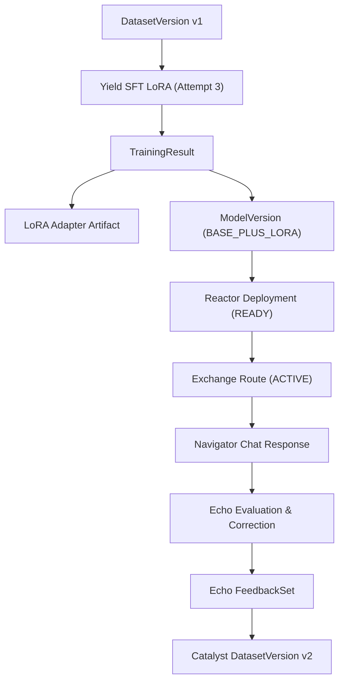

# Text Model Lifecycle V1: Canonical Local Acceptance Evidence

This document records the end-to-end local canonical acceptance evidence for **Text Model Lifecycle V1**, executed using the canonical driver (`scripts/text-lifecycle-v1.py`). All host-specific paths, usernames, hostnames, private IPs, and authentication tokens have been sanitized.

---

## 1. Environment and Hardware Profile

| Field | Value |
|---|---|
| **Runtime Profile** | `WSL_DEV_PROFILE` |
| **Host OS** | Windows 11 with WSL2 Linux kernel |
| **GPU Model** | NVIDIA GeForce RTX 5070 (Compute Capability 12.0) |
| **GPU Total VRAM** | 12,227 MiB |
| **NVIDIA Driver / CUDA** | Driver `615.65.06` / CUDA UMD `13.4` |
| **Base Model** | `Qwen/Qwen2.5-0.5B-Instruct` |
| **Base Model Revision** | `7ae557604adf67be50417f59c2c2f167def9a775` |
| **Base Model Artifact Digest** | `sha256:b328f12190709857ce73ffe417b9fe86807aa275c9b55baa35e731556b1d345a` |

---

## 2. Canonical Git Commit SHAs

| Component / Repository | Commit SHA | State |
|---|---|:---:|
| `Cyrene-Workspace` | `7012a4d178a7a832dc6cb77c5c151d8ccb2dbab1` | Verified |
| `Cyrene-Platform` | `7bda74bd3410dc2c5b5c5e66e12485519c2b5e54` | Verified |
| `Cyrene-Catalyst` | `d0114bd914a1f4cf171e38e73408f1e72086efd0` | Verified |
| `Cyrene-Yield` | `c5f86a5c861915ac1d8488b8715b798b6f40b67a` | Verified |
| `Cyrene-Reactor` | `6d7092fa52c9a62f4fdc4bd84eeacbc7fefe9b3b` | Verified |
| `Cyrene-Exchange` | `f2c8182d6758783a17d5ccabe69561d991fd4629` | Verified |
| `Cyrene-Navigator` | `4e4b7edeb690af6e8e37006b9db278cf940193e9` | Verified |
| `Cyrene-Echo` | `63f27aac7f4dfeda9161f917a4a20d44b830f449` | Verified |

---

## 3. End-to-End Canonical Chain Identifiers



| Lifecycle Stage | Resource Kind | Identifier / Digest / Value |
|---|---|---|
| **Catalyst Model** | `Model` | `0199252c-c7ea-7589-a51f-6a7516d00dc2` (`Acceptance-1788798937`) |
| **Catalyst Dataset** | `Dataset` | `0199252c-cb0a-73d8-a83d-3b951475739e` |
| **Initial Dataset Version** | `DatasetVersion` (v1) | `0199252c-cffb-7c70-877d-7b2eeadcf981`<br>`artifact://sha256/00b048b47ed4ccabcb6395c493388a1e47583c0ed08039dbc9f6d69ada08bb51` |
| **Yield Training Run** | `TrainingRun` | `cyrene://yield/training-runs/6b6cb64a-0448-47e4-9faa-9c68a0aa11d3` |
| ↳ *Preflight Attempt* | `TrainingAttempt` (1) | `0199252c-d2d4-729f-a8ea-bbba861d875a` (status: `succeeded`) |
| ↳ *Dry-run Attempt* | `TrainingAttempt` (2) | `0199252d-0348-709d-ad02-39c20a484501` (status: `succeeded`) |
| ↳ *Execution Attempt* | `TrainingAttempt` (3) | `0199252d-1bf9-7387-a25e-04f7ca11fb85` (status: `succeeded`, 1 step real CUDA LoRA) |
| **Yield Training Result** | `TrainingResult` | `5ee94cb5-ed1b-55eb-a831-e7f2d66599a1` (internal `0199252d-71ee-70d3-b1d7-2f6a9c14828f`) |
| **LoRA Adapter Artifact** | `Artifact` | `artifact://sha256/090eb4dc5567c8f795ea1d14fd10fcf767d11df1332f2a1d2726d2cedd6aa014` (17,641,047 bytes) |
| **ModelVersion** | `ModelVersion` | `model-version://sha256/31a73c6be3e4704a3db3b955d9b1ef77c49a88ada90dfae62d0f5bfe9c17dfe8`<br>Composition: `BASE_PLUS_LORA` |
| **Reactor Deployment** | `Deployment` | `350cce97-a933-41f5-a418-e882d0052a94` (internal `0199252d-7521-7290-b184-5f111818bfa9`)<br>Serving Binding: `local-gpu`<br>Status: `READY` (served real inference) |
| **Exchange Route** | `GatewayRoute` | `0199252d-fc54-722a-8c88-e214da39a739`<br>Status: `ACTIVE` |
| **Navigator Session** | `ConversationSession`| `0199252d-fd83-70ae-9ae6-70e2815ecb91` |
| **Navigator Inference Response** | Real Text Response | `"Hello! How can I help you today?"` |
| **Echo Evaluation** | `Evaluation` | `0199252e-067f-720d-83cb-1ee6b6cfbdf9` |
| **Echo Feedback** | `Feedback` | `0199252e-0731-7004-954f-178b66da9d10` |
| **Echo FeedbackSet** | `FeedbackSet` | `0199252e-07df-7223-bdce-668b57111e3b` |
| **Echo Export Receipt** | `ExportReceipt` | `0199252e-08c3-71e9-a78d-5eb685b8c9d0` (status: `EXPORTED`) |
| **Second Dataset Version** | `DatasetVersion` (v2) | `0199252e-0967-73d6-a2e6-76ddadbf2b6b`<br>`artifact://sha256/264e107db75479be0ef421d0339d332616ce5cbb81e7d825ddb19e99a868470a` |

---

## 4. Teardown and Resource Cleanup Audit

### 4.1 Eight Mandatory Cleanup Gates

| Gate Condition | Expected | Verified Result | Status |
|---|:---:|:---:|:---:|
| `TRAINING_WORKERS_REMAINING` | `0` | `0` (LLaMA-Factory worker terminated on completion) | **PASS** |
| `REACTOR_DEPLOYMENTS_REMAINING` | `0` | `0` (Deployment transitioned to `STOPPED`) | **PASS** |
| `KERNEL_MANAGED_CHILDREN` | `0` | `0` (vLLM process stopped, all child pipes closed) | **PASS** |
| `LEASES_REMAINING` | `0` | `0` (Kernel lease released) | **PASS** |
| `NVIDIA_ADAPTER` | `STOPPED` | Process terminated via `reference-runtime.py down` | **PASS** |
| `SANDBOXD` | `STOPPED` | Process terminated via `reference-runtime.py down` | **PASS** |
| `KERNEL` | `STOPPED` | Process terminated via `reference-runtime.py down` | **PASS** |
| `REFERENCE_RUNTIME` | `DOWN` | Confirmed `{"status": "DOWN"}` | **PASS** |

### 4.2 Residual Process Scan
```bash
ps aux | grep -E "vllm|llamafactory|cyrene|sandbox|nvidia-adapter" | grep -v grep
# Output: (empty, exit code 1)
```
Confirmed **zero** lingering processes.

### 4.3 GPU VRAM Lifecycle Audit

```
Baseline (Pre-run):      1,934 MiB / 12,227 MiB (Windows desktop base)
Active Serving (vLLM):   9,509 MiB / 12,227 MiB (Base Qwen2.5-0.5B + LoRA + KV Cache)
Teardown (Post-cleanup): 1,936 MiB / 12,227 MiB (Delta: +2 MiB OS window redraw fluctuation)
Residual GPU Processes:  0
```

---

## 5. Architectural Clarification: Authority over `ModelVersion`

- **Canonical Authority**: **`Yield`**
- **Catalog Distinction**:
  - `Catalyst` is exclusively the authority for **`Dataset`**, **`DatasetVersion`**, and **`Preparation`**. Catalyst does **not** register or own model versions.
  - `Yield` is the authority for **`TrainingRun`**, **`TrainingAttempt`**, **`TrainingResult`**, and **`ModelVersion`**.
  - Upon training run completion, Yield produces the canonical `ModelVersion` manifest containing `composition: BASE_PLUS_LORA`, adapter artifact digest, base model provenance, chat template, and training lineage.
  - Yield directly hands off the `ModelVersion` to `Reactor` via `POST /api/v1/training-results/{id}/actions/send-to-reactor`.
